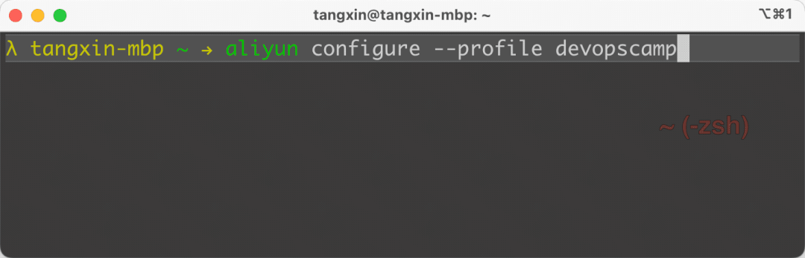
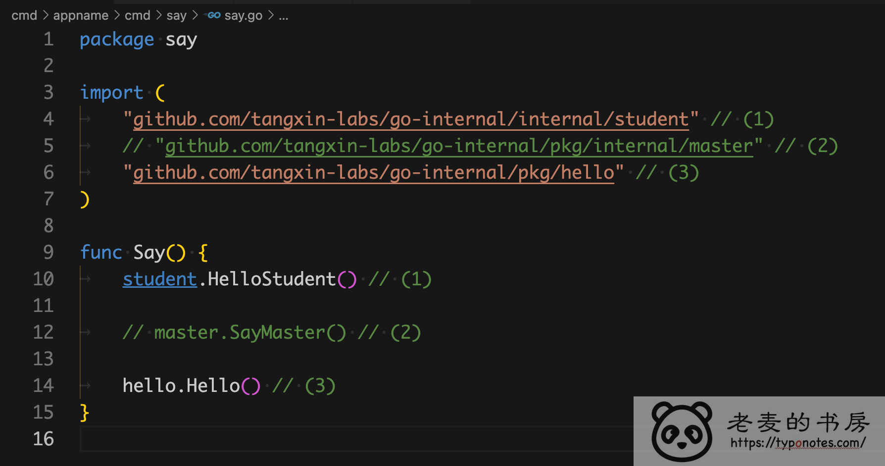

:::tip 摘要
Cobra现代CLI应用程序的库使用
:::
<!-- more -->

# Cobra现代 CLI 应用程序的库使用

## 1、cobra

github：https://github.com/spf13/cobra

官网：https://cobra.dev/

Cobra 是一个用于创建功能强大的现代 CLI 应用程序的库。

Cobra 在许多 Go 项目中使用，例如 [Kubernetes](https://kubernetes.io/)、[Hugo](https://gohugo.io/) 和 [GitHub CLI](https://github.com/cli/cli) 仅举几例。[此列表](https://github.com/spf13/cobra/blob/main/site/content/projects_using_cobra.md)包含使用 Cobra 的更广泛的项目列表。

```sh
# 安装cobra
go get -u github.com/spf13/cobra@latest
# 导入包
import "github.com/spf13/cobra"
```

相关文章：

https://opscloud.vip/2020/11/17/%20golang%20cobra%E7%9A%84%E4%B8%80%E4%BA%9B%E7%AC%94%E8%AE%B0/#/Cobra%E4%BB%8B%E7%BB%8D

关闭completion官方命令：

https://github.com/spf13/cobra/issues/1507

cobra 开启自动补全功能：

https://blog.csdn.net/qiubingcsdn/article/details/107143073

万字长文——Go 语言现代命令行框架 Cobra 详解

https://juejin.cn/post/7231197051203256379#heading-25

自定义help:

https://zhuanlan.zhihu.com/p/627848739

https://github.com/jianghushinian/blog-go-example/blob/main/cobra/getting-started/hugo/cmd/root.go

Cobra 命令行工具:

https://www.cnblogs.com/cy0628/p/16095927.html


## 2、cobra01-实现编译与参数绑定（简单）

需求：

1. 使用 https://github.com/spf13/cobra 实现命令工具
2. 命令具有以下参数
   1. `--name` 姓名 （-n 姓名）
   2. `--age` 年龄（-a 年龄）
3. 如果年龄为空， 默认为 20 岁。
4. 完成交叉编译脚本， 编译其他平台的二进制文件
  ```shell
  -rw-r--r-- 1 OBY 197121 5108032  4月  7 17:55 greeting-darwin-amd64
  -rw-r--r-- 1 OBY 197121 5023842  4月  7 17:55 greeting-darwin-arm64
  -rw-r--r-- 1 OBY 197121 5065145  4月  7 17:55 greeting-linux-amd64
  -rw-r--r-- 1 OBY 197121 4981187  4月  7 17:55 greeting-linux-arm64
  -rwxr-xr-x 1 OBY 197121 5190144  4月  7 17:55 greeting-windows-amd64*
  -rwxr-xr-x 1 OBY 197121 4987904  4月  7 17:55 greeting-windows-arm64*
  ```
5. 执行输出效果如下

  ```shell
  $ ./out/greeting-windows-amd64 
  你好， 今年 20 岁
  
  $ ./out/greeting-windows-amd64 --age 123 --name jk
  jk 你好， 今年 123 岁
  
  $ ./out/greeting-windows-amd64 -a 123 -n jk
  jk 你好， 今年 123 岁
  
  $ ./out/greeting-windows-amd64 -h
  打招呼
  
  Usage:
    greeting [flags]
  
  Flags:
    -a, --age int       年龄 (default 20)
    -h, --help          help for greeting
    -n, --name string   姓名
  
  $ ./out/greeting-windows-amd64 afsadf
   你好， 今年 20 岁
  ```

实现：

```shell
# 进入golang工作区的src下，
# 创建目录
mkdir cobra
cd cobra
# 创建项目目录
mkdir 01 && cd 01
# 初始化
go mod init 01
# 安装cobra
go get -u github.com/spf13/cobra@latest
```

main.go

```go
package main

import (
	"fmt"
	"os"

	"github.com/spf13/cobra"
)

func greeting(name string, age int) {
	fmt.Printf("%s 你好， 今年 %d 岁\n", name, age)
}

// 1、创建命令
var rootCmd = &cobra.Command{
	Use:   "greeting",
	Short: "打招呼",
	Run: func(cmd *cobra.Command, args []string) {
		greeting(name, age)
	},
}

// 2、指定参数
/**
1、定义了变量作为参数接受者。
2、使用 init 函数， 在程序初始化的时候， 传递参数值。
	1）参数接受者 指针类型
	2）参数名称， 字符串类型
	3）短参数名称， 字符串类型， 但只接受一个参数
	4）默认值， 具体类型
	5）参数描述， 字符串类型
**/
var (
	name = ""
	age  = 0
)
func init() {
	rootCmd.Flags().StringVarP(&name, "name", "n", "", "姓名")
	rootCmd.Flags().IntVarP(&age, "age", "a", 20, "年龄")
}

// 3、调用执行
/**
1、greeting 是程序实际执行逻辑， 及执行逻辑入口。
2、在 rootCmd 的 Run 中调用 执行逻辑入口。
3、在 main 中调用 rootCmd 的执行函数 Execute()
**/
func main() {
	if err := rootCmd.Execute(); err != nil {
		fmt.Println(err)
		os.Exit(1)
	}
}

```

Makefile

1. 使用 `GOOS` 和 `GOARCH` 设置环境变量命令。
2. 使用 `make build` 命令， 使用进行 **当前系统环境** 的编译
   - 并且编译文件命名包含系统信息。
3. 使用 `make buildx` 命令， 实现 **交叉编译**
4. 使用 `make clean` 命令清空编译结果。

```makefile
## 默认变量， 获取当前 go 的环境变量
GOOS ?= $(shell go env GOOS)
GOARCH ?= $(shell go env GOARCH)

## build 在指定环境变异
build:
	go build -o out/greeting-$(GOOS)-$(GOARCH) .

## 通过指定环境变量， 执行交叉编译
buildx:
	GOOS=linux GOARCH=amd64 make build
	GOOS=linux GOARCH=arm64 make build
	GOOS=windows GOARCH=amd64 make build
	GOOS=windows GOARCH=arm64 make build
	GOOS=darwin GOARCH=amd64 make build
	GOOS=darwin GOARCH=arm64 make build

## 清理编译结果
clean:
	rm -rf out/
```

Makefile版本二：

```makefile
APP := $(shell cat go.mod | grep "^module " | sed -e "s/module //g")
VERSION := $(shell grep -oP '(?<=Version = ").*?(?=")' version/version.go)

GOARCH := $(shell go env GOARCH)
GOOS := $(shell go env GOOS)

# VERSION ?= $(shell git describe --tags)
# TAG ?= "minio/mc:$(VERSION)"

GOBUILD=CGO_ENABLED=0 go build -a -ldflags "-X ${APP}/version.Version=${VERSION}"

# 使用内置目标名.PHONY声明这些“伪目标”名是“伪目标”，而不是与“伪目标”同名的文件
.PHONY: help all build windows linux darwin

default:help

all:build windows linux darwin ls

build:
	@echo "Building the binary..."
	@${GOBUILD} -o ./bin/${APP}
windows:
	@echo "Building the windows binary..."
	@GOOS=windows ${GOBUILD} -o ./bin/${APP}-${VERSION}-windows-${GOARCH}
linux:
	@echo "Building the linux binary..."
	@GOOS=linux ${GOBUILD} -o ./bin/${APP}-${VERSION}-linux-${GOARCH}
darwin:
	@echo "Building the darwin binary..."
	@GOOS=darwin ${GOBUILD} -o ./bin/${APP}-${VERSION}-darwin-${GOARCH}
ls:
	@ls ./bin

clean:
	@echo "Cleaning up all the generated files"
	@if [ -d bin ] ; then rm -rf ./bin ; fi

install:
	@echo "installing binary file to /usr/local/bin"
	@if [ -e ./bin/${APP} ];then \
	/bin/cp  ./bin/${APP}  /usr/local/bin;else \
	echo "error: the binary file is not exist, install failed!!!";fi

uninstall:
	@echo "uninstall /usr/local/bin/${APP}"
	@if [ -e /usr/local/bin/${APP} ];then \
	rm -f /usr/local/bin/${APP};else \
	echo "error: the binary file is not exist, uninstall failed!!!";fi
	
help:
	@echo "usage: make <option>"
	@echo "options and effects:"
	@echo "    help   	: Show help"
	@echo "    all    	: Build multiple binary of this project"
	@echo "    build  	: Build the binary of this project for current platform"
	@echo "    windows	: Build the windows binary of this project"
	@echo "    linux  	: Build the linux binary of this project"
	@echo "    darwin 	: Build the darwin binary of this project"
	@echo "    clean  	: Cleaning up all the generated files"
	@echo "    install	: install binary file to /usr/local/bin"
	@echo "    uninstall	: uninstall /usr/local/bin/${APP}"
```


## 3、cobra02-**配置文件的读取与写入（简单**）

需求：

1. 使用 https://github.com/spf13/cobra 实现命令工具
2. 命令具有以下参数
   1. `--config` , `-c` 配置文件

**配置文件如下**

```
# config.yml
name: zhangsan
age: 20
```

1. 将配置文件保存为 `JSON` 格式

```
$ cat config.json
```

输出结果

```
{
    "name":"zhangsan",
    "age": 20
}
```

分析：

### 配置文件

**最常用** 的的配置文件类型就是 `YAML` 和 `JSON`。除此之外还有 `toml, xml, ini` 等， 这些类型的配置文件可以在实际碰到的时候去学习掌握， 大差不差。

通常 **解析** 和 **映射** 方法名称分别为 `Marshal` 和 `Unmarshal`

1. `Marshal(v any) ([]byte, error)` 将结构体 **解析** 成 `[]byte` 类型。
2. `Unmarshal(data []byte, v any) error` 将 `[]byte` **映射** 到结构体中。这里的 `v` 需要是 **指针类型**

但有些库在名字上可能具有一定变种，通常也有迹可循。

```
MarshalJSON
MarshalYAMl
```

**不同库** 对应的的 **方法名称** 和 **实现逻辑** 也不尽相同， 如果凭经验使用遇到了问题， 一定要去看看官网文档。

最基本常用的解析库

1. `json`: `encoding/json`
2. `yaml`: `gopkg.in/yaml.v3`, `gopkg.in/yaml.v2` **v2 和 v3** 有区别， 自己研究。

### 读取配置

我们定义了一个名为 `Person` 的结构体， 包含两个字段 Name 和 Age， 用于接受参数/变量。

```
type Person struct {
 Name string `yaml:"name,omitempty"`
 Age  int    `yaml:"age,omitempty"`
}
```

我们在字段后面， 使用 `tag` 进行了信息补充， 提供 `yaml` 解析的行为参数。


图片是之前 struct 的截图， 其中

1. **（1）** 是字段名称
2. **（2-4）** 是 `tag` 内容。
   1. **（2）** 是 `tag name`， 解析库依赖此字段进行判定。
   2. **（3-4）** 是 `tag value`, 本质上是 **字符串**。例如这里 `name` 和 `omitempty` 使用 **分隔符`,`** 进行分割。不同的库的分隔符有所不同， 例如 `gorm` 使用的 **分号`;`**。
   3. **（3）** 在这里对应的是 **映射** 的字段名称。例如 yaml 文件中的 `name` 对应结构体中的 `Name`。这里 `name` 也可以是其他值， 例如 `MyName`， 那么就会在 yaml文件中找对应的 MyName 字段。
   4. **（4）** `omitempty` 是 yaml 支持的操作符， 同时还支持 `flow, inline`。具体功能描述可以参考 https://pkg.go.dev/gopkg.in/yaml.v3#pkg-functions

```
func readConfig(name string) *Person {
 person := &Person{}

 // 1. 读取文件
 b, err := os.ReadFile(config)
 if err != nil {
  panic(err)
 }

 // 2. 绑定参数
 err2 := yaml.Unmarshal(b, person)
 if err2 != nil {
  panic(err)
 }

 return person
}
```

1. 初始化 `person` **指针对象**， 其底层类型为 Person 结构体。
2. 在 `readConfig` 函数中， 我们使用 `os.ReadFile` 读取文件内容。
3. 并通过 `yaml.Unmarshal` 将数据映射到 `person` 实例中。需要 **注意的是**， `person` 所在的参数未知， 必须是 **指针** 对象， 否则反射无法保存数据到 **内存** 中。

### 保存文件为 json

把配置信息保存为 json 文件， 就是之前 yaml 的反操作。

```
// dumpConfig 保存文件
func dumpConfig(person *Person) {
 // 将结构体解析成 []byte
 b, err := json.Marshal(person)
 if err != nil {
  panic(err)
 }

 // os.ModePerm => folder 755, file 644
 err2 := os.WriteFile("config.json", b, os.ModePerm)
 if err2 != nil {
  panic(err)
 }
}
```

1. 使用 `json.Marshal` 将对象转换成 []byte。由于是 **读取操作**， `person` 所在的参数为止可以是结构体， 也可以是指针。
2. 使用 `os.WriteFile` 进行文件写入操作。需要注意的是 `os.ModePerm` 这个权限， 对于文件夹是 755， 对于文件是 644， 非常的灵活。

```
{"Name":"zhugeliang","Age":2600}
```

执行后，得到的结果与期望的结果有一点点不同。**注意** ，这里的 `Name` 和 `Age` 都是大写。

我们对 `Person` 结构体稍微做一点改造

```
type Person struct {
 Name string `yaml:"name,omitempty" json:"name,omitempty"`
 Age  int    `yaml:"age,omitempty" json:"age,omitempty"`
}
```

加上 `json tag` 之后， 得到的结果就与期望一致了。

```
{"name":"zhugeliang","age":2600}
```

**实现：**

```shell
# 进入golang工作区的src下，
# 创建目录
mkdir cobra
cd cobra
# 创建项目目录
mkdir 02 && cd 02
# 初始化
go mod init 02
# 安装依赖包
go get -u github.com/spf13/cobra@latest
go get gopkg.in/yaml.v3
```

config.yml

```yml
name: zhangsanlisi
age: 888
```

main.go

```go
package main

import (
	"fmt"
	"os"

	"encoding/json"

	"github.com/spf13/cobra"
	"gopkg.in/yaml.v3"
)

type Person struct {
	Name string `yaml:"name,omitempty" json:"name,omitempty"`
	Age  int    `yaml:"age,omitempty" json:"age,omitempty"`
}

func greeting(name string, age int) {
	fmt.Printf("%s 你好， 今年 %d 岁\n", name, age)
}

// readConfig 读取yml配置文件
//
//	@param name
//	@return *Person
func readConfig(name string) *Person {
	person := &Person{}

	// 1. 读取文件
	b, err := os.ReadFile(config)
	if err != nil {
		panic(err)
	}

	// 2. 绑定参数
	err2 := yaml.Unmarshal(b, person)
	if err2 != nil {
		panic(err)
	}

	return person
}

// dumpConfig 保存为json文件
func dumpConfig(person *Person) {
	// 将结构体解析成 []byte
	b, err := json.Marshal(person)
	if err != nil {
		panic(err)
	}

	// os.ModePerm => folder 755, file 644
	err2 := os.WriteFile("config.json", b, os.ModePerm)
	if err2 != nil {
		panic(err)
	}
}

var rootCmd = &cobra.Command{
	Use:   "yml2json",
	Short: "yml文件转json文件",
	Run: func(cmd *cobra.Command, args []string) {
		// 1、读取配置文件
		person := readConfig(config)
		// 2、业务逻辑
		greeting(person.Name, person.Age)
		// 3、转换配置文件
		dumpConfig(person)
	},
}

var config string

func init() {
	rootCmd.Flags().StringVarP(&config, "config", "c", "config.yml", "配置文件")
}

func main() {
	if err := rootCmd.Execute(); err != nil {
		fmt.Println(err)
		os.Exit(1)
	}
}

```


## 4、cobra03-交互式命令（简单）

需求：

1. 使用 https://github.com/spf13/cobra 实现命令工具
2. 使用 https://github.com/go-survey/survey 实现交互式命令
3. 实现 Demo 效果

除了官方效果之外， 我还发现了 `aliyun` 命令行工具在配置账户的时候使用的是 **交互式** ， 如下



**分析：**

实现：

```shell
# 进入golang工作区的src下，
# 创建目录
mkdir cobra
cd cobra
# 创建项目目录
mkdir 03 && cd 03
# 初始化
go mod init 03
# 安装依赖包
go get -u github.com/spf13/cobra@latest
go get gopkg.in/yaml.v3
go get -u github.com/AlecAivazis/survey/v2
```

main.go

```go
package main

import (
	"fmt"
	"os"

	"github.com/spf13/cobra"
)

var rootCmd = &cobra.Command{
	Use:   "aliyunx",
	Short: "aliyun 配置中心",
	Run: func(cmd *cobra.Command, args []string) {
		// 1. 使用全局 profile
		interactive(profile)
	},
}

var profile string

func init() {
	rootCmd.Flags().StringVarP(&profile, "profile", "p", "default", "配置名称")
}

func main() {
	if err := rootCmd.Execute(); err != nil {
		fmt.Println(err)
		os.Exit(1)
	}
}

```

survey.go

```go
package main

import (
	"encoding/json"
	"fmt"
	"os"

	"github.com/AlecAivazis/survey/v2"
)

/**
1、qs 中的 Name 名称与 answers 中的字段名称都是一一对应的。
2、在 id 和 key 字段， 设置了验证器， 要求 必须提供。
3、在 region 字段， 设置 cn-hangzhou 为默认值， 虽然在切片中排在第二位
**/
// the questions to ask
var qs = []*survey.Question{
	{
		// 1. Input 输入框
		Name: "id",
		Prompt: &survey.Input{
			Message: "Access Secret ID: ",
		},
		Validate: survey.Required,
	},
	{
		// 2. Password 密码输入框
		Name: "key",
		Prompt: &survey.Password{
			Message: "Access Secret Key: ",
		},
		Validate: survey.Required,
	},
	{
		// 3. Select 单选框
		Name: "region",
		Prompt: &survey.Select{
			Message: "Choose a region:",
			Options: []string{"cn-shanghai", "cn-hangzhou"},
			Default: "cn-hangzhou",
		},
	},
	{
		// 4. MultiSelect 多选框
		Name: "language",
		Prompt: &survey.MultiSelect{
			Message: "Supported Configure Language: ",
			Options: []string{"zh", "en", "jp"},
		},
	},
}

func confirm() bool {
	ok := false
	// 5. Confirm 确认框
	prompt := &survey.Confirm{
		Message: "是否保存文件?",
	}
	_ = survey.AskOne(prompt, &ok)

	return ok
}

func interactive(profile string) {
	answers := struct {
		ID          string
		Key         string
		ChinaRegion string `survey:"region"`
		Language    []string
	}{}

	err := survey.Ask(qs, &answers)
	if err != nil {
		fmt.Println(err.Error())
		return
	}

	// 不需要保存的确认信息，单独提问交互
	if !confirm() {
		fmt.Println("用户取消文件保存")
	}

	// 2. 参数传递
	dumpConfig(profile, answers)
}

func dumpConfig(profile string, answer any) {
	b, err := json.MarshalIndent(answer, "", " ")
	if err != nil {
		panic(err)
	}

	// 3. 参数传递
	name := fmt.Sprintf("%s.config.json", profile)
	err2 := os.WriteFile(name, b, os.ModePerm)
	if err2 != nil {
		panic(err2)
	}
}

```


```sh
# cat local.config.json
{
 "ID": "fsadf",
 "Key": "asdfds",
 "ChinaRegion": "cn-shanghai",
 "Language": [
  "zh",
  "en"
 ]
}
```


## 5、cobra04-Go项目的目录结构

Go 项目的目录结构， 通常都会参考该项目 [Go语言规范/项目结构 - Github](https://github.com/golang-standards/project-layout) 。

这是一个社区规范， 遵守这个规范， 大家都会很轻松。 但并不是严格的 Go 语言标准， 实际操作中各个公司可能会有自己的标准。

另外， 在上述的 Github 仓库中可以看到， 所有 **目录功能** 都只有一层。 这样就意味着在实际使用时我们是可以自由组合。 只要遵守该层的功能约定就可以了。

例如， 使用 cobra 时， 用于管理命令的 `cmd` 目录， 位置可以是

```tex
/cmd/appname/cmd

# 或
/pkg/cmd/

# 或
/internal/pkg/cmd

# 或
/pkg/internal/cmd
```

关于这个没有必要钻牛角尖， 只要是一群相对固定的维护人员认同的约定， 就可以了。

**`internal` 包**

`internal` 包是是特殊的， 也是 Go 语言规范 **强制** 约束的。

1. 首先， 它的目录位置不是固定的， 和其他包一样。
2. 其次， 它的访问是受限的， 只有和他有 **近亲亲属关系** 的路径才能访问。

举个例子， 代码在 https://github.com/tangx-labs/go-internal-demo

代码目录树如下


**限制访问**



在上图中, 其中 (2) 的调用因为没有权限被限制

在 `/cmd/appname/cmd/say` 访问 `pkg/internal/master` 时，

1. 找到与 `/pkg` 与 `/cmd` 是相同层级。
2. 但是 `/pkg/internal` 是子层级， 与 `/cmd/appname` 是同一层级。
3. 因此属于 **远亲**， 不能直接调用 `/pkg/internal/master`

**公共方法暴露**


但是， 可以通过 **私有包的公共方法暴露**， 例如上图中的 (3)

1. `/pkg/hello` 与 `/pkg/internal` 是同级， 且是 **近亲**， 可以调用。
2. `/pkg/hello` 是公共的
3. `/cmd/appname/cmd/say` 可以通过调用 `/pkg/hello` 间接实现调用 master 的逻辑。（

更多详细信息， 可以阅读 [internal 运行机制](https://go.dev/s/go14internal)

那 internal 是不是就一定不能被访问了呢？ 也不一定， 可以参考 [突破限制,访问其它Go package中的私有函数](https://colobu.com/2017/05/12/call-private-functions-in-other-packages/)

**包命名规范**

关于包的命名规范， Go 官方是有明确说明的， 但是 **没有强制约束** 。

要求

1. **短，好记，有意义**： `bytes, io, os`
2. 小写字母。 多个单词使用 **连字符（-）** 连接， 不要使用 **蛇形（下划线）** 或者 **驼峰**： `qcloud-cdn-sdk`

更多信息， 参考 [effective_go](https://go.dev/doc/effective_go#package-names)

**函数/方法，变量命令**

1. **大写开头是公共， 小写开头是私有**： 这个就不多说了
2. 命名不要与包名有重复： 假如包名为 `bytes`，
3. 函数名就不用叫 `BytesReader` 了， 否则调用起来就是 `bytes.BytesReader`。
4. 函数名就叫 `Reader` 就好了， 调用起来就是 `bytes.Reader`。
5. 命令要有意义： 见名知义。
6. 命名要遵循 **驼峰** 规则。

**循环依赖**

这个就不多说了， 学了基础的都应该知道， 相关文章一搜一大把。


这个是 Go 语言的 **强制约束**。 换句话说， 不用等到编译， 在写代码的时候 IDE 就会提示你出现错误。


## 6、cobra05- Cobra 的子命令

在 cobra 中， 每个 **命令** 都是独立的。 通过 `parent.AddCommand(children)` 的形式进行串连。

```tex
var root = &cobra.Command{}

var child = &cobra.Command{}

func init() {
	root.AddCommand(child)
}
```


## 7、CobraUtils 使用结构体更方便绑定参数

https://github.com/go-jarvis/cobrautils

安装

```sh
go get -u github.com/go-jarvis/cobrautils
```

demo1

main.go

```go
package main

import (
    "fmt"

    "github.com/go-jarvis/cobrautils"
    "github.com/spf13/cobra"
)

type student struct {
    Name    string `flag:"name" usage:"student name" persistent:"true"`
    Age     int64  `flag:"age" usage:"student age" shorthand:"a"`
}

var rootCmd = &cobra.Command{
    Use: "root",
    Run: func(cmd *cobra.Command, args []string) {
        _ = cmd.Help()
    },
}

func main() {
    stu := student{
        Name:   "zhangsanfeng",
        Age:    20100
    }

    cobrautils.BindFlags(rootCmd, &stu)
    _ = rootCmd.Execute()

    fmt.Printf("%+v", stu)
}
```

执行结果

```
go run . --name wenzhaolun
Usage:
    root [flags]
Flags:
    -a, --age int            student age (default 20100)
    -h, --help               help for root
        --name string        student name (default "zhangsanfeng")

{Name:wenzhaolun Age:20100}
```

demo2

main.go

```go
package main

import (
	"fmt"
	"time"

	"github.com/go-jarvis/cobrautils"
	"github.com/spf13/cobra"
)

type student struct {
	Name     string  `flag:"name" usage:"student name" persistent:"true"`
	NamePtr  *string `flag:"nameptr" usage:"student name" persistent:"true"`
	Age      int64   `flag:"age" usage:"student age" shorthand:"a"`
	Gender   bool
	Address  address       `flag:"addr"`
	Duration time.Duration `flag:"duration"`
	Account  *uint8        `flag:"account" usage:"account count"`
}

type address struct {
	Home   string `flag:"home"`
	School string `flag:"-"`
}

var rootCmd = &cobra.Command{
	Use: "root",
	Run: func(cmd *cobra.Command, args []string) {
		_ = cmd.Help()
	},
}

func toStringPrt(s string) *string {
	return &s
}
func getString(s *string) string {
	return *s
}
func main() {
	stu := student{
		Name:    "zhangsanfeng",
		NamePtr: toStringPrt("zhangsanfeng"),
		Age:     20100,
		Gender:  false,
		Address: address{
			Home:   "chengdu",
			School: "shuangliu",
		},
		// Duration: tim,
	}

	cobrautils.BindFlags(rootCmd, &stu)
	_ = rootCmd.Execute()

	fmt.Println("=== result ===")
	fmt.Printf("%+v\n", stu)
	if stu.NamePtr == nil {
		fmt.Println("Warning: stu.Name is nil")
		return
	}
	fmt.Println("stu.Name =", getString(stu.NamePtr))
	fmt.Println("duration =", stu.Duration.Seconds())
	fmt.Println("account=", *stu.Account)

	/*
	   go run . --addr.home sichuan
	   Usage:
	     root [flags]

	   Flags:
	         --addr.home string    (default "chengdu")
	     -a, --age int            student age (default 20100)
	     -h, --help               help for root
	         --name string        student name (default "zhangsanfeng")

	   {Name:zhangsanfeng Age:20100 Gender:false Address:{Home:sichuan School:shuangliu}}
	*/
}
```


golang server agent

https://github.com/FengGeSe/terminal


