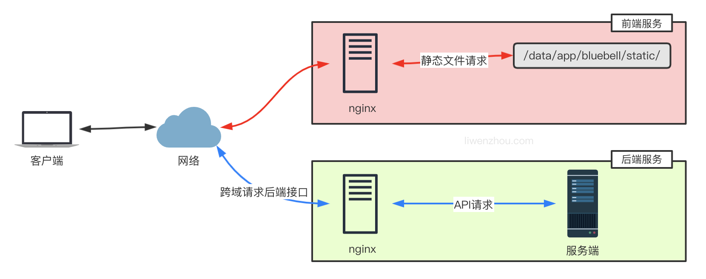

:::tip 摘要
golang应用部署
:::
<!-- more -->

# golang应用部署

部分内容来自：https://liwenzhou.com/

## 一、docker部署golang web

### 1、使用scratch镜像部署golang web

#### 1.1 scratch镜像示例

```sh
# tree
.
├── Dockerfile
├── go.mod
└── main.go
```
go.mod
```go
module golang-docker-demo

go 1.22.3
```
main.go 
```go
package main

import (
	"fmt"
	"net/http"
)

func main() {
	http.HandleFunc("/", hello)
	server := &http.Server{
		Addr: ":8080",
	}
  fmt.Println("server startup...")
	if err := server.ListenAndServe(); err != nil {
		fmt.Printf("server startup failed, err:%v\n", err)
	}
}

func hello(w http.ResponseWriter, _ *http.Request) {
	w.Write([]byte("hello world"))
}
```
Dockerfile 
```dockerfile
# 打包镜像
FROM golang:1.22.3-alpine AS Builder

# 为我们的镜像设置必要的环境变量
ENV GO111MODULE=on \
    GOPROXY=https://goproxy.cn,direct \
    CGO_ENABLED=0 \
    GOOS=linux \
    GOARCH=amd64

# 工作目录：/build
WORKDIR /build

# 将代码复制到容器中的/build下
COPY . .

# 将我们的代码编译成二进制可执行文件app
RUN go build -ldflags "-s -w" -a -installsuffix cgo -o app .

# 运行镜像
FROM scratch

# 信息
LABEL maintainer="https://oby.ink"

# 移动到用于存放生成的二进制文件的 /dist 目录
# WORKDIR /dist

# 将二进制文件从 /build 目录复制到这里
COPY --from=Builder /build/app /app

# 声明服务端口
EXPOSE 8080

# 数据卷
VOLUME ["/data"]

# 启动容器时运行的命令
CMD ["/app"]
```

```sh
# docker build -t go-demo  .
# docker images
REPOSITORY               TAG                            IMAGE ID       CREATED        SIZE
go-demo                  latest                         3ca7bb817c27   9 hours ago    4.77MB

# docker run -d --name go-demo -p 8080:8080 go-demo:latest
# docker ps
CONTAINER ID IMAGE          COMMAND   CREATED   STATUS   PORTS    NAMES                                                               
f0ad72a7ae41 go-demo:latest "/app" About a minute ago Up About a minute 0.0.0.0:8080->8080/tcp, :::8080->8080/tcp                                              go-demo
```

#### 1.2 docker scratch镜像

Docker Scratch镜像是一个极简的Docker镜像，它仅包含了Docker容器运行所必需的最小文件系统和执行环境。这使得Scratch镜像非常适合用于构建微服务应用程序和轻量级容器化应用程序。

**Docker Scratch镜像是什么？**
Docker Scratch镜像是一个特殊的Docker镜像，它不基于任何其他镜像构建。相反，它是一个空白的镜像，只包含了Docker运行所需的最小文件系统和执行环境。这使得它非常适合用于构建轻量级容器化应用程序，因为它不包含任何额外的组件或库。

Scratch镜像是一个精简的基础镜像，因为它不包含操作系统和软件包。这使得它非常适合构建轻量级容器化应用程序，因为它不会增加容器的大小或复杂性。在构建微服务应用程序时，Scratch镜像也非常有用，因为每个微服务可以使用自己的Scratch镜像作为基础镜像，从而获得更好的隔离和可移植性。

**如何使用Docker Scratch镜像**

使用Docker Scratch镜像非常简单，只需要在Dockerfile中指定FROM scratch即可：

```dockerfile
FROM scratch

# 添加应用程序文件
ADD app /

# 定义容器启动时运行的命令
CMD ["/app"]
```

在上面的Dockerfile中，我们使用Scratch镜像作为基础镜像，并将应用程序文件添加到容器中。然后，我们定义了容器启动时运行的命令。请注意，我们使用了绝对路径/app，这是因为Scratch镜像不包含PATH环境变量，因此只能使用绝对路径运行命令。

**如何构建Docker Scratch镜像**

构建Docker Scratch镜像与构建其他Docker镜像相似。唯一的区别是，你需要确保你的镜像不依赖于任何其他基础镜像。这意味着你需要在你的Dockerfile中添加所有必需的文件和组件，包括操作系统和任何依赖库。

下面是一个简单的示例Dockerfile，用于构建一个Hello World应用程序的Scratch镜像：

```dockerfile
FROM golang:1.16-alpine AS builder

WORKDIR /app

COPY main.go .

RUN go build -o app

FROM scratch

COPY --from=builder /app/app /

CMD ["/app"]
```

在上面的Dockerfile中，我们首先使用golang基础镜像作为构建镜像，构建我们的Hello World应用程序。然后，我们使用Scratch镜像作为最终镜像，并将应用程序复制到其中。请注意，我们使用了多个FROM指令来创建多个阶段构建，以便在构建阶段中使用完整的操作系统和依赖库，而在最终阶段中使用Scratch镜像。这是一个很好的做法，因为它可以减小镜像大小并提高安全性。

**为什么要使用Docker Scratch镜像**

Docker Scratch镜像具有以下优点：

1. 极小的镜像大小：Scratch镜像非常小，因为它仅包含Docker容器运行所需的最小文件系统和执行环境。这使得它非常适合用于构建轻量级容器化应用程序，减小了镜像大小和传输时间。
2. 更好的安全性：由于Scratch镜像非常精简，因此它具有更少的漏洞和攻击面，提高了容器的安全性。此外，由于Scratch镜像不包含任何额外的组件或库，因此它可以防止不必要的攻击。
3. 更好的可移植性：由于Scratch镜像非常小，因此它非常适合构建微服务应用程序。每个微服务都可以使用自己的Scratch镜像作为基础镜像，从而获得更好的隔离和可移植性。

### 2、使用alpine镜像部署golang web

#### 2.1 alpine镜像示例

```sh
# tree
.
├── Dockerfile
├── go.mod
├── main.go
└── scripts
    └── docker-entrypoint.sh
```
go.mod 
```go
module golang-docker-demo

go 1.22.3
```
main.go
```sh  
package main

import (
	"fmt"
	"net/http"
)

func main() {
	http.HandleFunc("/", hello)
	server := &http.Server{
		Addr: ":8080",
	}
  fmt.Println("server startup...")
	if err := server.ListenAndServe(); err != nil {
		fmt.Printf("server startup failed, err:%v\n", err)
	}
}

func hello(w http.ResponseWriter, _ *http.Request) {
	w.Write([]byte("hello world"))
}

```
Dockerfile
```sh
# 打包镜像
FROM golang:1.22.3-alpine AS Builder

# 配置时区
RUN apk --update add --no-cache tzdata && \
    /bin/cp /usr/share/zoneinfo/Asia/Shanghai /etc/localtime && \
    echo 'Asia/Shanghai' > /etc/timezone

# 为我们的镜像设置必要的环境变量
ENV GO111MODULE=on \
    GOPROXY=https://goproxy.cn,direct \
    CGO_ENABLED=0 \
    GOOS=linux \
    GOARCH=amd64

# 工作目录：/build
WORKDIR /build

# 将代码复制到容器中的/build下
COPY . .

# 下载依赖信息并将我们的代码编译成二进制可执行文件app
RUN go mod download && go build -ldflags "-s -w" -a -installsuffix cgo -o app .

# 运行镜像
FROM alpine:3.20

# 信息
LABEL maintainer="https://oby.ink"

# 移动到用于存放生成的二进制文件的 /dist 目录
# WORKDIR /dist

# 将二进制文件从 /build 目录复制到这里
COPY --from=Builder /build/app /usr/bin/app

# 拷贝docker-entrypoint.sh
COPY scripts/docker-entrypoint.sh /usr/bin/docker-entrypoint.sh

# 拷贝时区文件
COPY --from=Builder /usr/share/zoneinfo/Asia/Shanghai /etc/localtime
COPY --from=Builder /etc/timezone /etc/timezone

# 声明服务端口
EXPOSE 8080

# 数据卷
VOLUME ["/data"]

# 设置容器启动时执行的命令,用于检查环境
ENTRYPOINT ["/usr/bin/docker-entrypoint.sh"]

# 启动容器时运行的命令
CMD ["app"]
```
scripts/docker-entrypoint.sh
```sh  
#!/bin/sh

# Protect against buggy runc in docker <20.10.6 causing problems in with Alpine >= 3.14
if [ ! -x /bin/sh ]; then
  echo "Executable test for /bin/sh failed. Your Docker version is too old to run Alpine 3.14+ and app. You must upgrade Docker.";
  exit 1;
fi

# exec CMD
exec "$@"
```
部署
```sh
docker build -t go-demo  .
# docker images
REPOSITORY               TAG                            IMAGE ID       CREATED        SIZE
go-demo                  latest                         e295eea57dac   10 hours ago   12.6MB

docker run -d --name go-demo -p 8080:8080 go-demo:latest 
# docker ps
CONTAINER ID   IMAGE                                      COMMAND                  CREATED         STATUS         PORTS                                                                                  NAMES
1e509f475616   go-demo:latest                             "/usr/bin/docker-ent…"   9 minutes ago   Up 9 minutes   0.0.0.0:8080->8080/tcp, :::8080->8080/tcp                                              go-demo
```

注意：golang的应用打包时，建议使用go mod的方式，并且加上go mod download这个命令，这样，docker会将下载的go依赖缓存，避免每次打包都下载一遍go依赖。当使用这种方式时，docker build命令**可能**要加上--network host，否则容器内网络不通会导致go mod download超时。命令如下：

```sh
docker build --network host . -t hello:v1beta1
```


#### **2.2 ENTRYPOINT和CMD的区别**

ENTRYPOINT和CMD在Dockerfile中都用于指定容器启动时执行的命令，但它们之间存在一些关键的区别和不同的用途：

1. 基本用途和行为差异

   ENTRYPOINT 定义了容器启动时执行的基础命令，使得容器像一个可执行程序。ENTRYPOINT让你能够指定容器启动时的主命令，并且可以在docker run时通过附加命令行参数来传递额外的参数给这个命令。

   CMD 既可以指定容器启动时的默认命令，也可以提供默认的给ENTRYPOINT指定命令的参数。如果ENTRYPOINT被定义，CMD中的内容会作为参数传递给ENTRYPOINT。

2. 写法上的区别

     执行格式：两者都支持两种格式——shell格式和exec格式。
     Shell格式：CMD command param1 param2 或 ENTRYPOINT command param1 param2

     Exec格式：CMD ["command", "param1", "param2"] 或 ENTRYPOINT ["command", "param1", "param2"]

     参数传递：当使用exec格式时，如果同时使用了ENTRYPOINT和CMD，那么CMD中的内容会作为参数传递给ENTRYPOINT。这意味着，你可以定义一个固定的ENTRYPOINT（比如应用程序的启动命令），然后通过修改CMD来调整传递给这个命令的参数。

3. 实际使用差异

     如果只使用CMD，那么在docker run时可以通过附加的命令行参数来覆盖CMD指定的命令。

     如果设置了ENTRYPOINT，则ENTRYPOINT指定的命令将作为容器的主命令执行，而CMD提供的任何内容都将作为参数传递给ENTRYPOINT。这意味着，使用ENTRYPOINT可以让容器的行为更像是一个单独的应用，而CMD则提供了灵活性，允许用户在启动容器时指定额外的参数。

4. 覆盖行为

     在docker run命令中，通过指定命令行参数，可以覆盖CMD指令，但ENTRYPOINT指令定义的命令不会被覆盖，除非使用--entrypoint选项。

综上所述，ENTRYPOINT和CMD在一起使用时提供了强大的灵活性，允许Docker容器以更预期和可控的方式运行。选择使用哪一个，或如何组合使用，取决于你的具体需求，比如是否需要容器行为像一个单独的可执行程序，以及是否需要在启动容器时传递额外的参数。


### 3、打包静态、配置文件到镜像

Dockerfile 

```dockerfile
# 打包镜像
FROM golang:1.22.3-alpine AS Builder

# 为我们的镜像设置必要的环境变量
ENV GO111MODULE=on \
    GOPROXY=https://goproxy.cn,direct \
    CGO_ENABLED=0 \
    GOOS=linux \
    GOARCH=amd64

# 工作目录：/build
WORKDIR /build

# 将代码复制到容器中的/build下
COPY . .

# 将我们的代码编译成二进制可执行文件app
RUN go build -ldflags "-s -w" -a -installsuffix cgo -o app .

# 运行镜像
FROM scratch

# 信息
LABEL maintainer="https://oby.ink"

# 移动到用于存放生成的二进制文件的 /dist 目录
# WORKDIR /dist

# 将二进制文件从 /build 目录复制到这里
COPY --from=Builder /build/app /

# 从builder镜像中把静态文件拷贝到当前目录
COPY ./templates /templates
COPY ./static /static

# 从builder镜像中把配置文件拷贝到当前目录
COPY ./conf /conf

# 声明服务端口
EXPOSE 8080

# 数据卷
VOLUME ["/data"]

# 启动容器时运行的命令
CMD ["/app", "-c", "conf/config.ini"]
```


## 二、docker-compose部署golang web

### 1、docker-compose简单示例

```sh
# cat docker-compose.yml
version: '3'
services:
  go-app:
    build:
      context: ./
      dockerfile: Dockerfile
    image: go-app:1.0.3
    container_name: go-app
    restart: always
    volumes:
      - /tmp/data:/data
    ports:
      - "8080:8080"
    networks:
      - go-app

networks:
  go-app:
```

### 2、docker-compose启动顺序问题

一个很常见的场景就是微服务启动过程中，应用服务会依赖于配置中心、注册中心、数据库、redis等基础服务，所以这些基础服务应当优先于应用服务启动。还有就是在服务器重启时由于容器设置了自动重启，如果不控制启动顺序的话就就会导致有些服务去读取配置中心配置时，由于配置中心尚未完全启动成功导致应用服务启动中断或者失败。

解决方案：

1. 使用docker-compose提供的depends_on:
   - 被依赖的服务确实会优先启动，
   - 不能保证应用服务启动时被依赖的服务已经完全启动成功
2. 把docker-compose文件拆开:
   - 拆开成基础服务和应用服务，人工确保先后顺序。
   - 不能解决服务器重启后服务自动按顺序启动
3. 使用脚本监听依赖服务端口: 等依赖服务端口可以监听到时再启动应用服务**（推荐）**
   - 脚本需要在实际执行命令前执行，且需要明确必备依赖服务及端口

示例：

该案例部署依赖于mysql

源码：https://github.com/Q1mi/deploy_bubble_using_docker

**监听依赖服务端口脚本（无需要修改）**

wait-for-it.sh脚本源码：https://github.com/vishnubob/wait-for-it

scripts/wait-for-it.sh

```sh
#!/usr/bin/env bash
# Use this script to test if a given TCP host/port are available

WAITFORIT_cmdname=${0##*/}

echoerr() { if [[ $WAITFORIT_QUIET -ne 1 ]]; then echo "$@" 1>&2; fi }

usage()
{
    cat << USAGE >&2
Usage:
    $WAITFORIT_cmdname host:port [-s] [-t timeout] [-- command args]
    -h HOST | --host=HOST       Host or IP under test
    -p PORT | --port=PORT       TCP port under test
                                Alternatively, you specify the host and port as host:port
    -s | --strict               Only execute subcommand if the test succeeds
    -q | --quiet                Don't output any status messages
    -t TIMEOUT | --timeout=TIMEOUT
                                Timeout in seconds, zero for no timeout
    -- COMMAND ARGS             Execute command with args after the test finishes
USAGE
    exit 1
}

wait_for()
{
    if [[ $WAITFORIT_TIMEOUT -gt 0 ]]; then
        echoerr "$WAITFORIT_cmdname: waiting $WAITFORIT_TIMEOUT seconds for $WAITFORIT_HOST:$WAITFORIT_PORT"
    else
        echoerr "$WAITFORIT_cmdname: waiting for $WAITFORIT_HOST:$WAITFORIT_PORT without a timeout"
    fi
    WAITFORIT_start_ts=$(date +%s)
    while :
    do
        if [[ $WAITFORIT_ISBUSY -eq 1 ]]; then
            nc -z $WAITFORIT_HOST $WAITFORIT_PORT
            WAITFORIT_result=$?
        else
            (echo -n > /dev/tcp/$WAITFORIT_HOST/$WAITFORIT_PORT) >/dev/null 2>&1
            WAITFORIT_result=$?
        fi
        if [[ $WAITFORIT_result -eq 0 ]]; then
            WAITFORIT_end_ts=$(date +%s)
            echoerr "$WAITFORIT_cmdname: $WAITFORIT_HOST:$WAITFORIT_PORT is available after $((WAITFORIT_end_ts - WAITFORIT_start_ts)) seconds"
            break
        fi
        sleep 1
    done
    return $WAITFORIT_result
}

wait_for_wrapper()
{
    # In order to support SIGINT during timeout: http://unix.stackexchange.com/a/57692
    if [[ $WAITFORIT_QUIET -eq 1 ]]; then
        timeout $WAITFORIT_BUSYTIMEFLAG $WAITFORIT_TIMEOUT $0 --quiet --child --host=$WAITFORIT_HOST --port=$WAITFORIT_PORT --timeout=$WAITFORIT_TIMEOUT &
    else
        timeout $WAITFORIT_BUSYTIMEFLAG $WAITFORIT_TIMEOUT $0 --child --host=$WAITFORIT_HOST --port=$WAITFORIT_PORT --timeout=$WAITFORIT_TIMEOUT &
    fi
    WAITFORIT_PID=$!
    trap "kill -INT -$WAITFORIT_PID" INT
    wait $WAITFORIT_PID
    WAITFORIT_RESULT=$?
    if [[ $WAITFORIT_RESULT -ne 0 ]]; then
        echoerr "$WAITFORIT_cmdname: timeout occurred after waiting $WAITFORIT_TIMEOUT seconds for $WAITFORIT_HOST:$WAITFORIT_PORT"
    fi
    return $WAITFORIT_RESULT
}

# process arguments
while [[ $# -gt 0 ]]
do
    case "$1" in
        *:* )
        WAITFORIT_hostport=(${1//:/ })
        WAITFORIT_HOST=${WAITFORIT_hostport[0]}
        WAITFORIT_PORT=${WAITFORIT_hostport[1]}
        shift 1
        ;;
        --child)
        WAITFORIT_CHILD=1
        shift 1
        ;;
        -q | --quiet)
        WAITFORIT_QUIET=1
        shift 1
        ;;
        -s | --strict)
        WAITFORIT_STRICT=1
        shift 1
        ;;
        -h)
        WAITFORIT_HOST="$2"
        if [[ $WAITFORIT_HOST == "" ]]; then break; fi
        shift 2
        ;;
        --host=*)
        WAITFORIT_HOST="${1#*=}"
        shift 1
        ;;
        -p)
        WAITFORIT_PORT="$2"
        if [[ $WAITFORIT_PORT == "" ]]; then break; fi
        shift 2
        ;;
        --port=*)
        WAITFORIT_PORT="${1#*=}"
        shift 1
        ;;
        -t)
        WAITFORIT_TIMEOUT="$2"
        if [[ $WAITFORIT_TIMEOUT == "" ]]; then break; fi
        shift 2
        ;;
        --timeout=*)
        WAITFORIT_TIMEOUT="${1#*=}"
        shift 1
        ;;
        --)
        shift
        WAITFORIT_CLI=("$@")
        break
        ;;
        --help)
        usage
        ;;
        *)
        echoerr "Unknown argument: $1"
        usage
        ;;
    esac
done

if [[ "$WAITFORIT_HOST" == "" || "$WAITFORIT_PORT" == "" ]]; then
    echoerr "Error: you need to provide a host and port to test."
    usage
fi

WAITFORIT_TIMEOUT=${WAITFORIT_TIMEOUT:-15}
WAITFORIT_STRICT=${WAITFORIT_STRICT:-0}
WAITFORIT_CHILD=${WAITFORIT_CHILD:-0}
WAITFORIT_QUIET=${WAITFORIT_QUIET:-0}

# Check to see if timeout is from busybox?
WAITFORIT_TIMEOUT_PATH=$(type -p timeout)
WAITFORIT_TIMEOUT_PATH=$(realpath $WAITFORIT_TIMEOUT_PATH 2>/dev/null || readlink -f $WAITFORIT_TIMEOUT_PATH)

WAITFORIT_BUSYTIMEFLAG=""
if [[ $WAITFORIT_TIMEOUT_PATH =~ "busybox" ]]; then
    WAITFORIT_ISBUSY=1
    # Check if busybox timeout uses -t flag
    # (recent Alpine versions don't support -t anymore)
    if timeout &>/dev/stdout | grep -q -e '-t '; then
        WAITFORIT_BUSYTIMEFLAG="-t"
    fi
else
    WAITFORIT_ISBUSY=0
fi

if [[ $WAITFORIT_CHILD -gt 0 ]]; then
    wait_for
    WAITFORIT_RESULT=$?
    exit $WAITFORIT_RESULT
else
    if [[ $WAITFORIT_TIMEOUT -gt 0 ]]; then
        wait_for_wrapper
        WAITFORIT_RESULT=$?
    else
        wait_for
        WAITFORIT_RESULT=$?
    fi
fi

if [[ $WAITFORIT_CLI != "" ]]; then
    if [[ $WAITFORIT_RESULT -ne 0 && $WAITFORIT_STRICT -eq 1 ]]; then
        echoerr "$WAITFORIT_cmdname: strict mode, refusing to execute subprocess"
        exit $WAITFORIT_RESULT
    fi
    exec "${WAITFORIT_CLI[@]}"
else
    exit $WAITFORIT_RESULT
fi
```

启动容器时运行的命令脚本**（如无必要，无需要修改）**

scripts/docker-entrypoint.sh

```sh
#!/bin/sh

# Protect against buggy runc in docker <20.10.6 causing problems in with Alpine >= 3.14
if [ ! -x /bin/sh ]; then
  echo "Executable test for /bin/sh failed. Your Docker version is too old to run Alpine 3.14+ and app. You must upgrade Docker.";
  exit 1;
fi

# exec CMD
exec "$@"
```

Dockerfile

```dockerfile
# 打包镜像
FROM golang:1.22.3-alpine AS Builder

# 为我们的镜像设置必要的环境变量
ENV GO111MODULE=on \
    GOPROXY=https://goproxy.cn,direct \
    CGO_ENABLED=0 \
    GOOS=linux \
    GOARCH=amd64

# 工作目录：/build
WORKDIR /build

# 将代码复制到容器中的/build下
COPY . .

# 将我们的代码编译成二进制可执行文件app
RUN go build -ldflags "-s -w" -a -installsuffix cgo -o app .

# 运行镜像
FROM alpine

# 信息
LABEL maintainer="https://oby.ink"

# 移动到用于存放生成的二进制文件的 /dist 目录
# WORKDIR /dist

# 将二进制文件从 /build 目录复制到这里
COPY --from=Builder /build/app /

# 拷贝docker-entrypoint.sh和wait-for-it.sh脚本
COPY scripts/docker-entrypoint.sh /usr/bin/docker-entrypoint.sh
COPY scripts/wait-for-it.sh /usr/bin/wait-for-it.sh
# wait-for-it.sh脚本需要用到bash
RUN  apk  add --update --no-cache bash && \
     chmod +x /usr/bin/docker-entrypoint.sh && \
     chmod +x /usr/bin/wait-for-it.sh

# 把静态文件拷贝到当前目录
COPY ./templates /templates
COPY ./static /static

# 从builder镜像中把配置文件拷贝到当前目录
COPY ./conf /conf

# 声明服务端口
EXPOSE 8888

# 数据卷
VOLUME ["/data"]

# 启动容器时运行的命令
ENTRYPOINT ["/usr/bin/docker-entrypoint.sh"]
#CMD ["/app", "-c", "conf/config.ini"]
```

docker-compose.yml

```yml
version: '3'
services:
  mysql8019:
    image: mysql:8.0.19
    container_name: go-app-mysql
    restart: always
    environment:
      MYSQL_ROOT_PASSWORD: "root1234"
      MYSQL_DATABASE: "bubble"
      MYSQL_PASSWORD: "root1234"
    volumes:
      - ./init.sql:/data/application/init.sql
    ports:
      - "33061:3306"
    command: "--default-authentication-plugin=mysql_native_password --init-file /data/application/init.sql"
    networks:
      - go-app

  go-app:
    build:
      context: ./
      dockerfile: Dockerfile
    image: go-app
    container_name: go-app
    restart: always
    volumes:
      - /tmp/data:/data
    ports:
      - "8888:8888"
    command: sh -c "/usr/bin/wait-for-it.sh mysql8019:3306 -- ./app ./conf/config.ini"
    depends_on:
      - mysql8019
    networks:
      - go-app

networks:
  go-app:
```

**注意：mysql8019:3306对应的是容器的端口**

部署

```sh
docker-compose up -d

# docker images
REPOSITORY               TAG                            IMAGE ID       CREATED          SIZE
go-app                   latest                         046b31779845   16 minutes ago   19.4MB

# docker ps 
CONTAINER ID   IMAGE                                      COMMAND                  CREATED          STATUS          PORTS                                                                                  NAMES
a1bfeedaa8cf   go-app:                              "/usr/bin/docker-ent…"   17 minutes ago   Up 17 minutes   0.0.0.0:8888->8888/tcp, :::8888->8888/tcp                                              go-app
3e14b1ed32c7   mysql:8.0.19                               "docker-entrypoint.s…"   21 minutes ago   Up 17 minutes   33060/tcp, 0.0.0.0:33061->3306/tcp, :::33061->3306/tcp                                 go-app-mysql
```


## 三、独立部署

### 1、nohup

nohup 用于在系统后台**不挂断**地运行命令，不挂断指的是退出执行命令的终端也不会影响程序的运行。

我们可以使用 nohup 命令来运行应用程序，使其作为后台守护进程运行。由于在主流的 Linux 发行版中都会默认安装 nohup 命令工具，我们可以直接输入以下命令来启动我们的项目：

```bash
nohup ./app conf/config.yaml > app.log 2>&1 &
ps -ef|grep app
pkill app
```

其中：

- `./app conf/config.yaml`是我们应用程序的启动命令
- `nohup ... &`表示在后台不挂断的执行上述应用程序的启动命令
- `> app.log`表示将命令的标准输出重定向到 nohup_bluebell.log 文件
- `2>&1`表示将标准错误输出也重定向到标准输出中，结合上一条就是把执行命令的输出都定向到 app.log 文件
- ps -ef|grep app 查看运行结果
- pkill app 杀掉app

### 2、Supervisor 

Supervisor 是业界流行的一个通用的进程管理程序，它能将一个普通的命令行进程变为后台守护进程，并监控该进程的运行状态，当该进程异常退出时能将其自动重启。

安装

```sh
# REHL系
yum install -y epel-release
yum install -y supervisor
# Debian系
apt install -y supervisor
```

配置

Supervisor 的配置文件为：/etc/supervisord.conf ，Supervisor 所管理的应用的配置文件放在 /etc/supervisord.d/ 目录中，这个目录可以在 supervisord.conf 中的include配置。

```tex
[include]
files = /etc/supervisord.d/*.conf
```

新建应用服务

```sh
# cat /etc/supervisor/conf.d/go-demo.conf 
[program:go-demo]  ;程序名称
user=root  ;执行程序的用户
command=/root/go-demo/app  ;执行的命令
directory=/root/go-demo ;命令执行的目录
stopsignal=TERM  ;重启时发送的信号
autostart=true  
autorestart=true  ;是否自动重启
stdout_logfile=/root/go-demo/app.log  ;标准输出日志位置
stderr_logfile=/root/go-demo/app-error.log   ;标准错误日志位置

# 启动
systemctl start supervisor.service
systemctl status supervisor.service 

# 管理命令
supervisorctl status       # 查看所有任务状态
supervisorctl shutdown     # 关闭所有任务
supervisorctl start 程序名  # 启动任务
supervisorctl stop 程序名   # 关闭任务
supervisorctl reload       # 重启supervisor

# ls /root/go-demo/
app  app-error.log  app.log

# netstat -nulpt|grep app
tcp6       0      0 :::8080                 :::*                    LISTEN      108958/app
```

### 3、nginx反向代理

#### 正向代理与反向代理

正向代理可以简单理解为客户端的代理，你访问墙外的网站用的那个属于正向代理。


反向代理可以简单理解为服务器的代理，通常说的 Nginx 和 Apache 就属于反向代理。


#### nginx反向代理和负载均衡

```tex
worker_processes  1;

events {
    worker_connections  1024;
}

http {
    include       mime.types;
    default_type  application/octet-stream;

    sendfile        on;
    keepalive_timeout  65;

    upstream backend {
      server 127.0.0.1:8084;
      # 这里需要填真实可用的地址，默认轮询
      #server backend1.example.com;
      #server backend2.example.com;
    }

    server {
        listen       80;
        server_name  localhost;

        access_log   /var/log/bluebell-access.log;
        error_log    /var/log/bluebell-error.log;

        location / {
            proxy_pass                 http://backend/;
            proxy_redirect             off;
            proxy_set_header           Host             $host;
            proxy_set_header           X-Real-IP        $remote_addr;
            proxy_set_header           X-Forwarded-For  $proxy_add_x_forwarded_for;
        }
    }
}
```

#### Nginx分离静态文件请求

上面的配置是简单的使用 nginx 作为反向代理处理所有的请求并转发给我们的 Go 程序处理，其实我们还可以有选择的将静态文件部分的请求直接使用 nginx 处理，而将 API 接口类的动态处理请求转发给后端的 Go 程序来处理。


```tex
worker_processes  1;

events {
    worker_connections  1024;
}

http {
    include       mime.types;
    default_type  application/octet-stream;

    sendfile        on;
    keepalive_timeout  65;

    server {
        listen       80;
        server_name  bluebell;

        access_log   /var/log/bluebell-access.log;
        error_log    /var/log/bluebell-error.log;

		# 静态文件请求
        location ~ .*\.(gif|jpg|jpeg|png|js|css|eot|ttf|woff|svg|otf)$ {
            access_log off;
            expires    1d;
            root       /data/app/bluebell;
        }

        # index.html页面请求
        # 因为是单页面应用这里使用 try_files 处理一下，避免刷新页面时出现404的问题
        location / {
            root /data/app/bluebell/templates;
            index index.html;
            try_files $uri $uri/ /index.html;
        }

		# API请求
        location /api {
            proxy_pass                 http://127.0.0.1:8084;
            proxy_redirect             off;
            proxy_set_header           Host             $host;
            proxy_set_header           X-Real-IP        $remote_addr;
            proxy_set_header           X-Forwarded-For  $proxy_add_x_forwarded_for;
        }
    }
}
```

#### 前后端分开部署

前后端的代码没必要都部署到相同的服务器上，也可以分开部署到不同的服务器上，下图是前端服务将 API 请求转发至后端服务的方案。


上面的部署方案中，所有浏览器的请求都是直接访问前端服务，而如果是浏览器直接访问后端API服务的部署模式下，如下图。

此时前端和后端通常不在同一个域下，我们还需要在后端代码中添加跨域支持。



这里使用[github.com/gin-contrib/cors](https://github.com/gin-contrib/cors)库来支持跨域请求。

最简单的允许跨域的配置是使用`cors.Default()`，它默认允许所有跨域请求。

```go
func main() {
	router := gin.Default()
	// same as
	// config := cors.DefaultConfig()
	// config.AllowAllOrigins = true
	// router.Use(cors.New(config))
	router.Use(cors.Default())
	router.Run()
}
```

此外，还可以使用`cors.Config`自定义具体的跨域请求相关配置项：

```go
package main

import (
	"time"

	"github.com/gin-contrib/cors"
	"github.com/gin-gonic/gin"
)

func main() {
	router := gin.Default()
	// CORS for https://foo.com and https://github.com origins, allowing:
	// - PUT and PATCH methods
	// - Origin header
	// - Credentials share
	// - Preflight requests cached for 12 hours
	router.Use(cors.New(cors.Config{
		AllowOrigins:     []string{"https://foo.com"},
		AllowMethods:     []string{"PUT", "PATCH"},
		AllowHeaders:     []string{"Origin"},
		ExposeHeaders:    []string{"Content-Length"},
		AllowCredentials: true,
		AllowOriginFunc: func(origin string) bool {
			return origin == "https://github.com"
		},
		MaxAge: 12 * time.Hour,
	}))
	router.Run()
}
```
