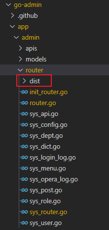
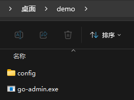
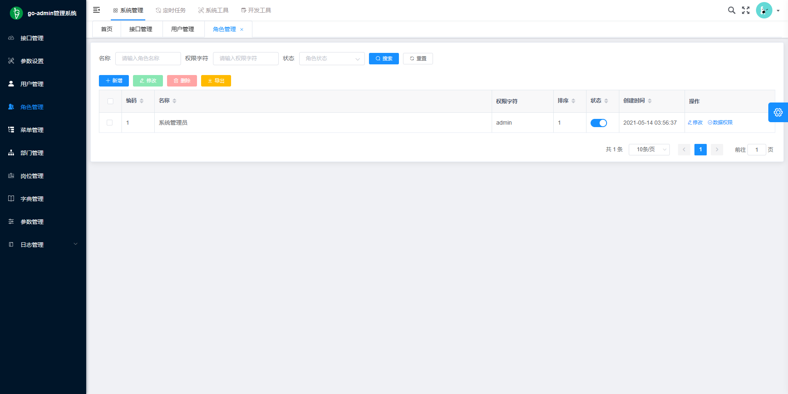

:::tip 摘要
前后分离开发模式现在非常流行，前后端工程师各自开发各端，各不干扰，提高开发效率。但是部署起来特别麻烦。前后端需要各自打包部署。本文介绍将golang前后端分离项目打包成一个可执行文件。
:::
<!-- more -->

## 现状

前后分离开发模式现在非常流行，前后端工程师各自开发各端，各不干扰，提高开发效率。但是部署起来特别麻烦。前后端需要各自打包部署。传统的上线部署方式：前后端各自打包好，配置好数据库、redis等中间件，通过nginx给api、前端资源做反向代理，提供给用户访问。而golang是一门非常方便的开发语言，能把代码打包成一个可执行文件，部署起来非常方便。很显然传统的上线部署方式违背了golang便捷的原则。有没有可能把前后端打包在一起？

## 需求

以go-admin前后端分离项目为例，打包成一个可执行文件。

项目地址：https://github.com/go-admin-team/go-admin

## 环境

| 环境   | 语言和框架      | 版本              |
| ------ | --------------- | ----------------- |
| 后端   | golang、gin     | go 1.18           |
| 前端   | vue、element-ui | node v14.16.0     |
| 数据库 | mysql、sqlite3  | mysql8.0、sqlite3 |

## 实践

### （1）拉取go-admin代码

go-admin版本为go-admin-2.1.1

go-admin-ui版本为go-admin-2.0.9


> 重点注意：两个项目必须放在同一文件夹下；

```sh
# 获取后端代码
git clone https://github.com/go-admin-team/go-admin.git

# 获取前端代码
git clone https://github.com/go-admin-team/go-admin-ui.git
```

### （2）打包前端项目

修改配置文件，配置后端api接口

**注意，注意，注意，VUE_APP_BASE_API跨域问题。**

.env.production

```tex
# just a flag
ENV = 'production'

# base api
VUE_APP_BASE_API = 'http://localhost:8000'
```

```sh
# 进入前端项目目录
cd go-admin-ui

# 安装依赖
npm install

# 建议不要直接使用 cnpm 安装依赖，会有各种诡异的 bug。可以通过如下操作解决 npm 下载速度慢的问题
npm install --registry=https://registry.npm.taobao.org

# 打包
npm run build:prod

# 打包完成后,在go-admin-ui下生成dist目录，这是我们需要的前端文件。
```

### （3）打包后端项目

安装gin-contrib/static

github地址：https://github.com/gin-contrib/static

```sh
go get github.com/gin-contrib/static
```

将前端打包好的dist目录移动到go-admin\app\admin\router下



按理说可以将dist目录放置到go-admin根目录下或其他目录下，但是我没有尝试。

修改路由文件sys_router.go

```go
// 使用go embed嵌入dist
//go:embed  dist
var front embed.FS

func InitSysRouter(r *gin.Engine, authMiddleware *jwt.GinJWTMiddleware) *gin.RouterGroup {
    // 添加以下代码 start
	r.Use(static.Serve("/", static.EmbedFolder(front, "dist")))
	r.NoRoute(func(c *gin.Context) {
		fmt.Printf("%s doesn't exists, redirect on /\n", c.Request.URL.Path)
		c.Redirect(http.StatusMovedPermanently, "/")
	})
    // end
    
	g := r.Group("")
	sysBaseRouter(g)
	// 其他代码略
}
```

打包go-admin，以sqlite3数据库为例，mysql差不多

```sh
# 进入后端项目目录
cd go-admin

# 安装依赖
go mod tidy

# 打包
go build -tags sqlite3

# 打包完成后，生成go-admin.exe
```

### （4）如何测试使用

将go-admin.exe拷贝到其他测试目录，如桌面的demo目录，并拷贝config目录。



```sh
# 初始化
go-admin.exe  migrate -c config/settings.sqlite.yml

# 运行
go-admin.exe  server -c config/settings.sqlite.yml

                                                              ____
                                               ,---,        ,'  , `.  ,--,
              ,---.      ,---,.              ,---.'|     ,-+-,.' _ |,--.'|         ,---,
  ,----._,.  '   ,'\   ,'  .' |              |   | :  ,-+-. ;   , |||  |,      ,-+-. /  |
 /   /  ' / /   /   |,---.'   , ,--.--.      |   | | ,--.'|'   |  ||`--'_     ,--.'|'   |
|   :     |.   ; ,. :|   |    |/       \   ,--.__| ||   |  ,', |  |,,' ,'|   |   |  ,"' |
|   | .\  .'   | |: ::   :  .'.--.  .-. | /   ,'   ||   | /  | |--' '  | |   |   | /  | |
.   ; ';  |'   | .; ::   |.'   \__\/: . ..   '  /  ||   : |  | ,    |  | :   |   | |  | |
'   .   . ||   :    |`---'     ," .--.; |'   ; |:  ||   : |  |/     '  : |__ |   | |  |/
 `---`-'| | \   \  /          /  /  ,.  ||   | '/  '|   | |`-'      |  | '.'||   | |--'
 .'__/\_: |  `----'          ;  :   .'   \   :    :||   ;/          ;  :    ;|   |/
 |   :    :                  |  ,     .-./\   \  /  '---'           |  ,   / '---'
  \   \  /                    `--`---'     `----'                    ---`-'
   `--`-'

欢迎使用 go-admin 2.1.1 可以使用 -h 查看命令

Server run at:
-  Local:   http://localhost:8000/
-  Network: 172.24.80.1://http:8000/
Swagger run at:
-  Local:   http://localhost:8000/swagger/admin/index.html
-  Network: http://172.24.80.1:8000/swagger/admin/index.html
2024-04-25 18:43:02 Enter Control + C Shutdown Server
```




### （5）重点说明

这种方式只适用于中小型web项目，大型项目还是推荐前后端分离部署，方便解耦，更容易排查问题。

其实配置文件和sqlite3数据都可以嵌入可执行文件。但是go-admin需要config下的sql文件初始化数据库，因此需要拷贝config目录到与可执行文件同一目录。其他项目使用gorm，可以直接配置迁移命令，将结构体转化到数据库，就不用sql文件，只需配置文件，若将配置文件也embed到可执行文件更方便，但是不方便将来做迁移。


## 项目推荐

[花落南国北亭凉的博客，我的博客，哈哈](https://www.oby.ink/)

[go-admin后台管理项目](https://github.com/go-admin-team/go-admin)

[nunu快速生成golang项目CLI](https://github.com/go-nunu/nunu)

[nunu：使用 Go 和 Web 技术构建桌面应用程序：支持Vue，React](https://github.com/wailsapp/wails)


## 相关文章

https://zhuanlan.zhihu.com/p/378635694

https://blog.hi917.com/detail/92.html

https://community.aidlux.com/postDetail/727

https://www.jb51.net/article/267543.htm

https://blog.csdn.net/weixin_41601114/article/details/115114577

https://blog.csdn.net/q1009020096/article/details/125267490

https://www.cnblogs.com/lxz123/p/15844156.html

https://www.jianshu.com/p/ba92441e25ba