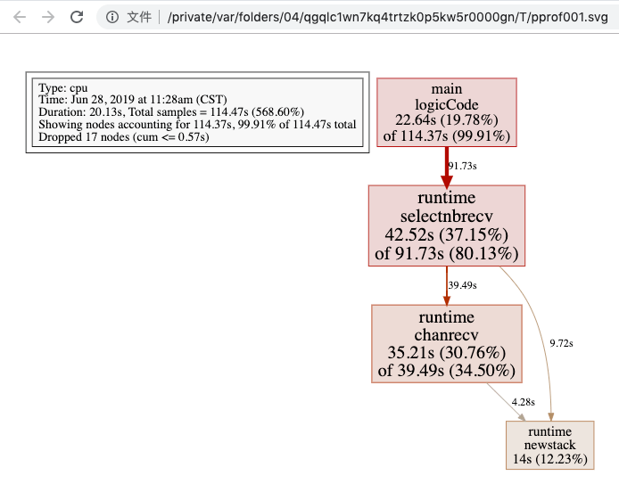

:::tip 摘要
Golang pprof性能优化
:::
<!-- more -->

# Go性能优化

在计算机性能调试领域里，profiling 是指对应用程序的画像，画像就是应用程序使用 CPU 和内存的情况。 Go语言是一个对性能特别看重的语言，因此语言中自带了 profiling 的库，这篇文章就要讲解怎么在 golang 中做 profiling。

Go语言项目中的性能优化主要有以下几个方面：

- CPU profile：报告程序的 CPU 使用情况，按照一定频率去采集应用程序在 CPU 和寄存器上面的数据
- Memory Profile（Heap Profile）：报告程序的内存使用情况
- Block Profiling：报告 goroutines 不在运行状态的情况，可以用来分析和查找死锁等性能瓶颈
- Goroutine Profiling：报告 goroutines 的使用情况，有哪些 goroutine，它们的调用关系是怎样的

## 1. 采集性能数据

Go语言内置了获取程序的运行数据的工具，包括以下两个标准库：

- `runtime/pprof`：采集工具型应用运行数据进行分析
- `net/http/pprof`：采集服务型应用运行时数据进行分析

pprof开启后，每隔一段时间（10ms）就会收集下当前的堆栈信息，获取各个函数占用的CPU以及内存资源；最后通过对这些采样数据进行分析，形成一个性能分析报告。

**注意，我们只应该在性能测试的时候才在代码中引入pprof。**

### 1.1 工具型应用

如果你的应用程序是运行一段时间就结束退出类型。那么最好的办法是在应用退出的时候把 profiling 的报告保存到文件中，进行分析。对于这种情况，可以使用`runtime/pprof`库。 首先在代码中导入`runtime/pprof`工具：

```go
import "runtime/pprof"
```

#### CPU性能分析

开启CPU性能分析：

```go
pprof.StartCPUProfile(w io.Writer)
```

停止CPU性能分析：

```go
pprof.StopCPUProfile()
```

应用执行结束后，就会生成一个文件，保存了我们的 CPU profiling 数据。得到采样数据之后，使用go tool pprof工具进行CPU性能分析。

#### 内存性能优化

记录程序的堆栈信息

```go
pprof.WriteHeapProfile(w io.Writer)
```

得到采样数据之后，使用`go tool pprof`工具进行内存性能分析。

`go tool pprof`默认是使用`-inuse_space`进行统计，还可以使用`-inuse-objects`查看分配对象的数量。


### 1.2 服务型应用

如果你的应用程序是一直运行的，比如 web 应用，那么可以使用`net/http/pprof`库，它能够在提供 HTTP 服务进行分析。

如果使用了默认的`http.DefaultServeMux`（通常是代码直接使用 http.ListenAndServe(“0.0.0.0:8000”, nil)），只需要在你的web server端代码中按如下方式导入`net/http/pprof`

```go
import _ "net/http/pprof"
```

如果你使用自定义的 Mux，则需要手动注册一些路由规则：

```如果你使用自定义的 Mux，则需要手动注册一些路由规则：
r.HandleFunc("/debug/pprof/", pprof.Index)
r.HandleFunc("/debug/pprof/cmdline", pprof.Cmdline)
r.HandleFunc("/debug/pprof/profile", pprof.Profile)
r.HandleFunc("/debug/pprof/symbol", pprof.Symbol)
r.HandleFunc("/debug/pprof/trace", pprof.Trace)
```

如果你使用的是gin框架，那么推荐使用github.com/gin-contrib/pprof，在代码中通过以下命令注册pprof相关路由。

```go
	r := gin.New()
	// 设置pprof性能优化
	pprof.Register(r)
	// 修改pprof路由前缀，默认为"debug/pprof"
	// pprof.Register(r, "dev/pprof")
```

不管哪种方式，你的 HTTP 服务都会多出/debug/pprof endpoint，访问它会得到类似下面的内容：

http://localhost:8080/debug/pprof/


- allocs：过去所有内存分配的采样
- block： 同步基元阻塞的堆栈跟踪
- cmdline： 当前程序的命令行调用
- goroutine： 当前所有 goroutine 的堆栈跟踪。使用 debug=2 作为查询参数，以与未恢复的 panic 相同的格式导出。
- heap：实时对象的内存分配采样。可以指定 gc GET 参数，以便在采集堆样本前运行 GC。
- mutex： 有争议的互斥项持有者的堆栈跟踪
- profile：CPU画像。您可以在秒 GET 参数中指定持续时间。获取配置文件后，使用 go tool pprof 命令检查配置文件。
- threadcreate： 创建新操作系统线程的堆栈跟踪
- trace： 当前程序的执行跟踪。您可以在秒 GET 参数中指定持续时间。获取跟踪文件后，使用 go tool trace 命令对跟踪进行调查。


http://localhost:8080/debug/pprof/这个路径下还有几个子页面：

- /debug/pprof/profile：访问这个链接会自动进行 CPU profiling，持续 30s，并生成一个文件供下载
- /debug/pprof/heap： Memory Profiling 的路径，访问这个链接会得到一个内存 Profiling 结果的文件
- /debug/pprof/block：block Profiling 的路径
- /debug/pprof/goroutines：运行的 goroutines 列表，以及调用关系


## 2. go tool pprof分析性能数据

### 命令行

不管是工具型应用还是服务型应用，我们使用相应的pprof库获取数据之后，下一步的都要对这些数据进行分析，我们可以使用`go tool pprof`命令行工具。

`go tool pprof`最简单的使用方式为:

```bash
go tool pprof [binary] [source]
```

其中：

- binary 是应用的二进制文件，用来解析各种符号；
- source 表示 profile 数据的来源，可以是本地的文件，也可以是 http 地址。

**注意事项：** 获取的 Profiling 数据是动态的，要想获得有效的数据，请保证应用处于较大的负载（比如正在生成中运行的服务，或者通过其他工具模拟访问压力）。否则如果应用处于空闲状态，得到的结果可能没有任何意义。

```sh
go tool pprof cpu.pprof
go tool pprof http://localhost:8080/debug/pprof/heap
```

例1：

```sh
$ go tool pprof http://localhost:8080/debug/pprof/heap
Fetching profile over HTTP from http://localhost:8080/debug/pprof/heap
Saved profile in C:\Users\OBY\pprof\pprof.gin-web.exe.alloc_objects.alloc_space.inuse_objects.inuse_space.002.pb.gz
File: gin-web.exe
Build ID: C:\Users\OBY\AppData\Local\Temp\go-build4106749456\b001\exe\gin-web.exe2024-07-08 09:24:44.6477509 +0800 CST
Type: inuse_space
Time: Jul 8, 2024 at 10:19am (CST)
Entering interactive mode (type "help" for commands, "o" for options)
(pprof)
(pprof) help
  Commands:
    callgrind        Outputs a graph in callgrind format
    comments         Output all profile comments
    disasm           Output assembly listings annotated with samples
    dot              Outputs a graph in DOT format
    eog              Visualize graph through eog
    evince           Visualize graph through evince
    gif              Outputs a graph image in GIF format
    gv               Visualize graph through gv
    kcachegrind      Visualize report in KCachegrind
    list             Output annotated source for functions matching regexp
    pdf              Outputs a graph in PDF format
    peek             Output callers/callees of functions matching regexp
    png              Outputs a graph image in PNG format
    proto            Outputs the profile in compressed protobuf format
    ps               Outputs a graph in PS format
    raw              Outputs a text representation of the raw profile
    svg              Outputs a graph in SVG format
    tags             Outputs all tags in the profile
    text             Outputs top entries in text form
    top              Outputs top entries in text form
    topproto         Outputs top entries in compressed protobuf format
    traces           Outputs all profile samples in text form
    tree             Outputs a text rendering of call graph
    web              Visualize graph through web browser
    weblist          Display annotated source in a web browser
    o/options        List options and their current values
    q/quit/exit/^D   Exit pprof

  Options:
    call_tree        Create a context-sensitive call tree
    compact_labels   Show minimal headers
    divide_by        Ratio to divide all samples before visualization
    drop_negative    Ignore negative differences
    edgefraction     Hide edges below <f>*total
    focus            Restricts to samples going through a node matching regexp
    hide             Skips nodes matching regexp
    ignore           Skips paths going through any nodes matching regexp
    intel_syntax     Show assembly in Intel syntax
    mean             Average sample value over first value (count)
    nodecount        Max number of nodes to show
    nodefraction     Hide nodes below <f>*total
    noinlines        Ignore inlines.
    normalize        Scales profile based on the base profile.
    output           Output filename for file-based outputs
    prune_from       Drops any functions below the matched frame.
    relative_percentages Show percentages relative to focused subgraph
    sample_index     Sample value to report (0-based index or name)
    show             Only show nodes matching regexp
    show_from        Drops functions above the highest matched frame.
    source_path      Search path for source files
    tagfocus         Restricts to samples with tags in range or matched by regexp
    taghide          Skip tags matching this regexp
    tagignore        Discard samples with tags in range or matched by regexp
    tagleaf          Adds pseudo stack frames for labels key/value pairs at the callstack leaf.
    tagroot          Adds pseudo stack frames for labels key/value pairs at the callstack root.
    tagshow          Only consider tags matching this regexp
    trim             Honor nodefraction/edgefraction/nodecount defaults
    trim_path        Path to trim from source paths before search
    unit             Measurement units to display

  Option groups (only set one per group):
    granularity
      functions        Aggregate at the function level.
      filefunctions    Aggregate at the function level.
      files            Aggregate at the file level.
      lines            Aggregate at the source code line level.
      addresses        Aggregate at the address level.
    sort
      cum              Sort entries based on cumulative weight
      flat             Sort entries based on own weight
  :   Clear focus/ignore/hide/tagfocus/tagignore

  type "help <cmd|option>" for more information
(pprof)
```

例2：

```bash
go tool pprof cpu.pprof
```

执行上面的代码会进入交互界面如下：

```bash
runtime_pprof $ go tool pprof cpu.pprof
Type: cpu
Time: Jun 28, 2019 at 11:28am (CST)
Duration: 20.13s, Total samples = 1.91mins (568.60%)
Entering interactive mode (type "help" for commands, "o" for options)
(pprof)  
```

我们可以在交互界面输入`top3`来查看程序中占用CPU前3位的函数：

```bash
(pprof) top3
Showing nodes accounting for 100.37s, 87.68% of 114.47s total
Dropped 17 nodes (cum <= 0.57s)
Showing top 3 nodes out of 4
      flat  flat%   sum%        cum   cum%
    42.52s 37.15% 37.15%     91.73s 80.13%  runtime.selectnbrecv
    35.21s 30.76% 67.90%     39.49s 34.50%  runtime.chanrecv
    22.64s 19.78% 87.68%    114.37s 99.91%  main.logicCode
```

其中：

- flat：当前函数占用CPU的耗时
- flat：:当前函数占用CPU的耗时百分比
- sun%：函数占用CPU的耗时累计百分比
- cum：当前函数加上调用当前函数的函数占用CPU的总耗时
- cum%：当前函数加上调用当前函数的函数占用CPU的总耗时百分比
- 最后一列：函数名称

在大多数的情况下，我们可以通过分析这五列得出一个应用程序的运行情况，并对程序进行优化。

我们还可以使用`list 函数名`命令查看具体的函数分析，例如执行`list logicCode`查看我们编写的函数的详细分析。

```bash
(pprof) list logicCode
Total: 1.91mins
ROUTINE ================ main.logicCode in .../runtime_pprof/main.go
    22.64s   1.91mins (flat, cum) 99.91% of Total
         .          .     12:func logicCode() {
         .          .     13:   var c chan int
         .          .     14:   for {
         .          .     15:           select {
         .          .     16:           case v := <-c:
    22.64s   1.91mins     17:                   fmt.Printf("recv from chan, value:%v\n", v)
         .          .     18:           default:
         .          .     19:
         .          .     20:           }
         .          .     21:   }
         .          .     22:}
```

通过分析发现大部分CPU资源被17行占用，我们分析出select语句中的default没有内容会导致上面的`case v:=<-c:`一直执行。我们在default分支添加一行`time.Sleep(time.Second)`即可。


### 图形化

#### web

或者可以直接输入web，通过svg图的方式查看程序中详细的CPU占用情况。 想要查看图形化的界面首先需要安装[graphviz](https://graphviz.gitlab.io/)图形化工具。

Windows: 下载[graphviz](https://graphviz.gitlab.io/_pages/Download/Download_windows.html) 将`graphviz`安装目录下的bin文件夹添加到Path环境变量中。 在终端输入`dot -version`查看是否安装成功。

```sh
# go tool pprof http://localhost:8080/debug/pprof/profile
(pprof)
(pprof) web
(pprof)
```



关于图形的说明： 每个框代表一个函数，理论上框的越大表示占用的CPU资源越多。 方框之间的线条代表函数之间的调用关系。 线条上的数字表示函数调用的次数。 方框中的第一行数字表示当前函数占用CPU的百分比，第二行数字表示当前函数累计占用CPU的百分比。

除了分析CPU性能数据，pprof也支持分析内存性能数据。比如，使用下面的命令分析http服务的heap性能数据，查看当前程序的内存占用以及热点内存对象使用的情况。

```bash
# 查看内存占用数据
go tool pprof -inuse_space http://127.0.0.1:8080/debug/pprof/heap
go tool pprof -inuse_objects http://127.0.0.1:8080/debug/pprof/heap
# 查看临时内存分配数据
go tool pprof -alloc_space http://127.0.0.1:8080/debug/pprof/heap
go tool pprof -alloc_objects http://127.0.0.1:8080/debug/pprof/heap
```


#### 火焰图

压测

```sh
go-wrk -t=8 -n=1000 "http://localhost:8080/api/v1/test"
```

执行命令，生成.pb.gz文件

```sh
# go tool pprof http://localhost:8080/debug/pprof/heap
Fetching profile over HTTP from http://localhost:8080/debug/pprof/heap
Saved profile in C:\Users\OBY\pprof\pprof.gin-web.exe.alloc_objects.alloc_space.inuse_objects.inuse_space.003.pb.gz
File: gin-web.exe
Build ID: C:\Users\OBY\AppData\Local\Temp\go-build4106749456\b001\exe\gin-web.exe2024-07-08 09:24:44.6477509 +0800 CST
Type: inuse_space
Time: Jul 8, 2024 at 11:58am (CST)
Entering interactive mode (type "help" for commands, "o" for options)
(pprof)
```

启动服务，生成火焰图

```sh
go tool pprof -http=:8081  C:\Users\OBY\pprof\pprof.gin-web.exe.alloc_objects.alloc_space.inuse_objects.inuse_space.003.pb.gz
```


