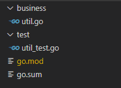
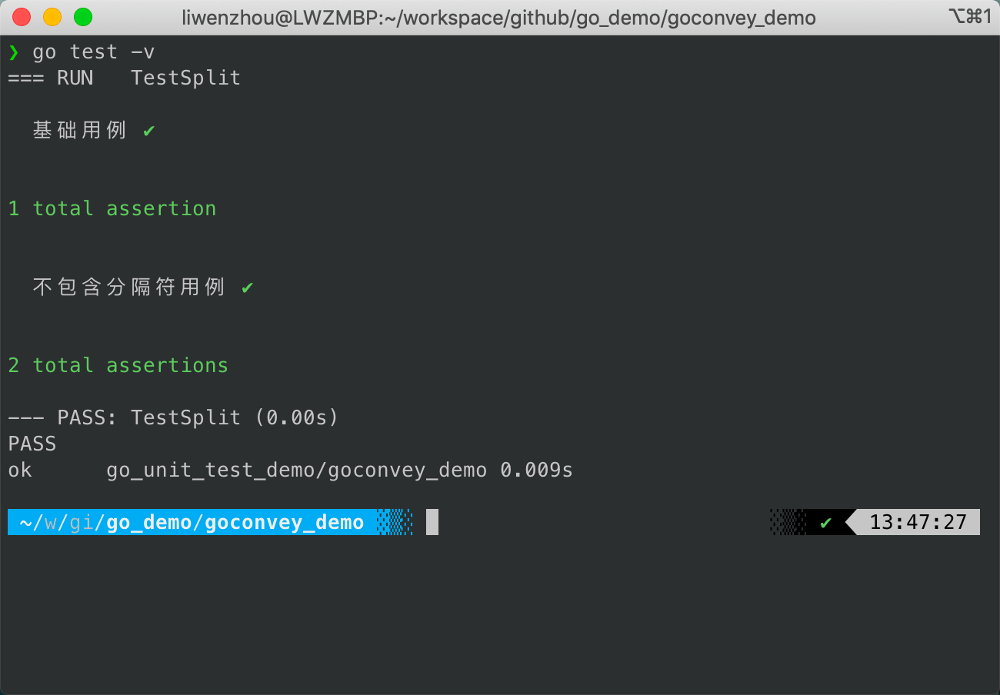
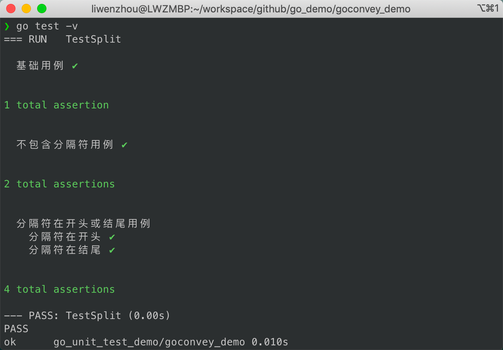
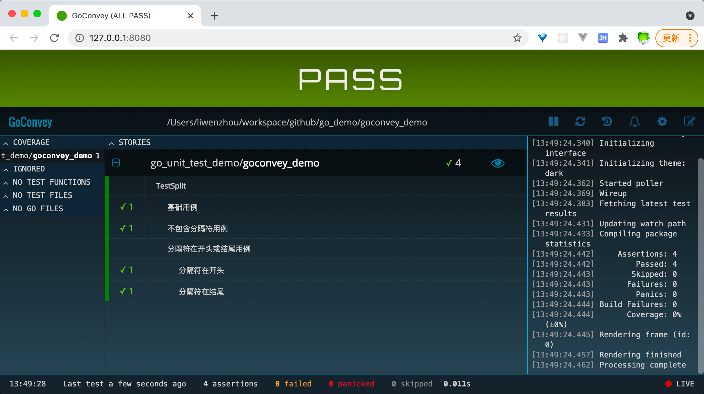

:::tip 摘要
golang单元测试
:::
<!-- more -->


## 一、单元测试

### go test工具

Go语言中的测试依赖`go test`命令。编写测试代码和编写普通的Go代码过程是类似的，并不需要学习新的语法、规则或工具。

go test命令是一个按照一定约定和组织的测试代码的驱动程序。在包目录内，所有以`_test.go`为后缀名的源代码文件都是`go test`测试的一部分，不会被`go build`编译到最终的可执行文件中。

在`*_test.go`文件中有三种类型的函数，单元测试函数、基准测试函数和示例函数。

|   类型   |         格式          |              作用              |
| :------: | :-------------------: | :----------------------------: |
| 测试函数 |   函数名前缀为Test    | 测试程序的一些逻辑行为是否正确 |
| 基准函数 | 函数名前缀为Benchmark |         测试函数的性能         |
| 示例函数 |  函数名前缀为Example  |       为文档提供示例文档       |

`go test`命令会遍历所有的`*_test.go`文件中符合上述命名规则的函数，然后生成一个临时的main包用于调用相应的测试函数，然后构建并运行、报告测试结果，最后清理测试中生成的临时文件。

说明：

t.Run：子测试，多组数据测试


示例



业务

business\util.go

```go
package business

func Add(a int, b int) int {
	return a + b
}
```

测试

test\util_test.go

```go
package test

import (
	"reflect"
	"testdemo/business"
	"testing"
)

func TestAdd(t *testing.T) {
	if testing.Short() {
		t.Skip("skip this test case")
	}

	// target func and expected
	got := business.Add(1, 2)
	want := 3

	if !reflect.DeepEqual(want, got) {
		t.Errorf("expected:%v, got:%v", want, got)
	}
}

func TestAdd2(t *testing.T) {
	// parallel test 并行测试
	t.Parallel()
	if testing.Short() {
		t.Skip("skip this test case")
	}

	// case list
	type args struct {
		a, b int
	}
	type want struct {
		w int
	}
	testCases := []struct {
		name string // case name
		args args   // case args
		want want   // case want
	}{
		{
			"tc1",
			args{
				1,
				2,
			},
			want{
				3,
			},
		},
		{"tc1", args{1, 2}, want{3}},
		{"tc1", args{1, 2}, want{3}},
	}

	for _, tc := range testCases {
		t.Run(tc.name, func(t *testing.T) {
			// target func
			got := business.Add(tc.args.a, tc.args.b)

			t.Logf("got: %v ", got)

			if !reflect.DeepEqual(tc.want.w, got) {
				t.Errorf("expected:%v, got:%v", tc.want.w, got)
			}
		})
	}
}

```

在test目录下执行命令

```sh
# 默认执行当前目录下所有测试文件测试方法
$ go test
PASS
ok      testdemo/test   0.130s

# 打印详细过程
$ go test -v
=== RUN   TestAdd
--- PASS: TestAdd (0.00s)
=== RUN   TestAdd2
=== PAUSE TestAdd2
=== CONT  TestAdd2
=== RUN   TestAdd2/tc1
    util_test.go:61: got: 3
=== RUN   TestAdd2/tc1#01
    util_test.go:61: got: 3
=== RUN   TestAdd2/tc1#02
    util_test.go:61: got: 3
--- PASS: TestAdd2 (0.00s)
    --- PASS: TestAdd2/tc1 (0.00s)
    --- PASS: TestAdd2/tc1#01 (0.00s)
    --- PASS: TestAdd2/tc1#02 (0.00s)
PASS
ok      testdemo/test   0.125s

# 只执行某一个测试方法
$ go test -v -run TestAdd
=== RUN   TestAdd
--- PASS: TestAdd (0.00s)
=== RUN   TestAdd2
=== PAUSE TestAdd2
=== CONT  TestAdd2
=== RUN   TestAdd2/tc1
    util_test.go:61: got: 3
=== RUN   TestAdd2/tc1#01
    util_test.go:61: got: 3
=== RUN   TestAdd2/tc1#02
    util_test.go:61: got: 3
--- PASS: TestAdd2 (0.00s)
    --- PASS: TestAdd2/tc1 (0.00s)
    --- PASS: TestAdd2/tc1#01 (0.00s)
    --- PASS: TestAdd2/tc1#02 (0.00s)
PASS
ok      testdemo/test   0.123s

# 根据testing.Short()标志，使用-short参数跳过测试
$ go test -v -short
=== RUN   TestAdd
--- PASS: TestAdd (0.00s)
=== RUN   TestAdd2
=== PAUSE TestAdd2
=== CONT  TestAdd2
    util_test.go:23: skip this test case
--- SKIP: TestAdd2 (0.00s)
PASS
ok      testdemo/test   0.136s
```

### 测试覆盖率

测试覆盖率是指代码被测试套件覆盖的百分比。通常我们使用的都是语句的覆盖率，也就是在测试中至少被运行一次的代码占总代码的比例。在公司内部一般会要求测试覆盖率达到80%左右。

Go提供内置功能来检查你的代码覆盖率，即使用go test -cover来查看测试覆盖率。

```sh
# 查看测试覆盖率
go test -cover

# 将覆盖率相关的记录信息输出到一个文件，并将打开本地浏览器并生成HTML报告
# 用绿色标记的语句块表示被覆盖了，而红色的表示没有被覆盖
go test -cover -coverprofile=c.out
go tool cover -html=c.out
```


### testify/assert单元测试包

testify是一个社区非常流行的Go单元测试工具包，其中使用最多的功能就是它提供的断言工具。

```sh
go get github.com/stretchr/testify
```

使用

```go
func TestSomething(t *testing.T) {
  assert := assert.New(t)

  // assert equality
  assert.Equal(123, 123, "they should be equal")

  // assert inequality
  assert.NotEqual(123, 456, "they should not be equal")

  // assert for nil (good for errors)
  assert.Nil(object)

  // assert for not nil (good when you expect something)
  if assert.NotNil(object) {

    // now we know that object isn't nil, we are safe to make
    // further assertions without causing any errors
    assert.Equal("Something", object.Value)
  }
}
```


## 二、网络测试

### httptest

在Web开发场景下的单元测试，如果涉及到HTTP请求推荐大家使用Go标准库 net/http/httptest 进行测试，能够显著提高测试效率。

business\http_demo.go

```go
package business

import (
	"fmt"
	"net/http"

	"github.com/gin-gonic/gin"
)

// Param 请求参数
type Param struct {
	Name string `json:"name"`
}

// helloHandler /hello请求处理函数
func helloHandler(c *gin.Context) {
	var p Param
	if err := c.ShouldBindJSON(&p); err != nil {
		c.JSON(http.StatusOK, gin.H{
			"msg": "we need a name",
		})
		return
	}
	c.JSON(http.StatusOK, gin.H{
		"msg": fmt.Sprintf("hello %s", p.Name),
	})
}

// SetupRouter 路由
func SetupRouter() *gin.Engine {
	router := gin.Default()
	router.POST("/hello", helloHandler)
	return router
}

```

test\http_test.go

```go
package test

import (
	"encoding/json"
	"net/http"
	"net/http/httptest"
	"strings"
	"testdemo/business"
	"testing"

	"github.com/stretchr/testify/assert"
)

func Test_helloHandler(t *testing.T) {
	// 定义两个测试用例
	tests := []struct {
		name   string
		param  string
		expect string
	}{
		{"base case", `{"name": "liwenzhou"}`, "hello liwenzhou"},
		{"bad case", "", "we need a name"},
	}

	r := business.SetupRouter()

	for _, tt := range tests {
		t.Run(tt.name, func(t *testing.T) {
			// mock一个HTTP请求
			req := httptest.NewRequest(
				"POST",                      // 请求方法
				"/hello",                    // 请求URL
				strings.NewReader(tt.param), // 请求参数
			)

			// mock一个响应记录器
			w := httptest.NewRecorder()

			// 让server端处理mock请求并记录返回的响应内容
			r.ServeHTTP(w, req)

			// 校验状态码是否符合预期
			assert.Equal(t, http.StatusOK, w.Code)

			// 解析并检验响应内容是否复合预期
			var resp map[string]string
			err := json.Unmarshal([]byte(w.Body.String()), &resp)
			assert.Nil(t, err)
			assert.Equal(t, tt.expect, resp["msg"])
		})
	}
}

```

```sh
$ go test -v -run  Test_helloHandler
=== RUN   Test_helloHandler
[GIN-debug] [WARNING] Creating an Engine instance with the Logger and Recovery middleware already attached.

[GIN-debug] [WARNING] Running in "debug" mode. Switch to "release" mode in production.
 - using env:   export GIN_MODE=release
 - using code:  gin.SetMode(gin.ReleaseMode)

[GIN-debug] POST   /hello                    --> testdemo/business.helloHandler (3 handlers)
=== RUN   Test_helloHandler/base_case
[GIN] 2024/06/09 - 13:49:02 | 200 |       515.4µs |       192.0.2.1 | POST     "/hello"
=== RUN   Test_helloHandler/bad_case
[GIN] 2024/06/09 - 13:49:02 | 200 |            0s |       192.0.2.1 | POST     "/hello"
--- PASS: Test_helloHandler (0.01s)
    --- PASS: Test_helloHandler/base_case (0.01s)
    --- PASS: Test_helloHandler/bad_case (0.00s)
PASS
ok      testdemo/test   0.235s
```


### gock

如果不想在测试过程中真正去发送请求或者依赖的外部接口还没有开发完成时，我们可以在单元测试中对依赖的API进行mock。

安装

```sh
go get -u gopkg.in/h2non/gock.v1
```

例

有以下业务逻辑代码，依赖外部API：`http://your-api.com/post`提供的数据。

```go
// api.go

// ReqParam API请求参数
type ReqParam struct {
	X int `json:"x"`
}

// Result API返回结果
type Result struct {
	Value int `json:"value"`
}

func GetResultByAPI(x, y int) int {
	p := &ReqParam{X: x}
	b, _ := json.Marshal(p)

	// 调用其他服务的API
	resp, err := http.Post(
		"http://your-api.com/post",
		"application/json",
		bytes.NewBuffer(b),
	)
	if err != nil {
		return -1
	}
	body, _ := ioutil.ReadAll(resp.Body)
	var ret Result
	if err := json.Unmarshal(body, &ret); err != nil {
		return -1
	}
	// 这里是对API返回的数据做一些逻辑处理
	return ret.Value + y
}

```

在对类似上述这类业务代码编写单元测试的时候，如果不想在测试过程中真正去发送请求或者依赖的外部接口还没有开发完成时，我们可以在单元测试中对依赖的API进行mock。

使用gock对外部API进行mock，即mock指定参数返回约定好的响应内容。 下面的代码中mock了两组数据，组成了两个

测试用例。

```go
// api_test.go
package gock_demo

import (
	"testing"

	"github.com/stretchr/testify/assert"
	"gopkg.in/h2non/gock.v1"
)

func TestGetResultByAPI(t *testing.T) {
	defer gock.Off() // 测试执行后刷新挂起的mock

	// mock 请求外部api时传参x=1返回100
	gock.New("http://your-api.com").
		Post("/post").
		MatchType("json").
		JSON(map[string]int{"x": 1}).
		Reply(200).
		JSON(map[string]int{"value": 100})

	// 调用我们的业务函数
	res := GetResultByAPI(1, 1)
	// 校验返回结果是否符合预期
	assert.Equal(t, res, 101)

	// mock 请求外部api时传参x=2返回200
	gock.New("http://your-api.com").
		Post("/post").
		MatchType("json").
		JSON(map[string]int{"x": 2}).
		Reply(200).
		JSON(map[string]int{"value": 200})

	// 调用我们的业务函数
	res = GetResultByAPI(2, 2)
	// 校验返回结果是否符合预期
	assert.Equal(t, res, 202)

	assert.True(t, gock.IsDone()) // 断言mock被触发
}

```

```sh
go test -v
```


## 三、MySQL和Redis测试

### go-sqlmock

[sqlmock](https://github.com/DATA-DOG/go-sqlmock) 是一个实现 `sql/driver` 的mock库。它不需要建立真正的数据库连接就可以在测试中模拟任何 sql 驱动程序的行为。使用它可以很方便的在编写单元测试的时候mock sql语句的执行结果。

**安装**

```sh
go get github.com/DATA-DOG/go-sqlmock
```

**使用示例**

这里使用的是`go-sqlmock`官方文档中提供的基础示例代码。 在下面的代码中，我们实现了一个`recordStats`函数用来记录用户浏览商品时产生的相关数据。具体实现的功能是在一个事务中进行以下两次SQL操作：

- 在`products`表中将当前商品的浏览次数+1
- 在`product_viewers`表中记录浏览当前商品的用户id

```go
// app.go
package main

import "database/sql"

// recordStats 记录用户浏览产品信息
func recordStats(db *sql.DB, userID, productID int64) (err error) {
	// 开启事务
	// 操作views和product_viewers两张表
	tx, err := db.Begin()
	if err != nil {
		return
	}

	defer func() {
		switch err {
		case nil:
			err = tx.Commit()
		default:
			tx.Rollback()
		}
	}()

	// 更新products表
	if _, err = tx.Exec("UPDATE products SET views = views + 1"); err != nil {
		return
	}
	// product_viewers表中插入一条数据
	if _, err = tx.Exec(
		"INSERT INTO product_viewers (user_id, product_id) VALUES (?, ?)",
		userID, productID); err != nil {
		return
	}
	return
}

func main() {
	// 注意：测试的过程中并不需要真正的连接
	db, err := sql.Open("mysql", "root@/blog")
	if err != nil {
		panic(err)
	}
	defer db.Close()
	// userID为1的用户浏览了productID为5的产品
	if err = recordStats(db, 1 /*some user id*/, 5 /*some product id*/); err != nil {
		panic(err)
	}
}

```

现在我们需要为代码中的`recordStats`函数编写单元测试，但是又不想在测试过程中连接真实的数据库进行测试。这个时候我们就可以像下面示例代码中那样使用`sqlmock`工具去mock数据库操作。

```go
package main

import (
	"fmt"
	"testing"

	"github.com/DATA-DOG/go-sqlmock"
)

// TestShouldUpdateStats sql执行成功的测试用例
func TestShouldUpdateStats(t *testing.T) {
	// mock一个*sql.DB对象，不需要连接真实的数据库
	db, mock, err := sqlmock.New()
	if err != nil {
		t.Fatalf("an error '%s' was not expected when opening a stub database connection", err)
	}
	defer db.Close()

	// mock执行指定SQL语句时的返回结果
	mock.ExpectBegin()
	mock.ExpectExec("UPDATE products").WillReturnResult(sqlmock.NewResult(1, 1))
	mock.ExpectExec("INSERT INTO product_viewers").WithArgs(2, 3).WillReturnResult(sqlmock.NewResult(1, 1))
	mock.ExpectCommit()

	// 将mock的DB对象传入我们的函数中
	if err = recordStats(db, 2, 3); err != nil {
		t.Errorf("error was not expected while updating stats: %s", err)
	}

	// 确保期望的结果都满足
	if err := mock.ExpectationsWereMet(); err != nil {
		t.Errorf("there were unfulfilled expectations: %s", err)
	}
}

// TestShouldRollbackStatUpdatesOnFailure sql执行失败回滚的测试用例
func TestShouldRollbackStatUpdatesOnFailure(t *testing.T) {
	db, mock, err := sqlmock.New()
	if err != nil {
		t.Fatalf("an error '%s' was not expected when opening a stub database connection", err)
	}
	defer db.Close()

	mock.ExpectBegin()
	mock.ExpectExec("UPDATE products").WillReturnResult(sqlmock.NewResult(1, 1))
	mock.ExpectExec("INSERT INTO product_viewers").
		WithArgs(2, 3).
		WillReturnError(fmt.Errorf("some error"))
	mock.ExpectRollback()

	// now we execute our method
	if err = recordStats(db, 2, 3); err == nil {
		t.Errorf("was expecting an error, but there was none")
	}

	// we make sure that all expectations were met
	if err := mock.ExpectationsWereMet(); err != nil {
		t.Errorf("there were unfulfilled expectations: %s", err)
	}
}

```

上面的代码中，定义了一个执行成功的测试用例和一个执行失败回滚的测试用例，确保我们代码中的每个逻辑分支都能被测试到，提高单元测试覆盖率的同时也保证了代码的健壮性。

```sh
go test -v
```


### miniredis

[miniredis](https://github.com/alicebob/miniredis)是一个纯go实现的用于单元测试的redis server。它是一个简单易用的、基于内存的redis替代品，它具有真正的TCP接口，你可以把它当成是redis版本的`net/http/httptest`。当我们为一些包含Redis操作的代码编写单元测试时就可以使用它来mock Redis操作。

**安装**

```sh
go get github.com/alicebob/miniredis/v2
```

**使用示例**

这里以github.com/go-redis/redis库为例，编写了一个包含若干Redis操作的DoSomethingWithRedis函数。

```go
// redis_op.go
package miniredis_demo

import (
	"context"
	"github.com/go-redis/redis/v8" // 注意导入版本
	"strings"
	"time"
)

const (
	KeyValidWebsite = "app:valid:website:list"
)

func DoSomethingWithRedis(rdb *redis.Client, key string) bool {
	// 这里可以是对redis操作的一些逻辑
	ctx := context.TODO()
	if !rdb.SIsMember(ctx, KeyValidWebsite, key).Val() {
		return false
	}
	val, err := rdb.Get(ctx, key).Result()
	if err != nil {
		return false
	}
	if !strings.HasPrefix(val, "https://") {
		val = "https://" + val
	}
	// 设置 blog key 五秒过期
	if err := rdb.Set(ctx, "blog", val, 5*time.Second).Err(); err != nil {
		return false
	}
	return true
}

```

下面的代码是我使用`miniredis`库为`DoSomethingWithRedis`函数编写的单元测试代码，其中`miniredis`不仅支持mock常用的Redis操作，还提供了很多实用的帮助函数，例如检查key的值是否与预期相等的`s.CheckGet()`和帮助检查key过期时间的`s.FastForward()`。

```go
// redis_op_test.go

package miniredis_demo

import (
	"github.com/alicebob/miniredis/v2"
	"github.com/go-redis/redis/v8"
	"testing"
	"time"
)

func TestDoSomethingWithRedis(t *testing.T) {
	// mock一个redis server
	s, err := miniredis.Run()
	if err != nil {
		panic(err)
	}
	defer s.Close()

	// 准备数据
	s.Set("q1mi", "liwenzhou.com")
	s.SAdd(KeyValidWebsite, "q1mi")

	// 连接mock的redis server
	rdb := redis.NewClient(&redis.Options{
		Addr: s.Addr(), // mock redis server的地址
	})

	// 调用函数
	ok := DoSomethingWithRedis(rdb, "q1mi")
	if !ok {
		t.Fatal()
	}

	// 可以手动检查redis中的值是否复合预期
	if got, err := s.Get("blog"); err != nil || got != "https://liwenzhou.com" {
		t.Fatalf("'blog' has the wrong value")
	}
	// 也可以使用帮助工具检查
	s.CheckGet(t, "blog", "https://liwenzhou.com")

	// 过期检查
	s.FastForward(5 * time.Second) // 快进5秒
	if s.Exists("blog") {
		t.Fatal("'blog' should not have existed anymore")
	}
}

```

```sh
go test -v
```


## 四、使用gomock和gostub工具mock接口和打桩

### gomock

gomock 是 Go 编程语言的模拟框架。它 与 Go 的内置包很好地集成，但可以在其他 上下文也是如此。testing这个项目起源于谷歌的仓库。不幸的是，谷歌不再维护golang/mock这个项目，并且考虑到 Gomock 项目的大量使用 在 Uber 内部，我们决定在 Uber 中分叉并维护这一点。

#### **支持的 Go 版本**

go.uber.org/mock 支持官方 Go 发布政策支持的所有 Go 版本。那是 Go 的两个最新版本。


#### **安装**

```sh
go install go.uber.org/mock/mockgen@latest
mockgen -version
```


#### mockgen模式

`mockgen`有两种操作模式：源和反射。

**源模式**

源模式从源文件生成模拟接口。 它是使用 -source 标志启用的。其他标志 在此模式下可能有用的是 -imports 和 -aux_files。

例：

```
mockgen -source=foo.go [other options]
```

**反射模式**

反射模式通过构建程序生成模拟接口 它使用反射来理解接口。它已启用 通过传递两个非标志参数：导入路径和 以逗号分隔的符号列表。

您可以使用“.”来引用当前路径的包。

例：

```
mockgen database/sql/driver Conn,Driver

# Convenient for `go:generate`.
mockgen . Conn,Driver
```


#### flags

`mockgen` 命令用来为给定一个包含要mock的接口的Go源文件，生成mock类源代码。它支持以下标志：

- `-source`：包含要mock的接口的文件。
- `-destination`：生成的源代码写入的文件。如果不设置此项，代码将打印到标准输出。
- `-package`：用于生成的模拟类源代码的包名。如果不设置此项包名默认在原包名前添加`mock_`前缀。
- `-imports`：在生成的源代码中使用的显式导入列表。值为foo=bar/baz形式的逗号分隔的元素列表，其中bar/baz是要导入的包，foo是要在生成的源代码中用于包的标识符。
- `-aux_files`：需要参考以解决的附加文件列表，例如在不同文件中定义的嵌入式接口。指定的值应为foo=bar/baz.go形式的以逗号分隔的元素列表，其中bar/baz.go是源文件，foo是`-source`文件使用的文件的包名。
- `-build_flags`：（仅反射模式）一字不差地传递标志给go build
- `-mock_names`：生成的模拟的自定义名称列表。这被指定为一个逗号分隔的元素列表，形式为`Repository = MockSensorRepository,Endpoint=MockSensorEndpoint`，其中`Repository`是接口名称，`mockSensorrepository`是所需的mock名称(mock工厂方法和mock记录器将以mock命名)。如果其中一个接口没有指定自定义名称，则将使用默认命名约定。
- `-self_package`：生成的代码的完整包导入路径。使用此flag的目的是通过尝试包含自己的包来防止生成代码中的循环导入。如果mock的包被设置为它的一个输入(通常是主输入)，并且输出是stdio，那么mockgen就无法检测到最终的输出包，这种情况就会发生。设置此标志将告诉 mockgen 排除哪个导入
- `-copyright_file`：用于将版权标头添加到生成的源代码中的版权文件
- `-debug_parser`：仅打印解析器结果
- `-exec_only`：（反射模式） 如果设置，则执行此反射程序
- `-prog_only`：（反射模式）只生成反射程序；将其写入标准输出并退出。
- `-write_package_comment`：如果为true，则写入包文档注释 (godoc)。（默认为true）


#### 构建mock

这里就以日常开发中经常用到的数据库操作为例，讲解一下如何使用gomock来mock接口的单元测试。

假设有查询MySQL数据库的业务代码如下，其中`DB`是一个自定义的接口类型：

```go
// db.go

// DB 数据接口
type DB interface {
	Get(key string)(int, error)
	Add(key string, value int) error
}


// GetFromDB 根据key从DB查询数据的函数
func GetFromDB(db DB, key string) int {
	if v, err := db.Get(key);err == nil{
		return v
	}
	return -1
}

```

我们现在要为`GetFromDB`函数编写单元测试代码，可是我们又不能在单元测试过程中连接真实的数据库，这个时候就需要mock `DB`这个接口来方便进行单元测试。

使用上面提到的 `mockgen` 工具来为生成相应的mock代码。通过执行下面的命令，我们就能在当前项目下生成一个`mocks`文件夹，里面存放了一个`db_mock.go`文件。

```sh
 mockgen -source=db.go -destination=mocks/db_mock.go -package=mocks
```

`db_mock.go`文件中的内容就是mock相关接口的代码了。

我们通常不需要编辑它，只需要在单元测试中按照规定的方式使用它们就可以了。例如，我们编写`TestGetFromDB` 函数如下：

```go
// db_test.go

func TestGetFromDB(t *testing.T) {
	// 创建gomock控制器，用来记录后续的操作信息
	ctrl := gomock.NewController(t)
	// 断言期望的方法都被执行
	// Go1.14+的单测中不再需要手动调用该方法
	defer ctrl.Finish()
	// 调用mockgen生成代码中的NewMockDB方法
	// 这里mocks是我们生成代码时指定的package名称
	m := mocks.NewMockDB(ctrl)
	// 打桩（stub）
	// 当传入Get函数的参数为liwenzhou.com时返回1和nil
	m.
		EXPECT().
		Get(gomock.Eq("liwenzhou.com")). // 参数
		Return(1, nil).                  // 返回值
		Times(1)                         // 调用次数

	// 调用GetFromDB函数时传入上面的mock对象m
	if v := GetFromDB(m, "liwenzhou.com"); v != 1 {
		t.Fatal()
	}
}

```


#### 打桩（stub）

软件测试中的打桩是指用一些代码（桩stub）代替目标代码，通常用来屏蔽或补齐业务逻辑中的关键代码方便进行单元测试。

> 屏蔽：不想在单元测试用引入数据库连接等重资源
>
> 补齐：依赖的上下游函数或方法还未实现

上面代码中就用到了打桩，当传入`Get`函数的参数为`liwenzhou.com`时就返回`1, nil`的返回值。

`gomock`支持针对参数、返回值、调用次数、调用顺序等进行打桩操作。

##### 参数

参数相关的用法有：

- gomock.Eq(value)：表示一个等价于value值的参数
- gomock.Not(value)：表示一个非value值的参数
- gomock.Any()：表示任意值的参数
- gomock.Nil()：表示空值的参数
- SetArg(n, value)：设置第n（从0开始）个参数的值，通常用于指针参数或切片

具体示例如下：

```go
m.EXPECT().Get(gomock.Not("q1mi")).Return(10, nil)
m.EXPECT().Get(gomock.Any()).Return(20, nil)
m.EXPECT().Get(gomock.Nil()).Return(-1, nil)
```

这里单独说一下`SetArg`的适用场景，假设你有一个需要mock的接口如下：

```go
type YourInterface {
  SetValue(arg *int)
}
```

此时，打桩的时候就可以使用`SetArg`来修改参数的值。

```go
m.EXPECT().SetValue(gomock.Any()).SetArg(0, 7)  // 将SetValue的第一个参数设置为7
```

##### 返回值

gomock中跟返回值相关的用法有以下几个：

- Return()：返回指定值
- Do(func)：执行操作，忽略返回值
- DoAndReturn(func)：执行并返回指定值

例如：

```go
m.EXPECT().Get(gomock.Any()).Return(20, nil)
m.EXPECT().Get(gomock.Any()).Do(func(key string) {
	t.Logf("input key is %v\n", key)
})
m.EXPECT().Get(gomock.Any()).DoAndReturn(func(key string)(int, error) {
	t.Logf("input key is %v\n", key)
	return 10, nil
})
```

##### 调用次数

使用gomock工具mock的方法都会有期望被调用的次数，默认每个mock方法只允许被调用一次。

```go
m.
	EXPECT().
	Get(gomock.Eq("liwenzhou.com")). // 参数
	Return(1, nil).                  // 返回值
	Times(1)                         // 设置Get方法期望被调用次数为1

// 调用GetFromDB函数时传入上面的mock对象m
if v := GetFromDB(m, "liwenzhou.com"); v != 1 {
	t.Fatal()
}
// 再次调用上方mock的Get方法时不满足调用次数为1的期望
if v := GetFromDB(m, "liwenzhou.com"); v != 1 {
	t.Fatal()
}
```

gomock为我们提供了如下方法设置期望被调用的次数。

- `Times()` 断言 Mock 方法被调用的次数。
- `MaxTimes()` 最大次数。
- `MinTimes()` 最小次数。
- `AnyTimes()` 任意次数（包括 0 次）。

##### 调用顺序

gomock还支持使用`InOrder`方法指定mock方法的调用顺序：

```go
// 指定顺序
gomock.InOrder(
	m.EXPECT().Get("1"),
	m.EXPECT().Get("2"),
	m.EXPECT().Get("3"),
)

// 按顺序调用
GetFromDB(m, "1")
GetFromDB(m, "2")
GetFromDB(m, "3")
```

此外知名的Go测试库[testify](https://github.com/stretchr/testify)目前也提供类似的mock工具—`testify/mock`和`mockery`。


### GoStub

GoStub也是一个单元测试中的打桩工具，它支持为全局变量、函数等打桩。

不过我个人感觉它为函数打桩不太方便，我一般在单元测试中只会使用它来为全局变量打桩。

**安装**

```sh
go get github.com/prashantv/gostub
```

**使用示例**

这里使用官方文档中的示例代码演示如何使用gostub为全局变量打桩。

```go
// app.go 

var (
	configFile = "config.json"
	maxNum = 10
)


func GetConfig() ([]byte, error) {
	return ioutil.ReadFile(configFile)
}


func ShowNumber()int{
	// ...
	return maxNum
}

```

上面代码中定义了两个全局变量和两个使用全局变量的函数，我们现在为这两个函数编写单元测试。

```go
// app_test.go


import (
	"github.com/prashantv/gostub"
	"testing"
)

func TestGetConfig(t *testing.T) {
	// 为全局变量configFile打桩，给它赋值一个指定文件
	stubs := gostub.Stub(&configFile, "./test.toml")
	defer stubs.Reset()  // 测试结束后重置
	// 下面是测试的代码
	data, err := GetConfig()
	if err != nil {
		t.Fatal()
	}
	// 返回的data的内容就是上面/tmp/test.config文件的内容
	t.Logf("data:%s\n", data)
}

func TestShowNumber(t *testing.T) {
	stubs := gostub.Stub(&maxNum, 20)
	defer stubs.Reset()
	// 下面是一些测试的代码
	res := ShowNumber()
	if res != 20 {
		t.Fatal()
	}
}

```

```sh
go test -v
```


## 五、使用monkey打桩

一个更强大的打桩工具——monkey，它支持为任意函数及方法进行打桩。

[monkey](https://github.com/bouk/monkey)是一个Go单元测试中十分常用的打桩工具，它在运行时通过汇编语言重写可执行文件，将目标函数或方法的实现跳转到桩实现，其原理类似于热补丁。

monkey库很强大，但是使用时需注意以下事项：

- monkey不支持内联函数，在测试的时候需要通过命令行参数`-gcflags=-l`关闭Go语言的内联优化。
- monkey不是线程安全的，所以不要把它用到并发的单元测试中。

**安装**

```sh
go get bou.ke/monkey
```

**使用示例**

假设你们公司中台提供了一个用户中心的库`varys`，使用这个库可以很方便的根据uid获取用户相关信息。但是当你编写代码的时候这个库还没实现，或者这个库要经过内网请求但你现在没这能力，这个时候要为`MyFunc`编写单元测试，就需要做一些mock工作。

```go
// func.go

func MyFunc(uid int64)string{
	u, err := varys.GetInfoByUID(uid)
	if err != nil {
		return "welcome"
	}

	// 这里是一些逻辑代码...

	return fmt.Sprintf("hello %s\n", u.Name)
}
```

我们使用`monkey`库对`varys.GetInfoByUID`进行打桩。

```go
// func_test.go

func TestMyFunc(t *testing.T) {
	// 对 varys.GetInfoByUID 进行打桩
	// 无论传入的uid是多少，都返回 &varys.UserInfo{Name: "liwenzhou"}, nil
	monkey.Patch(varys.GetInfoByUID, func(int64)(*varys.UserInfo, error) {
		return &varys.UserInfo{Name: "liwenzhou"}, nil
	})

	ret := MyFunc(123)
	if !strings.Contains(ret, "liwenzhou"){
		t.Fatal()
	}
}
```

执行单元测试：

> 注意：这里为防止内联优化添加了`-gcflags=-l`参数。

```bash
go test -run=TestMyFunc -v -gcflags=-l
```

输出：

```bash
=== RUN   TestMyFunc
--- PASS: TestMyFunc (0.00s)
PASS
ok      monkey_demo     0.009s
```

除了对函数进行mock外`monkey`也支持对方法进行mock。

```go
// method.go

type User struct {
	Name string
	Birthday string
}

// CalcAge 计算用户年龄
func (u *User) CalcAge() int {
	t, err := time.Parse("2006-01-02", u.Birthday)
	if err != nil {
		return -1
	}
	return int(time.Now().Sub(t).Hours()/24.0)/365
}


// GetInfo 获取用户相关信息
func (u *User) GetInfo()string{
	age := u.CalcAge()
	if age <= 0 {
		return fmt.Sprintf("%s很神秘，我们还不了解ta。", u.Name)
	}
	return fmt.Sprintf("%s今年%d岁了，ta是我们的朋友。", u.Name, age)
}
```

如果我们为`GetInfo`编写单元测试的时候`CalcAge`方法的功能还未完成，这个时候我们可以使用monkey进行打桩。

```go
// method_test.go

func TestUser_GetInfo(t *testing.T) {
	var u = &User{
		Name:     "q1mi",
		Birthday: "1990-12-20",
	}

	// 为对象方法打桩
	monkey.PatchInstanceMethod(reflect.TypeOf(u), "CalcAge", func(*User)int {
		return 18
	})

	ret := u.GetInfo()  // 内部调用u.CalcAge方法时会返回18
	if !strings.Contains(ret, "朋友"){
		t.Fatal()
	}
}
```

执行单元测试：

```bash
❯ go test -run=User -v
=== RUN   TestUser_GetInfo
--- PASS: TestUser_GetInfo (0.00s)
PASS
ok      monkey_demo     0.012s
```

`monkey`基本上能满足我们在单元测试中打桩的任何需求。

社区中还有一个参考monkey库实现的[gomonkey](https://github.com/agiledragon/gomonkey)库，原理和使用过程基本相似，这里就不再啰嗦了。除此之外社区里还有一些其他打桩工具如[GoStub](https://github.com/prashantv/gostub)（上一篇介绍过为全局变量打桩）等。


## 六、goconvey的使用

[GoConvey](https://github.com/smartystreets/goconvey)是一个非常非常好用的Go测试框架，它直接与`go test`集成，提供了很多丰富的断言函数，能够在终端输出可读的彩色测试结果，并且还支持全自动的Web UI。

### 安装

如果需要使用`goconvey`的Web UI程序，请执行下面的命令安装可执行程序。

```bash
 go install github.com/smartystreets/goconvey@latest
```

如果只是想在项目中引入依赖，只需要在项目目录中执行以下命令。

```bash
go get github.com/smartystreets/goconvey
```

### 使用示例

我们使用`goconvey`来为最开始的基础示例中的`Split`函数编写单元测试。`Split`函数如下：

```go
// split.go

func Split(s, sep string) (result []string) {
	result = make([]string, 0, strings.Count(s, sep)+1)
	i := strings.Index(s, sep)
	for i > -1 {
		result = append(result, s[:i])
		s = s[i+len(sep):]
		i = strings.Index(s, sep)
	}
	result = append(result, s)
	return
}
```

单元测试文件内容如下：

```go
// split_test.go


import (
	"testing"

	c "github.com/smartystreets/goconvey/convey"  // 别名导入
)

func TestSplit(t *testing.T) {
	c.Convey("基础用例", t, func() {
		var (
			s      = "a:b:c"
			sep    = ":"
			expect = []string{"a", "b", "c"}
		)
		got := Split(s, sep)
		c.So(got, c.ShouldResemble, expect) // 断言
	})

	c.Convey("不包含分隔符用例", t, func() {
		var (
			s      = "a:b:c"
			sep    = "|"
			expect = []string{"a:b:c"}
		)
		got := Split(s, sep)
		c.So(got, c.ShouldResemble, expect) // 断言
	})
}
```

命令行执行单元测试，会在终端输出可读性非常好的彩色结果。



goconvey还支持在单元测试中根据需要嵌套调用，比如：

```go
func TestSplit(t *testing.T) {
	// ...

	// 只需要在顶层的Convey调用时传入t
	c.Convey("分隔符在开头或结尾用例", t, func() {
		tt := []struct {
			name   string
			s      string
			sep    string
			expect []string
		}{
			{"分隔符在开头", "*1*2*3", "*", []string{"", "1", "2", "3"}},
			{"分隔符在结尾", "1+2+3+", "+", []string{"1", "2", "3", ""}},
		}
		for _, tc := range tt {
			c.Convey(tc.name, func() { // 嵌套调用Convey
				got := Split(tc.s, tc.sep)
				c.So(got, c.ShouldResemble, tc.expect)
			})
		}
	})
}
```

这样输出最终的测试结果时也会分层级显示。



### 断言方法

GoConvey为我们提供了很多种类断言方法在`So()`函数中使用。

##### 一般相等类

```go
So(thing1, ShouldEqual, thing2)
So(thing1, ShouldNotEqual, thing2)
So(thing1, ShouldResemble, thing2)		// 用于数组、切片、map和结构体相等
So(thing1, ShouldNotResemble, thing2)
So(thing1, ShouldPointTo, thing2)
So(thing1, ShouldNotPointTo, thing2)
So(thing1, ShouldBeNil)
So(thing1, ShouldNotBeNil)
So(thing1, ShouldBeTrue)
So(thing1, ShouldBeFalse)
So(thing1, ShouldBeZeroValue)
```

##### 数字数量比较类

```go
So(1, ShouldBeGreaterThan, 0)
So(1, ShouldBeGreaterThanOrEqualTo, 0)
So(1, ShouldBeLessThan, 2)
So(1, ShouldBeLessThanOrEqualTo, 2)
So(1.1, ShouldBeBetween, .8, 1.2)
So(1.1, ShouldNotBeBetween, 2, 3)
So(1.1, ShouldBeBetweenOrEqual, .9, 1.1)
So(1.1, ShouldNotBeBetweenOrEqual, 1000, 2000)
So(1.0, ShouldAlmostEqual, 0.99999999, .0001)   // tolerance is optional; default 0.0000000001
So(1.0, ShouldNotAlmostEqual, 0.9, .0001)
```

##### 包含类

```go
So([]int{2, 4, 6}, ShouldContain, 4)
So([]int{2, 4, 6}, ShouldNotContain, 5)
So(4, ShouldBeIn, ...[]int{2, 4, 6})
So(4, ShouldNotBeIn, ...[]int{1, 3, 5})
So([]int{}, ShouldBeEmpty)
So([]int{1}, ShouldNotBeEmpty)
So(map[string]string{"a": "b"}, ShouldContainKey, "a")
So(map[string]string{"a": "b"}, ShouldNotContainKey, "b")
So(map[string]string{"a": "b"}, ShouldNotBeEmpty)
So(map[string]string{}, ShouldBeEmpty)
So(map[string]string{"a": "b"}, ShouldHaveLength, 1) // supports map, slice, chan, and string
```

##### 字符串类

```go
So("asdf", ShouldStartWith, "as")
So("asdf", ShouldNotStartWith, "df")
So("asdf", ShouldEndWith, "df")
So("asdf", ShouldNotEndWith, "df")
So("asdf", ShouldContainSubstring, "稍等一下")		// optional 'expected occurences' arguments?
So("asdf", ShouldNotContainSubstring, "er")
So("adsf", ShouldBeBlank)
So("asdf", ShouldNotBeBlank)
```

##### panic类

```go
So(func(), ShouldPanic)
So(func(), ShouldNotPanic)
So(func(), ShouldPanicWith, "")		// or errors.New("something")
So(func(), ShouldNotPanicWith, "")	// or errors.New("something")
```

##### 类型检查类

```go
So(1, ShouldHaveSameTypeAs, 0)
So(1, ShouldNotHaveSameTypeAs, "asdf")
```

##### 时间和时间间隔类

```go
So(time.Now(), ShouldHappenBefore, time.Now())
So(time.Now(), ShouldHappenOnOrBefore, time.Now())
So(time.Now(), ShouldHappenAfter, time.Now())
So(time.Now(), ShouldHappenOnOrAfter, time.Now())
So(time.Now(), ShouldHappenBetween, time.Now(), time.Now())
So(time.Now(), ShouldHappenOnOrBetween, time.Now(), time.Now())
So(time.Now(), ShouldNotHappenOnOrBetween, time.Now(), time.Now())
So(time.Now(), ShouldHappenWithin, duration, time.Now())
So(time.Now(), ShouldNotHappenWithin, duration, time.Now())
```

##### 自定义断言方法

如果上面列出来的断言方法都不能满足你的需要，那么你还可以按照下面的格式自定义一个断言方法。

注意：`<>`中的内容是你需要按照实际需求替换的内容。

```go
func should<do-something>(actual interface{}, expected ...interface{}) string {
    if <some-important-condition-is-met(actual, expected)> {
        return ""   // 返回空字符串表示断言通过
    }
    return "<一些描述性消息详细说明断言失败的原因...>"
}
```

### WebUI

goconvey提供全自动的WebUI，只需要在项目目录下执行以下命令。

```bash
goconvey
```

默认就会在本机的8080端口提供WebUI界面，十分清晰地展现当前项目的单元测试数据。

