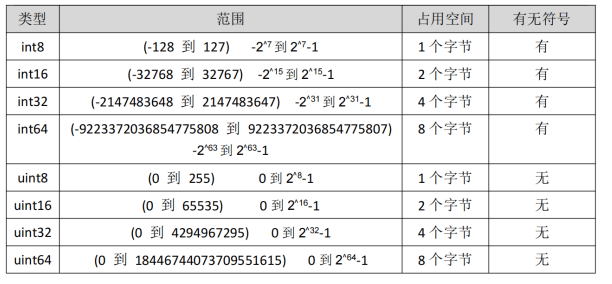

:::tip 摘要
Go 语言不仅拥有静态编译语言的安全和高性能，而且又达到了动态语言开发速度和易维护性。
:::
<!-- more -->

## 一、Go 语言特性

### 1.1 Go 语言介绍

-   Go 即 Golang，是 Google 公司 2009 年 11 月正式对外公开的一门语法简单、原生支持并发、静态强类型的编译型编程语言。根据 Go 语言开发者自述，近 10 多年，从单机时代的 C 语言到现在互联网时代的 Java，都没有令人满意的开发语言，而 C++往往给人的感觉是，花了100%的经历，却只有60%的开发效率，产出比太低，Java 和 C#的哲学又来源于 C++。并且，随着硬件的不断升级，这些语言不能充分的利用硬件及CPU。因此，一门高效、简洁、开源的语言诞生了。
-   Go 语言不仅拥有静态编译语言的安全和高性能，而且又达到了动态语言开发速度和易 维护性。有人形容 Go 语言：Go = C + Python , 说明 Go 语言既有 C 语言程序的运行速度，又能达到Python语言的快速开发。Go 语言是非常有潜力的语言，是因为它的应用场景是目前互联网非常热门的几个领域比如WEB开发、区块链开发、大型游戏服务端开发、分布式/云计算开发。国内比较知名的 B 站就是用Go语言开发的，像 Goggle、阿里、京东、百度、腾讯、小米、360 的很多应用也是使用 Go 语言开发的。

### 1.2 Go 语言解决的问题

-   多核硬件架构；
-   超大规模分布式计算集群；
-   Web 开发模式导致的前所未有的开发规模和更新速度。

### 1.3 Go语言特性

- 自由高效

GO编译速度明显优于JAVA和C++，接近C语言的运行效率和PHP开发效率。支持所有编程范式，如过程式编程、面向对象编程、面向接口编程、函数式编程。

- 原生支持并发

GO的并发是基于Goroutiner（协程），GO的并发执行单元，比线程更轻量，开销更小，性能更高。在一台机器上可以启动成千上万个协程。原生支持并发，但是不能保证并发时，线程一定是安全的，线程安全仍需要用锁等技术实现。

- 自动垃圾回收

内置GO Runtime库，负责管理任务高度、垃圾收集与运行环境。开发者只需要申请内存，而不必关心内存释放。


## 二、Go 运行环境

详看golang vscode环境安装


## 三、Go 基本语法

### 3.1 变量定义方法

#### 0、定义变量方式总结（推荐）

```go
package main

import "fmt"

func main() {
	num := 100   // 最常用的定义变量方式

	var name string    // 全局变量方式
	name = "jack"
	fmt.Println(num, name)
}
```

#### 1、var 定义变量

var 变量名 类型 = 表达式

```go
var name string = "zhangsan"
var age int =21
var isOk bool bool
```

#### 2、类型推导方式定义变量

在函数内部，可以使用更简略的 := 方式声明并初始化变量。
注意：短变量只能用于声明局部变量，不能用于全局变量的声明

```go
// 变量名 := 表达式
n := 10
var age = 18
```

#### 3、一次定义多个变量

```go
package main
import "fmt"
func main() {
    var username, sex string
    username = "张三"
    sex = "男"
    fmt.Println(username, sex)
}
```

#### 4、批量声明变量

```go
package main
import "fmt"
func main() {
    var (
        a string
        b int
        c bool
    )
    a = "张三"
    b = 10
    c = true
    fmt.Println(a,b,c)
}
```

### 3.2 常量定义

-   声明了 pi 和 e 这两个常量之后，在整个程序运行期间它们的值都不能再发生变化了。

```go
const pi = 3.1415
const e = 2.7182
// 多个常量也可以一起声明
const (
    pi = 3.1415
    e = 2.7182
)
```

-   const 同时声明多个常量时，如果省略了值则表示和上面一行的值相同。

```go
const (
    n1 = 100
    n2
    n3
)
// 上面示例中，常量 n1、n2、n3 的值都是 100
```

### 3.3 fmt 包

Println：

-   一次输入多个值的时候 Println 中间有空格
-   Println 会自动换行，Print 不会

Print：

-   一次输入多个值的时候 Print 没有 中间有空格
-   Print 不会自动换行

Printf

-   Printf 是格式化输出，在很多场景下比 Println 更方便

```go
package main

import "fmt"

func main() {
	fmt.Print("zhangsan","lisi","wangwu") // zhangsanlisiwangwu
	fmt.Println("zhangsan","lisi","wangwu") // zhangsan lisi wangwu
	name := "zhangsan"
	age := 20
	fmt.Printf("%s 今年 %d 岁", name, age) // zhangsan 今年 20 岁
}
```

Sprintf

- 格式化并返回

```go
dataSourceName := fmt.Sprintf("%s:%s@tcp(%s:%d)/%s?charset=%s", userName, password, ipAddress, port, dbName, charset)
```


### 3.4 Init 函数和 main 函数

#### 1、init 函数

-   go 语言中 init 函数用于包 (package) 的初始化，该函数是 go 语言的一个重要特性。

-   有下面的特征：

    -   1、init 函数是用于程序执行前做包的初始化的函数，比如初始化包里的变量等

    -   2、每个包可以拥有多个 init 函数

    -   3、包的每个源文件也可以拥有多个 init 函数

    -   4、同一个包中多个 init 函数的执行顺序 go 语言没有明确的定义(说明)

    -   5、不同包的 init 函数按照包导入的依赖关系决定该初始化函数的执行顺序

    -   6、init 函数不能被其他函数调用，而是在 main 函数执行之前，自动被调用

#### 2、main 函数

```go
// Go语言程序的默认入口函数(主函数)：func main()
// 函数体用｛｝一对括号包裹
func main(){
    //函数体
}
```

#### 3、init 函数和 main 函数的异同

-   相同点：

    -   两个函数在定义时不能有任何的参数和返回值，且 Go 程序自动调用。

-   不同点：

    -   init 可以应用于任意包中，且可以重复定义多个。

    -   main 函数只能用于 main 包中，且只能定义一个。

-   两个函数的执行顺序：

    -   对同一个 go 文件的 init() 调用顺序是从上到下的。

-   对同一个 package 中不同文件是按文件名字符串比较“从小到大”顺序调用各文件中的 init() 函数。

    -   对于不同的 package ，如果不相互依赖的话，按照 main 包中"先 import 的后调用"的顺序调用其包中的 init()

-   如果 package 存在依赖，则先调用最早被依赖的 package 中的 init() ，最后调用 main 函数。

    -   如果 init 函数中使用了 println() 或者 print() 你会发现在执行过程中这两个不会按照你想象中的顺序执行。

    -   这两个函数官方只推荐在测试环境中使用，对于正式环境不要使用。

#### 4、init()函数介绍

-   在 Go 语言程序执行时导入包语句会自动触发包内部 init() 函数的调用。
-   需要注意的是： init() 函数没有参数也没有返回值。
-   init() 函数在程序运行时自动被调用执行，不能在代码中主动调用它。
-   包初始化执行的顺序如下图所示：


### 3.5 golang 中关键字

-   var 和 const ：变量和常量的声明
-   package and import : 导入
-   func ： 用于定义函数和方法
-   return ：用于从函数返回
-   defer someCode ：在函数退出之前执行
-   go : 用于并行
-   select 用于选择不同类型的通讯
-   interface 用于定义接口
-   struct 用于定义抽象数据类型
-   break、case、continue、for、fallthrough、else、if、switch、goto、default 流程控制
-   chan 用于 channel 通讯
-   type 用于声明自定义类型
-   map 用于声明 map 类型数据
-   range 用于读取 slice、map、channel 数据

### 3.6 命名规范

#### 命名规范总结（推荐）

```tex
包名称：包名应该为小写单词，不要使用下划线或者混合大小写。package domain

文件名：应该为小写单词，使用下划线分隔各个单词。approve_service.go

结构体名：采用驼峰命名法，MainConfig

变量名称：一般遵循驼峰法，首字母根据访问控制原则大写或者小写

接口命名：结构名以 “er” 作为后缀，例如 Reader ,Writer 。

常量命名：常量均需使用全部大写字母组成，并使用下划线分词
```

**Go**是一门区分大小写的语言。**命名规则涉及变量、常量、全局函数、结构、接口、方法等的命名。**

**Go 语言**从语法层面进行了以下限定：**任何需要对外暴露的名字必须以大写字母开头，不需要对外暴露的则应该以小写字母开头。**

当命名（包括常量、变量、类型、函数名、结构字段等等）以一个大写字母开头，如：Analysize，那么使用这种形式的标识符的对象就**可以被外部包的代码所使用**（客户端程序需要先导入这个包），这被称为导出（像面向对象语言中的 public）；**命名如果以小写字母开头，则对包外是不可见的，但是他们在整个包的内部是可见并且可用的**（像面向对象语言中的 private ）

-   包名称

    -   保持 package 的名字和目录保持一致，尽量采取有意义的包名，简短，有意义，尽量和标准库

    -   不要冲突。包名应该为小写单词，不要使用下划线或者混合大小写。
    
    -   包名不用复数形式，如net/url，而不是net/urls

 package domain

 package main

-   文件命名
    -   尽量采取有意义的文件名，简短，有意义，应该为小写单词，使用下划线分隔各个单词。

 approve_service.go

-   结构体命名
    -   采用驼峰命名法，首字母根据访问控制大写或者小写 struct 申明和初始化格式采用多行，例如下面：

```GO
type MainConfig struct {
    Port string `json:"port"`
    Address string `json:"address"`
}
```

-   **接口命名**命名规则基本和上面的结构体类型单个函数的结构名以 “er” 作为后缀，例如 Reader ,Writer 。

    -   命名以“er”结尾，如：Writer，xxxHandler，Helper，Manager 等

    -   接口方法声明 = 方法名+方法签名如：methodA （param1, param2）outputTypeList

```GO
type Reader interface {
    Read(p []byte) (n int, err error)
}
```

-   变量命名
    -   和结构体类似，变量名称一般遵循驼峰法，首字母根据访问控制原则大写或者小写
    -   但遇到特有名词时，需要遵循以下规则：如果变量为私有，且特有名词为首个单词，则使用小写
    -   如 appService 若变量类型为 bool 类型，则名称应以 Has, Is, Can 或 Allow 开头

```GO
var isExist bool
var hasConflict bool
var canManage bool
var allowGitHook bool
```

-   常量命名常量均需使用全部大写字母组成，并使用下划线分词

    -   const APP_URL = "https://www.baidu.com"

    -   如果是枚举类型的常量，需要先创建相应类型：

```GO
type Scheme string const (
    HTTP Scheme = "http"
    HTTPS Scheme = "https"
)
```

### 3.7 包

import _ "xxx"：只执行包的init函数，而不调用其他函数

## 四、基本数据类型

### 4.1 内置类型

#### 1、值类型：

```go
bool
int(32 or 64), int8, int16, int32, int64
uint(32 or 64), uint8(byte), uint16, uint32, uint64
float32, float64
string
complex64, complex128
array // 固定长度的数组
```

#### 2、引用类型：(指针类型)

```go
slice // 序列数组(最常用)
map // 映射
chan // 管道
```

### 4.2 内置函数

-   Go 语言拥有一些不需要进行导入操作就可以使用的内置函数。
-   它们有时可以针对不同的类型进行操作，例如：len、cap 和 append，或必须用于系统级的操作，例如：panic。
-   因此，它们需要直接获得编译器的支持。

```go
append // 用来追加元素到数组、slice中,返回修改后的数组、slice
close // 主要用来关闭channel
delete // 从map中删除key对应的value
panic // 停止常规的goroutine （panic和recover：用来做错误处理）
recover // 允许程序定义goroutine的panic动作
real // 返回complex的实部 （complex、real imag：用于创建和操作复数）
imag // 返回complex的虚部
make // 用来分配内存，返回Type本身(只能应用于slice, map, channel)
new // 用来分配内存，主要用来分配值类型，比如int、struct。返回指向Type的指针
cap // capacity是容量的意思，用于返回某个类型的最大容量（只能用于切片和 map）
copy // 用于复制和连接slice，返回复制的数目
len // 来求长度，比如string、array、slice、map、channel ，返回长度
print、println // 底层打印函数，在部署环境中建议使用 fmt 包
```

### 4.2 基本类型介绍


## 五、数字

### 5.1 数字类型

#### 1、Golang 数据类型介绍

-   **Go** **语言中数据类型分为**：基本数据类型和复合数据类型
-   **基本数据类型有：**

    -   整型、浮点型、布尔型、字符串

-   **复合数据类型有：**
    -   数组、切片、结构体、函数、map、通道（channel）、接口

#### 2、整型分为两大类

-   有符号整形按长度分为：int8、int16、int32、int64
-   对应的无符号整型：uint8、uint16、uint32、uint64



**关于字节：**

-   字节也叫 Byte，是计算机数据的基本存储单位。8bit(位)=1Byte(字节) 1024Byte(字节)=1KB
-   1024KB=1MB 1024MB=1GB
-   1024GB=1TB 。在电脑里一个中文字是占两个字节的。

### **5.2** **数字定义**

#### 1、定义数字类型

```go
package main

import "fmt"

func main() {
	var a int8 = 4
	var b int32 = 4
	var c int64 = 4
	d := 4
	fmt.Printf("a: %T %v \n", a, a)
	fmt.Printf("b: %T %v \n", b, b)
	fmt.Printf("c: %T %v \n", c, c)
	fmt.Printf("d: %T %v \n", d, d)
}
/*
a: int8 4
b: int32 4
c: int64 4
d: int 4
*/
```

#### 2、reflect.TypeOf 查看数据类型

```go
package main

import (
	"fmt"
	"reflect"
)

func main() {
	c := 10
	fmt.Println(reflect.TypeOf(c)) // int
}
```

### 5.3 布尔值

-   Go 语言中以 bool 类型进行声明布尔型数据，布尔型数据只有 true（真）和 false（假）两个值。

-   注意：

    -   1.布尔类型变量的默认值为 false。

    -   2.Go 语言中不允许将整型强制转换为布尔型.

    -   3.布尔型无法参与数值运算，也无法与其他类型进行转换。

```go
package main

import (
	"fmt"
	"unsafe"
)

func main() {
	var b = true
	fmt.Println(b, "占用字节：", unsafe.Sizeof(b)) // true 占用字节： 1
}
```

## 六、字符串

### 6.1 字符串

#### 1、字符串

-   Go 语言里的字符串的内部实现使用 UTF-8 编码。
-   字符串的值为双引号(")中的内容，可以在 Go 语言的源码中直接添加非 ASCII 码字符

```
s1 := "hello"
s2 := "你好"
```

#### 2、多行字符串

反引号间换行将被作为字符串中的换行，但是所有的转义字符均无效，文本将会原样输出。

```go
package main
import (
    "fmt"
)
func main() {
    s1 := `
    第一行
    第二行
    第三行`
    fmt.Println(s1)

    s2 := "hell world"
	fmt.Printf("%#v", s2[:2]) // "he"
	// s[0] = "abc"  //字符串不可以直接切片赋值
}
```

#### 3、byte 和 rune

-   Go 语言的字符有以下两种

```go
byte类型，或者叫 uint8 型：代表了ASCII码的一个字符。
rune类型：代表一个 UTF-8字符
```

-   字符串底层是一个 byte 数组，所以可以和[]byte 类型相互转换。
-   字符串是不能修改的 字符串是由 byte 字节组成，所以字符串的长度是 byte 字节的长度。
-   rune 类型用来表示 utf8 字符，一个 rune 字符由一个或多个 byte 组成。

```go
package main
import "fmt"
func main() {
    // “美国第一”
    s := "美国第一"
    s_rune := []rune(s)
    fmt.Println( "中国" + string(s_rune[2:])) // 中国第一
}
```

### 6.2 字符串的常用操作（推荐）


#### 1、len(str)

```go
package main

import (
	"fmt"
)

func main() {
	var str = "this is str"
	fmt.Println(len(str)) // 11
}
```

#### 2、 +(拼接)

```go
package main

import (
	"fmt"
)

func main() {
	var str1 = "你好"
	var str2 = "golang"
	fmt.Println(str1 + str2) // 你好golang
}
```

#### 3、strings.Split()

```go
package main

import (
	"fmt"
	"strings"
)

func main() {
	var s = "123-456-789"
	var arr = strings.Split(s, "-")
	fmt.Println(arr) // [123 456 789]
}
```

#### 4、strings.Join()

```go
package main

import (
	"fmt"
	"strings"
)

func main() {
	var str = "123-456-789"
	var arr = strings.Split(str, "-") // [123 456 789]
	var str2 = strings.Join(arr, "*") // 123*456*789
	fmt.Println(arr)
	fmt.Println(str2)
}
```

#### 5、单引号

-   组成每个字符串的元素叫做“字符”，可以通过遍历字符串元素获得字符，字符用单引号（’）
-   uint8 类型，或者叫 byte 型，代表了 ASCII 码的一个字符
-   rune 类型，代表一个 UTF-8 字符

```go
package main
import "fmt"
func main() {
    a := 'a'
    name := "zhangsan"
    //当我们直接输出 byte（字符）的时候输出的是这个字符对应的码值
    fmt.Println(a) // 97 这里输出的是 a 字符串的 ASCII值
    fmt.Println(name) // zhangsan
    //如果我们要输出这个字符，需要格式化输出
    fmt.Printf("的值是%c", a) // a的值是a
}
```

### 6.3 字符串遍历

#### 1、遍历字符串

```go
package main

import "fmt"

func main() {
	s := "hello 张三"
	for i := 0; i < len(s); i++ { //byte
		fmt.Printf("%v(%c) ", s[i], s[i])
		// 104(h) 101(e) 108(l) 108(l) 111(o) 32( ) 229(å) 188(¼) 160() 228(ä) 184(¸) 137()
	}
	fmt.Println()         // 打印一个换行
	for _, r := range s { //rune
		fmt.Printf("%v=>%c ", r, r)
		// 104=>h 101=>e 108=>l 108=>l 111=>o 32=> 24352=>张 19977=>三
	}
	fmt.Println()
}
```

#### 2、修改字符串

-   要修改字符串，需要先将其转换成[]rune 或[]byte，完成后再转换为 string。
-   无论哪种转换，都会重新分配内存，并复制字节数组。
-   将“美国第一”改成“中国第一”

```go
package main

import "fmt"

func main() {
	// “美国第一”
	s := "美国第一"
	s_rune := []rune(s)
	fmt.Println("中国" + string(s_rune[2:])) // 中国第一
}
```

### 6.4 转 String

strconv

```go
package main

import (
	"fmt"
	"strconv"
)

func main() {
	//1、int 转换成 string
	var num1 int = 20
	s1 := strconv.Itoa(num1)
	fmt.Printf("类型： %T ,值=%v \n", s1, s1) // 类型： string ,值=20

	// 2、float 转 string
	var num2 float64 = 20.113123
	/* 参数 1：要转换的值
	参数 2：格式化类型
	参数 3: 保留的小数点 -1（不对小数点格式化）
	参数 4：格式化的类型
	*/
	s2 := strconv.FormatFloat(num2, 'f', 2, 64)
	fmt.Printf("类型： %T ,值=%v \n", s2, s2) // 类型： string ,值=20.11

	// 3、bool 转 string
	s3 := strconv.FormatBool(true)
	fmt.Printf("类型： %T ,值=%v \n", s3, s3) // 类型： string ,值=20.11

	//4、int64 转 string
	var num3 int64 = 20
	s4 := strconv.FormatInt(num3, 10)    /* 第二个参数10为 进制 */
	fmt.Printf("类型 %T ,值=%v \n", s4, s4) // 类型 string ,值=20
}
```

### 6.5 string 与 int 转换

```go
package main

import (
	"fmt"
	"strconv"
)

func main() {
	num := 100
	strNum := strconv.Itoa(num)
	fmt.Printf("num: %T %v \n", num, num)
	fmt.Printf("strNum: %T %v \n", strNum, strNum)
	intNum, _ := strconv.Atoi(strNum)
	fmt.Printf("intNum: %T %v \n", intNum, intNum)
}
/*
num: int 100
strNum: string 100
intNum: int 100
*/
```

## 七、数组 Array

### 7.1 数组介绍

#### 1、Array 介绍

-   数组是指一系列 同一类型数据的集合 。
-   数组中包含的每个数据被称为数组元素(element)，这种类型可以是任意的原始类型，比如 int、string 等
-   一个数组包含的元素个数被称为数组的长度。
-   在 Golang 中数组是一个长度固定的数据类型，数组的长度是类型的一部分，也就是说 [5]int 和[10]int 是两个不同的类型 。
-   Golang 中数组的另一个特点是占用内存的连续性，也就是说数组中的元素是被分配到连续的内存地址中的，因而索引数组元素的速度非常快。
-   和数组对应的类型是 Slice（切片），Slice 是可以增长和收缩的动态序列，功能也更灵活
-   但是想要理解 slice 工作原理的话需要先理解数组，所以本节主要为大家讲解数组的使用。


#### 2、数组定义

```
var 数组变量名 [元素数量]T
```

-   比如：var a [5]int， 数组的长度必须是常量，并且长度是数组类型的一部分
-   一旦定义，长度不能变。 [5]int 和[4]int 是不同的类型。

```go
package main

import "fmt"

func main() {
	// 定义一个长度为 3 元素类型为 int 的数组 a
	var a [5]int
	// 定义一个长度为 3 元素类型为 int 的数组 b 并赋值
	var b [3]int
	b[0] = 80
	b[1] = 100
	b[2] = 96
	fmt.Println(a) // [0 0 0 0 0]
	fmt.Print(b)   // [80 100 96]
}
```

### 7.2 数组的遍历

#### 1、普通遍历数组

```go
package main

import "fmt"

func main() {
	var a = [...]string{"北京", "上海", "深圳"}
	for i := 0; i < len(a); i++ {
		fmt.Println(a[i])
	}
}

/*
北京
上海
深圳
*/
```

## 八、切片 Sice

### 8.1 切片基础

#### 1、切片的定义

-   切片（Slice）是一个拥有相同类型元素的可变长度的序列。
-   它是基于数组类型做的一层封装。
-   它非常灵活，支持自动扩容。
-   切片是一个引用类型，它的内部结构包含地址、长度和容量。
-   声明切片类型的基本语法如下：

```tex
// var name []T
// 1、name:表示变量名
// 2、T:表示切片中的元素类型
```

-   切片之间是不能比较的，我们不能使用==操作符来判断两个切片是否含有全部相等元素。

-   切片唯一合法的比较操作是和 nil 比较。 一个 nil 值的切片并没有底层数组，一个 nil 值的切片的长度和容量都是 0。
-   但是我们不能说一个长度和容量都是 0 的切片一定是 nil

例如下面的

```go
package main

import "fmt"

func main() {
	// 切片是引用类型，不支持直接比较，只能和 nil 比较
	var a []string              //声明一个字符串切片
	fmt.Println(a)              //[]
	fmt.Println(a == nil)       //true
	var b = []int{}             //声明一个整型切片并初始化
	fmt.Println(b)              //[]
	fmt.Println(b == nil)       //false
	var c = []bool{false, true} //声明一个布尔切片并初始化
	fmt.Println(c)              //[false true]
	fmt.Println(c == nil)       //false
}
```

#### 2、切片的本质

-   切片的本质就是对底层数组的封装，它包含了三个信息：底层数组的指针、切片的长度（len）和切片的容量（cap）。
-   举个例子，现在有一个数组 a := [8]int{0, 1, 2, 3, 4, 5, 6, 7}，切片 s1 := a[:5]，相应示意图如下。


-   切片 s2 := a[3:6]，相应示意图如下


#### 3、切片的长度和容量

-   切片拥有自己的长度和容量，我们可以通过使用内置的 **len()**函数求长度，使用内置的 **cap()**函数求切片的容量。
-   切片的长度就是它所包含的元素个数。
-   切片的容量是从它的第一个元素开始数，到其底层数组元素末尾的个数。
-   切片 s 的长度和容量可通过表达式 len(s) 和 cap(s) 来获取。

```go
package main

import "fmt"

func main() {
	s := []int{2, 3, 5, 7, 11, 13}
	fmt.Printf("长度:%v 容量 %v\n", len(s), cap(s)) // 长度:6 容量 6
}
```

### 8.2 切片循环

切片的循环遍历和数组的循环遍历是一样的

#### 1、基本遍历

```go
package main

import "fmt"

func main() {
	var a = []string{"北京", "上海", "深圳"}
	for i := 0; i < len(a); i++ {
		fmt.Println(a[i])
	}
}

/*
北京
上海
深圳
*/
```

#### 2、k，v 遍历

```go
package main

import "fmt"

func main() {
	var a = []string{"北京", "上海", "深圳"}
	for index, value := range a {
		fmt.Println(index, value)
	}
}

/*
0 北京
1 上海
2 深圳
*/
```

#### 8.3 append()

-   Go 语言的内建函数 append()可以为切片动态添加元素，每个切片会指向一个底层数组
-   这个数组的容量够用就添加新增元素。
-   当底层数组不能容纳新增的元素时，切片就会自动按照一定的策略进行“扩容”，此时该切片指向的底层数组就会更换。
-   “扩容”操作往往发生在 append()函数调用时，所以我们通常都需要用原变量接收 append 函数的返回值。

#### 1、append 添加

```go
package main

import "fmt"

func main() {
	// append()添加元素和切片扩容
	var numSlice []int
	for i := 0; i < 10; i++ {
		numSlice = append(numSlice, i)
		fmt.Printf("%v len:%d cap:%d ptr:%p\n", numSlice, len(numSlice),
			cap(numSlice), numSlice)
	}
}
```

#### 2、append 追加多个

```go
package main

import "fmt"

func main() {
	var citySlice []string
	citySlice = append(citySlice, "北京")             // 追加一个元素
	citySlice = append(citySlice, "上海", "广州", "深圳") // 追加多个元素
	a := []string{"成都", "重庆"}
	citySlice = append(citySlice, a...) // 追加切片
	fmt.Println(citySlice)              //[北京 上海 广州 深圳 成都 重庆]
}
```

#### 3、切片中删除元素

Go 语言中并没有删除切片元素的专用方法，我们可以使用切片本身的特性来删除元素

```go
package main

import "fmt"

func main() {
	a := []int{30, 31, 32, 33, 34, 35, 36, 37}
	a = append(a[:2], a[3:]...) // 要删除索引为 2 的元素
	fmt.Println(a)              //[30 31 33 34 35 36 37]
}
```

#### 4、切片合并

```go
package main

import "fmt"

func main() {
	arr1 := []int{2, 7, 1}
	arr2 := []int{5, 9, 3}
	fmt.Println(arr2, arr1)
	arr1 = append(arr1, arr2...)
	fmt.Println(arr1) // [2 7 1 5 9 3]
}
```

## 九、Map 字典

### 9.1 map 介绍

-   map 是一种无序的基于 key-value 的数据结构，Go 语言中的 map 是引用类型，必须初始化才能使用。

-   Go 语言中 map 的定义语法如下： map[KeyType]ValueType

-   其中:

    -   KeyType:表示键的类型。

    -   ValueType:表示键对应的值的类型。

    -   map 类型的变量默认初始值为 nil，需要使用 make()函数来分配内存。

-   其中 cap 表示 map 的容量，该参数虽然不是必须的。
-   注意：获取 map 的容量不能使用 cap, cap 返回的是数组切片分配的空间大小, 根本不能用于 map。
-   要获取 map 的容量，可以用 len 函数。

### 9.2 定义 map

```go
package main

import (
	"fmt"
)

func main() {
	userInfo := map[string]string{
		"username": "root",
		"password": "123456",
	}
	fmt.Println(userInfo)  // map[password:123456 username:root]
}
```

### 9.3 map 基本使用

#### 1、判断某个键是否存在

```go
package main

import "fmt"

func main() {
	userInfo := map[string]string{
		"username": "root",
		"password": "123456",
	}
	user, ok := userInfo["username"]
	if ok {
		fmt.Println(user)
	} else {
		fmt.Println("none")
	}
}
```

#### 2、delete()函数

-   使用 delete()内建函数从 map 中删除一组键值对，delete()函数的格式如下：delete(map 对象, key)

-   其中

    -   map 对象:表示要删除键值对的 map 对象

    -   key:表示要删除的键值对的键

```go
package main

import (
	"fmt"
)

func main() {
	userInfo := map[string]string{
		"username": "root",
		"password": "123456",
	}
	delete(userInfo, "password") //将 password从 map 中删除
	fmt.Println(userInfo)        // map[username:root]
}
```

### 9.4 map 遍历

#### 1、遍历 key 和 value

```go
package main

import (
	"fmt"
)

func main() {
	scoreMap := map[string]int{
		"zhangsan": 24,
		"lisi":     26,
		"wangwu":   24,
	}
	for k, v := range scoreMap {
		fmt.Println(k, v)
	}
}

/*
zhangsan 24
lisi 26
wangwu 24
*/
```

#### 2、只遍历 Key

注意： 遍历 map 时的元素顺序与添加键值对的顺序无关

```go
package main

import (
	"fmt"
)

func main() {
	scoreMap := map[string]int{
		"zhangsan": 24,
		"lisi":     26,
		"wangwu":   24,
	}
	for k := range scoreMap {
		fmt.Println(k)
	}
}

/*
zhangsan
lisi
wangwu
*/
```


## 十、指针

### 10.1 关于指针

指针本质上就是内存地址，一般为内存中存储的变量值的起始位置。指针变量即存储内存地址的变量。

要搞明白 Go 语言中的指针需要先知道 3 个概念： 指针地址、指针类型、指针取值

-   指针地址（&a）
-   指针取值（\*&a）
-   指针类型（&a） —> \*int 改变数据传指针
-   变量的本质是给存储数据的内存地址起了一个好记的别名。
-   比如我们定义了一个变量 a := 10 ,这个时候可以直接通过 a 这个变量来读取内存中保存的 10 这个值。
-   在计算机底层 a 这个变量其实对应了一个内存地址。
-   指针也是一个变量，但它是一种特殊的变量，它存储的数据不是一个普通的值，而是另一个变量的内存地址。
-   Go 语言中的指针操作非常简单，我们只需要记住两个符号：&（取地址）和 \*（根据地址取值）

```go
package main

import "fmt"

func main() {
	var a int = 10
	fmt.Printf("%d \n", &a)  // &a 指针地址 (824633762008)
	fmt.Printf("%d \n", *&a) // *&a 指针取值 (10)
	fmt.Printf("%T \n", &a)  // %T 指针类型 (*int )
	var p *int = &a // 声明指针，var 指针名 *类型 = 初始值
	fmt.Printf("%v\n", p)  // 指针p的地址为 0xc00000a0d8，指向a的地址
}
```


### 10.2 &取变量地址

#### 1、&符号取地址操作

```go
package main

import "fmt"

func main() {
	var a = 10
	var b = &a
	var c = *&a
	fmt.Println(a) // 10 a的值
	fmt.Println(b) // 0xc00001e060 a变量的内存地址
	fmt.Println(c) // 10 *内存地址 取值
}
```

#### 2、b := &a 的图示


### 10.3 new 和 make

#### 1、执行报错

-   执行下面的代码会引发 panic，为什么呢？
-   在 Go 语言中对于引用类型的变量，我们在使用的时候不仅要声明它，还要为它分配内存空间，否则我们的值就没办法存储。
-   而对于值类型的声明不需要分配内存空间，是因为它们在声明的时候已经默认分配好了内存空间。
-   要分配内存，就引出来今天的 new 和 make。
-   Go 语言中 new 和 make 是内建的两个函数，主要用来分配内存。

```go
package main

import "fmt"

func main() {
	var userinfo map[string]string
	userinfo["username"] = "张三"
	fmt.Println(userinfo)
}

/*
panic: assignment to entry in nil map
*/
```

```go
package main

import "fmt"

func main() {
	// 指针名 := new(类型)
	// 创建一个未命名的 int 类型变量，初始值是 0，返回值 p 是指向 int 类型变量的指针。
    // 分配一块内存空间，并返回*int类型的指针
	p := new(int)
	fmt.Println(p, *p) // 0xc00001c0b8 0
	*p = 10 // 通过指针修改值
	fmt.Println(*p) // 10
	// 创建一个未命名的 string 类型变量，初始值是 "", 返回值是 q 是指向 string 类型变量的指针。
	q := new(string)
	fmt.Println(q, *q) // 0xc000010240 ""
	*q = "a"
	fmt.Println(*q) // a
}

```


#### 2、make 和 new 比较

-   new 和 make 是两个内置函数，主要用来创建并分配类型的内存。

-   make 和 new 区别

    -   make 关键字的作用是只适用于创建slice、map 和 channel 等内置的数据结构，且返回的不是指针，new返回的是指针

    -   new 的作用是为类型申请一片内存空间，并返回指向这片内存的指针

```go
package main

import "fmt"

func main() {
	a := make([]int, 3, 10) // 切片长度为 1，预留空间长度为 10
	a = append(a, 1)
	fmt.Printf("%v--%T \n", a, a) // [0 0 0]--[]int 值----切片本身
	var b = new([]int)
	//b = b.append(b,2) // 返回的是内存指针，所以不能直接 append
	*b = append(*b, 3)         // 必须通过 * 指针取值，才能进行 append 添加
	fmt.Printf("%v--%T", b, b) // &[]--*[]string 内存的指针---内存指针
}
```

#### 3、new 函数

一：系统默认的数据类型，分配空间

```go
package main

import "fmt"

func main() {
	// 1.new实例化int
	age := new(int)
	*age = 1

	// 2.new实例化切片
	li := new([]int)
	*li = append(*li, 1)

	// 3.实例化map
	userinfo := new(map[string]string)
	*userinfo = map[string]string{}
	(*userinfo)["username"] = "张三"
	fmt.Println(userinfo) // &map[username:张三]
}
```

二：自定义类型使用 new 函数来分配空间

```go
package main

import "fmt"

func main() {
	var s *Student
	s = new(Student) //分配空间
	s.name = "zhangsan"
	fmt.Println(s) // &{zhangsan 0}
}

type Student struct {
	name string
	age  int
}
```

#### 4、make 函数

-   make 也是用于内存分配的，但是和 new 不同，它只用于 chan、map 以及 slice 的内存创建
-   而且它返回的类型就是这三个类型本身，而不是他们的指针类型
-   因为这三种类型就是引用类型，所以就没有必要返回他们的指针了

```go
package main

import "fmt"

func main() {
	a := make([]int, 3, 10) // 切片长度为 1，预留空间长度为 10
	b := make(map[string]string)
	c := make(chan int, 1)
	fmt.Println(a, b, c) // [0 0 0] map[] 0xc0000180e0
}
```

-   当我们为 slice 分配内存的时候，应当尽量预估到 slice 可能的最大长度
-   通过给 make 传第三个参数的方式来给 slice 预留好内存空间
-   这样可以避免二次分配内存带来的开销，大大提高程序的性能。


## 十一、内置运算符

### 11.1 算数运算符


#### 1、算数运算符使用

```go
package main

import (
	"fmt"
)

func main() {
	fmt.Println("10+3=", 10+3) //10+3= 13
	fmt.Println("10-3=", 10-3) //10-3= 7
	fmt.Println("10*3=", 10*3) //10*3= 30
	//除法注意：如果运算的数都是整数，那么除后，去掉小数部分，保留整数部分
	fmt.Println("10/3=", 10/3)     //10/3= 3
	fmt.Println("10.0/3=", 10.0/3) //3.3333333333333335
	// 取余注意 余数=被除数-（被除数/除数）*除数
	fmt.Println("10%3=", 10%3)     //10%3= 1
	fmt.Println("-10%3=", -10%3)   // -10%3= -1
	fmt.Println("10%-3=", 10%-3)   // 10%-3= 1
	fmt.Println("-10%-3=", -10%-3) // -10%-3= -1
}
```

#### 2、i++

```go
package main

import (
	"fmt"
)

func main() {
	var i int = 1
	i++
	fmt.Println("i=", i) // i= 2
}
```

### 11.2 关系运算符


```go
package main

import (
	"fmt"
)

func main() {
	var n1 int = 9
	var n2 int = 8
	fmt.Println(n1 == n2) //false
	fmt.Println(n1 != n2) //true
	fmt.Println(n1 > n2)  //true
	fmt.Println(n1 >= n2) //true
	fmt.Println(n1 < n2)  //flase
	fmt.Println(n1 <= n2) //flase
	flag := n1 > n2
	fmt.Println("flag=", flag) //flag= true
}
```

### 11.3 逻辑运算符


```go
package main

import (
	"fmt"
)

func main() {
	//演示逻辑运算符的使用 &&
	var age int = 40
	if age > 30 && age < 50 {
		fmt.Println("ok1")
	}
	if age > 30 && age < 40 {
		fmt.Println("ok2")
	}
	//演示逻辑运算符的使用 ||
	if age > 30 || age < 50 {
		fmt.Println("ok3")
	}
	if age > 30 || age < 40 {
		fmt.Println("ok4")
	}
	//演示逻辑运算符的使用
	if age > 30 {
		fmt.Println("ok5")
	}
	if !(age > 30) {
		fmt.Println("ok6")
	}
}
```

### 11.4 赋值运算符


```go
package main

import (
	"fmt"
)

func main() {
	d := 8 + 2*8   //赋值运算从右向左
	fmt.Println(d) //24
	x := 10
	x += 5                       //x=x+5
	fmt.Println("x += 5 的值:", x) //24
}
```

## 十二、条件循环

### 12.1 if else(分支结构)

#### 1、if 条件判断基本写法

```go
package main

import (
	"fmt"
)

func main() {
	score := 65
	if score >= 90 {
		fmt.Println("A")
	} else if score > 75 {
		fmt.Println("B")
	} else {
		fmt.Println("C")
	}
}
```

#### 2、if 条件判断特殊写法

if 条件判断还有一种特殊的写法，可以在 if 表达式之前添加一个执行语句，再根据变量值进行判断

```go
package main

import "fmt"

func main() {
	//这里的 score 是局部作用域
	if score := 56; score >= 90 {
		fmt.Println("A")
	} else if score > 75 {
		fmt.Println("B")
	} else {
		fmt.Println("C")
		fmt.Println(score) // 只能在函数内部打印 score
	}
	// fmt.Println(score) //undefined: score
}
```

### 12.2 for(循环结构)

#### 1 for 循环

1）普通 for 循环

```go
package main

import "fmt"

func main() {
	// 打印： 0 ~ 9 的数字
	for i := 0; i < 10; i++ {
		fmt.Println(i)
	}
}
```

2）外部定义 i

```go
package main

import "fmt"

func main() {
	i := 0
	for i < 10 {
		fmt.Println(i)
		i++
	}
}
```

#### 2、模拟 while 循环

Go 语言中是没有 while 语句的，我们可以通过 for 代替

```go
package main

import "fmt"

func main() {
	k := 1
	for { // 这里也等价 for ; ; {
		if k <= 10 {
			fmt.Println("ok~~", k)
		} else {
			break //break 就是跳出这个 for 循环
		}
		k++
	}
}
```

#### 3、for range(键值循环)

```go
package main

import "fmt"

func main() {
	str := "abc上海"
	for index, val := range str {
		fmt.Printf("索引=%d, 值=%c \n", index, val)
	}
}

/*
索引=0, 值=a
索引=1, 值=b
索引=2, 值=c
索引=3, 值=上
索引=6, 值=海
*/
```

### 12.3 switch case

使用 switch 语句可方便地对大量的值进行条件判断

```go
package main

import "fmt"

func main() {
	score := "B"
	switch score {
	case "A":
		fmt.Println("非常棒")
	case "B":
		fmt.Println("优秀")
	case "C":
		fmt.Println("及格")
	default:
		fmt.Println("不及格")
	}
}
```

**fallthrough穿透**

某种情况下，需要继续执行下面的case

```go
package main

import "fmt"

func main() {
	ret := ""
	code := 0
	switch code {
	case 0:
		ret += "女"
		fallthrough
	case 1:
		ret += "男"
		fallthrough
	default:
		ret += "未知"
	}
	fmt.Println(ret) // 女男未知
}

```

**case多个表达式**

case后面可以带多个表达式，使用逗号隔开。


### 12.4 break、continue

-   break 跳出循环
-   continue 跳出本次循环

#### 1、break 跳出单循环

```go
package main

import "fmt"

func main() {
	k := 1
	for { // 这里也等价 for ; ; {
		if k <= 10 {
			fmt.Println("ok~~", k)
		} else {
			break //break 就是跳出这个 for 循环
		}
		k++
	}
}
```

#### 2、continue(继续下次循环)

```go
package main

func main() {
	for i := 0; i < 10; i++ {
		if i%2 == 0 {
			continue
		}
		println(i)
	}
}
/*1 3 5 7 9*/
```

## 十三、函数

### 13.1 函数基础

#### 1、函数定义

函数是组织好的、可重复使用的、用于执行指定任务的代码块。
本文介绍了 Go 语言中函数的相关内容。

```go
package main

import "fmt"

func main() {
	ret := intSum(1, 2)
	fmt.Println(ret) // 3
}
func intSum(x, y int) int {
	return x + y
}
```

#### 2、函数返回值

-   Go 语言中通过 return 关键字向外输出返回值。
-   函数多返回值，Go 语言中函数支持多返回值，函数如果有多个返回值时必须用()将所有返回值包裹起来

```go
package main

import "fmt"

func main() {
	plus, sub := calc(4, 5)
	fmt.Println(plus) // 和为：9
	fmt.Println(sub)  // 差为：-1
}
func calc(x, y int) (int, int) {
	sum := x + y
	sub := x - y
	return sum, sub
}
```

### 13.2 函数变量作用域

#### 1、全局变量

-   全局变量是定义在函数外部的变量，它在程序整个运行周期内都有效。
-   在函数中可以访问到全局变量

```go
package main

import "fmt"

//定义全局变量 num
var num int64 = 10

func main() {
	fmt.Printf("num=%d\n", num) //num=10
}
```

#### 2、局部变量

-   局部变量是函数内部定义的变量， 函数内定义的变量无法在该函数外使用
-   例如下面的示例代码 main 函数中无法使用 testLocalVar 函数中定义的变量 x

```go
package main

import "fmt"

func main() {
	// 这里name是函数test的局部变量，在其他函数无法访问
	//fmt.Println(name)
	test()
}
func test() {
	name := "zhangsan"
	fmt.Println(name)
}
```

#### 3、for 循环语句中定义的变量

for 循环语句中定义的变量，也是只在 for 语句块中生效

```go
package main

import "fmt"

func main() {
	testLocalVar3()
}
func testLocalVar3() {
	for i := 0; i < 10; i++ {
		fmt.Println(i) //变量 i 只在当前 for 语句块中生效
	}
	// fmt.Println(i) //此处无法使用变量 i
}
```

### 13.3 变长函数

有变长参数的函数称为变长函数

```go
package main

import "fmt"

// ...表示一个变长函数参数
func sum(ns ...int) int {
	ret := 0
	for _, n := range ns {
		ret += n
	}
	return ret
}

func main() {
	fmt.Println(sum())        // 0
	fmt.Println(sum(1))       // 1
	fmt.Println(sum(1, 2))    // 3
	fmt.Println(sum(1, 2, 3)) // 6
}

```

### 13.4 回调函数

回调函数本质上就是作为函数参数的一个函数。

```go
package main

import "fmt"

// 使用关键字type定义一个callback的自定义类型，这个callbacK类型是一个函数，签名为func(int,init) int
type callback func(int, int) int

func doAdd(a, b int, f callback) int {
	fmt.Println("f callback")
	return f(a, b)
}

func add(a, b int) int {
	fmt.Println("add running")
	return a + b
}

func main() {
	a, b := 2, 3
	fmt.Println(doAdd(a, b, add))
	fmt.Println(doAdd(a, b, func(a int, b int) int {
		fmt.Println("========")
		return a * b
	}))
	// f callback
	// add running
	// 5
	// f callback
	// ========
	// 6
}

```

### 13.5 defer关键字

defer字面意思推迟、延迟，defer是go中一种用于注册延迟调用的机制，常用于对资源进行释放的场景，如释放数据库连接。

当多个defer语句被定义时，它们会以定义的逆序依次执行。**注意，当调用os.Exit()方法退出程序时，defer并不会执行。**

```go
package main

import "fmt"

func add(a, b int) int {
	return a + b
}

func main() {
	defer fmt.Println(add(1, 1))
	defer fmt.Println(add(1, 2))
	defer fmt.Println(add(1, 3))
	// 4
	// 3
	// 2
}

```


## 十四、结构体

### 14.1 什么是结构体

-   Go 语言中没有“类”的概念，也不支持“类”的继承等面向对象的概念。
-   Go 语言中通过结构体的内嵌再配合接口比面向对象具有更高的扩展性和灵活性。

### 14.2 结构体定义

#### 1、基本实例化（法 1）

-   只有当结构体实例化时，才会真正地分配内存，也就是必须实例化后才能使用结构体的字段。
-   结构体本身也是一种类型，我们可以像声明内置类型一样使用 var 关键字声明结构体类型

```go
package main

import "fmt"

// type用来定义新的数据类型
type person struct {
	name string
	city string
	age  int
}
var p1 person

func main() {
	p1.name = "张三"
	p1.city = "北京"
	p1.age = 18
	fmt.Printf("p1=%v\n", p1)  // p1={张三 北京 18}
	fmt.Printf("p1=%T\n", p1)  // p1=main.person
	fmt.Printf("p1=%#v\n", p1) // p1=main.person{name:"张三", city:"北京", age:18}
}
```

#### 2、new 实例化（法 2）

-   我们还可以通过使用 new 关键字对结构体进行实例化，得到的是结构体的地址
-   从打印的结果中我们可以看出 p2 是一个结构体指针。
-   注意：在 Golang 中支持对结构体指针直接使用.来访问结构体的成员。
-   p2.name = "张三" 其实在底层是 (\*p2).name = "张三"

```go
package main

import "fmt"

type person struct {
	name string
	city string
	age  int
}

func main() {
	var p2 = new(person)
	p2.name = "张三"
	p2.age = 20
	p2.city = "北京"
	fmt.Printf("p2=%#v \n", p2) //p2=&main.person{name:"张三", city:"北京", age:20}
}
```

#### 3、键值对初始化（法 3）(推荐)

注意：最后一个属性的,要加上

```go
package main

import "fmt"

type Person struct {
	Name string
	City string
	Age int
}

func main() {
	p := Person{
		Name: "aaa",
		City: "bbb",
		Age: 45,
	}
	fmt.Printf("%v\n", p) // {aaa bbb 45}
	fmt.Printf("%#v", p) // main.Person{Name:"aaa", City:"bbb", Age:45}
}
```

### 14.3 结构体方法和接收者

#### 1、结构体说明

-   在 go 语言中，没有类的概念但是可以给类型（结构体，自定义类型）定义方法。

-   所谓方法就是定义了接收者的函数。

    -   Go 语言中的方法（Method）是一种作用于特定类型变量的函数。

    -   这种特定类型变量叫做接收者（Receiver）。

    -   接收者的概念就类似于其他语言中的 this 或者 self。

-   方法的定义格式如下：

```go
func (接收者变量 接收者类型) 方法名(参数列表) (返回参数) {
	函数体
}
```

-   给结构体 Person 定义一个方法打印 Person 的信息

#### 2、结构体方法和接收者

```go
package main

import (
	"fmt"
)

type Person struct {
	Name string
	Age int8
}

func (p Person) prinfInfo() {
	fmt.Printf("%v %v", p.Name, p.Age)
}

func main() {
	p1 := Person{
		Name: "aaa",
		Age: 30,
	}
	p1.prinfInfo() // aaa 30
}
```

#### 3、值类型和指针类型接收者

-   实例 1：给结构体 Person 定义一个方法打印 Person 的信息

-   1、值类型的接收者

    -   当方法作用于值类型接收者时，Go 语言会在代码运行时 将接收者的值复制一份 。

    -   在值类型接收者的方法中可以获取接收者的成员值，但 修改操作只是针对副本 ，无法修改接收者变量本身。

-   2、指针类型的接收者
    -   指针类型的接收者由一个结构体的指针组成
    -   由于指针的特性，调用方法时修改接收者指针的任意成员变量，在方法结束后，修改都是有效的。
    -   这种方式就十分接近于其他语言中面向对象中的 this 或者 self。

```go
package main

import (
	"fmt"
)

type Person struct {
	Name string
	Age int
}

// 值类型接受者
func (p Person) prinfInfo() {
	fmt.Printf("%v %v\n", p.Name, p.Age)
}

// 指针类型接收者
func (p *Person) setInfo(Name string, Age int) {
	p.Name = Name
	p.Age = Age
}

func main() {
	p1 := Person{
		Name: "aaa",
		Age: 30,
	}
	p1.prinfInfo() // aaa 30
	p1.setInfo("bbb", 50)
	p1.prinfInfo() // bbb 50
}
```

### 14.4 encoding-json 包

#### 1、struct 与 json

-   比如我们 Golang 要给 App 或者小程序提供 Api 接口数据，这个时候就需要涉及到结构体和 Json 之间的相互转换
-   GolangJSON 序列化是指把结构体数据转化成 JSON 格式的字符串
-   Golang JSON 的反序列化是指把 JSON 数据转化成 Golang 中的结构体对象
-   Golang 中 的 序 列 化 和 反 序 列 化 主 要 通 过 "encoding/json" 包 中 的 json.Marshal() 和 json.Unmarshal()方法实现

1）struct 转 Json 字符串

```go
package main

import (
	"encoding/json"
	"fmt"
)

type Student struct {
	ID     int
	Name   string
	Gender string
	Age    int
}

func main() {
	s := Student{
		ID:     1,
		Name:   "oby",
		Gender: "nan",
		Age:    30,
	}
	var s1,_ = json.Marshal(s)
	jsonStr := string(s1)
	fmt.Println(jsonStr)  // {"ID":1,"Name":"oby","Gender":"nan","Age":30}
}
```

2）Json 字符串转 struct

```go
package main

import (
	"encoding/json"
	"fmt"
)

type Student struct {
	ID     int
	Gender string
	Name   string
	Sno    string
}

func main() {
	var jsonStr = `{"ID":1,"Gender":"男","Name":"李四","Sno":"s0001"}`
	var student Student //定义一个 Monster 实例
	err := json.Unmarshal([]byte(jsonStr), &student)
	if err != nil {
		fmt.Printf("unmarshal err=%v\n", err)
	}
	// 反序列化后 student=main.Student{ID:1, Gender:"男", Name:"李四", Sno:"s0001"}
	student.Name = "李四"
	fmt.Printf("反序列化后 student=%#v student.Name=%v \n", student, student.Name)
}
```

#### 2、struct tag

1）Tag 标签说明

-   Tag 是结构体的元信息，可以在运行的时候通过反射的机制读取出来。
-   Tag 在结构体字段的后方定义，由一对反引号包裹起来
-   具体的格式如下：

```shell
key1:"value1" key2:"value2"
```

-   结构体 tag 由一个或多个键值对组成。键与值使用冒号分隔，值用双引号括起来。
-   同一个结构体字段可以设置多个键值对 tag，不同的键值对之间使用空格分隔。
-   注意事项：
    -   为结构体编写 Tag 时，必须严格遵守键值对的规则。
    -   结构体标签的解析代码的容错能力很差，一旦格式写错，编译和运行时都不会提示任何错误，通过反射也无法正确取值。
    -   例如不要在 key 和 value 之间添加空格。

2）Tag 结构体转化 Json 字符串

```go
package main

import (
	"encoding/json"
	"fmt"
)

type Student struct {
	ID     int    `json:"id"` //通过指定 tag 实现 json 序列化该字段时的 key
	Gender string `json:"gender"`
	Name   string
	Sno    string
}

func main() {
	var s1 = Student{
		ID:     1,
		Gender: "男",
		Name:   "李四",
		Sno:    "s0001",
	}
	// main.Student{ID:1, Gender:"男", Name:"李四", Sno:"s0001"}
	fmt.Printf("%#v\n", s1)
	var s, _ = json.Marshal(s1)
	jsonStr := string(s)
	fmt.Println(jsonStr) // {"id":1,"gender":"男","Name":"李四","Sno":"s0001"}
}
```

#### 3、Json 字符串转成 Tag 结构体

```go
package main

import (
	"encoding/json"
	"fmt"
)

type Student struct {
	ID     int    `json:"id"` //通过指定 tag 实现 json 序列化该字段时的 key
	Gender string `json:"gender"`
	Name   string
	Sno    string
}

func main() {
	var s2 Student
	var str = `{"id":1,"gender":"男","Name":"李四","Sno":"s0001"}`
	err := json.Unmarshal([]byte(str), &s2)
	if err != nil {
		fmt.Println(err)
	}
	// main.Student{ID:1, Gender:"男", Name:"李四", Sno:"s0001"}
	fmt.Printf("%#v", s2)
}
```


## 十五、面向对象

### 15.1 Golang 接口的定义

#### 1、Golang 中的接口

-   在 Go 语言中接口（interface）是一种类型，一种抽象的类型。
-   接口（interface）定义了一个对象的行为规范， 只定义规范不实现 ，由具体的对象来实现规范的细节 。
-   实现接口的条件
    -   一个对象只要全部实现了接口中的方法 ，那么就实现了这个接口。
    -   换句话说，接口就是一个需要实现的方法列表。

#### 2、为什么要使用接口

-   下面的代码中定义了猫和狗，然后它们都会叫，你会发现 main 函数中明显有重复的代码
-   如果我们后续再加上猪、青蛙等动物的话，我们的代码还会一直重复下去
-   那我们能不能把它们当成“能叫的动物”来处理呢？

```go
package main

import (
	"fmt"
)

type Cat struct {
	Name string
}

type Dog struct {
	Name string
}

func (c Cat) Say() string {
	return c.Name + ":喵喵喵"
}

func (d Dog) Say() string {
	return d.Name + ":汪汪汪"
}

func main() {
	c := Cat{
		Name: "小白猫",
	}
	fmt.Println(c.Say())  // 小白猫:喵喵喵

	d := Dog{
		Name: "老黄",
	}
	fmt.Println(d.Say())  // 老黄:汪汪汪
}

```

#### 3、定义一个 Usber 接口

定义一个 Usber 接口让 Phone 和 Camera 结构体实现这个接口

```go
package main

import "fmt"

//1.接口是一个规范
type Usber interface {
	start()
	stop()
}

//2.如果接口里面有方法的话，必要要通过结构体或者通过自定义类型实现这个接口
type Phone struct {
	Name string
}

//3.手机要实现usb接口的话必须得实现usb接口中的所有方法
func (p Phone) start() {
	fmt.Println(p.Name, "启动")
}
func (p Phone) stop() {
	fmt.Println(p.Name, "关机")
}

func main() {
	p := Phone{
		Name: "华为手机",
	}
	var p1 Usber // golang中接口就是一个数据类型
	p1 = p       // 表示手机实现Usb接口
	p1.start()
	p1.stop()
}

/*
华为手机 启动
华为手机 关机
*/
```

#### 4、go 中类

-   Go 语言中没有“类”的概念，也不支持“类”的继承等面向对象的概念。
-   Go 语言中通过结构体的内嵌再配合接口比面向对象具有更高的扩展性和灵活性。

### 15.2 空接口

#### 1、空接口说明

-   golang 中空接口也可以直接当做类型来使用，可以表示任意类型 （泛型概念）
-   Golang 中的接口可以不定义任何方法，没有定义任何方法的接口就是空接口。
-   空接口表示没有任何约束，因此任何类型变量都可以实现空接口。
-   空接口在实际项目中用的是非常多的，用空接口可以表示任意数据类型。

#### 2、空接口作为函数的参数

```go
package main

import "fmt"

//空接口作为函数的参数
func show(a interface{}) {
	fmt.Printf("值:%v 类型:%T\n", a, a)
}
func main() {
	show(20)         // 值:20 类型:int
	show("你好golang") // 值:你好golang 类型:string
	slice := []int{1, 2, 34, 4}
	show(slice) // 值:[1 2 34 4] 类型:[]int
}
```

#### 3、切片实现空接口

```go
package main

import "fmt"

func main() {
	var slice = []interface{}{"张三", 20, true, 32.2}
	fmt.Println(slice) // [张三 20 true 32.2]
}
```

#### 4、map 的值实现空接口

```go
package main

import "fmt"

func main() {
	// 空接口作为 map 值
	var studentInfo = make(map[string]interface{})
	studentInfo["name"] = "张三"
	studentInfo["age"] = 18
	studentInfo["married"] = false
	fmt.Println(studentInfo)
	// [age:18 married:false name:张三]
}
```

### 15.3 类型断言

-   一个接口的值（简称接口值）是由一个具体类型和具体类型的值两部分组成的。
-   这两部分分别称为接口的动态类型和动态值。
-   如果我们想要判断空接口中值的类型，那么这个时候就可以使用类型断言
-   其语法格式： x.(T)
    -   x : 表示类型为 interface{}的变量
    -   T : 表示断言 x 可能是的类型

```go
package main

import "fmt"

func main() {
	var x interface{}
	x = "Hello golnag"
	v, ok := x.(string)
	if ok {
		fmt.Println(v)
	} else {
		fmt.Println("非字符串类型")
	}
}
```

### 15.4 值接收者和指针接收者

#### 1、值接收者

-   当方法作用于值类型接收者时，Go 语言会在代码运行时将接收者的值复制一份。
-   在值类型接收者的方法中可以获取接收者的成员值，但修改操作只是针对副本，无法修改接收者变量本身。

```go
package main

import "fmt"

type Usb interface {
	Start()
	Stop()
}
type Phone struct {
	Name string
}

func (p Phone) Start() {
	fmt.Println(p.Name, "开始工作")
}
func (p Phone) Stop() {
	fmt.Println("phone 停止")
}
func main() {
	phone1 := Phone{ // 一：实例化值类型
		Name: "小米手机",
	}
	var p1 Usb = phone1 //phone1 实现了 Usb 接口 phone1 是 Phone 类型
	p1.Start()
	phone2 := &Phone{ // 二：实例化指针类型
		Name: "苹果手机",
	}
	var p2 Usb = phone2 //phone2 实现了 Usb 接口 phone2 是 *Phone 类型
	p2.Start()          //苹果手机 开始工作
}
```

#### 2、指针接收者

-   指针类型的接收者由一个结构体的指针组成
-   由于指针的特性，调用方法时修改接收者指针的任意成员变量，在方法结束后，修改都是有效的。
-   这种方式就十分接近于其他语言中面向对象中的 this 或者 self 。
-   例如我们为 Person 添加一个 SetAge 方法，来修改实例变量的年龄。

#### 3、 指针类型接收者 使用时机

注：并不是所有情况下都希望修改数据

-   1、需要修改接收者中的值
-   2、接收者是拷贝代价比较大的大对象
-   3、保证一致性，如果有某个方法使用了指针接收者，那么其他的方法也应该使用指针接收者。

## 十六、并发编程

### 16.1 并发介绍

#### 1、并发和并行

```shell
A. 多线程程序在一个核的cpu上运行，就是并发。
B. 多线程程序在多个核的cpu上运行，就是并行。
```

```shell
从CPU角度：
并发针对单核 CPU 而言，它指的是 CPU 交替执行不同任务的能力；并行针对多核 CPU 而言，它指的是多个核心同时执行多个任务的能力。
单核 CPU 只能并发，无法并行；换句话说，并行只可能发生在多核 CPU 中。
在多核 CPU 中，并发和并行一般都会同时存在，它们都是提高 CPU 处理任务能力的重要手段。
```

并发：本质还是串行

-   食堂窗口一个大妈（同一时间类只能给一个人打饭）
-   python 本质没有并行的线程


并行：任务分布在不同 CPU 上，同一时间点同时执行

-   并行就是有多个食堂大妈，同事给不同人打饭


#### 2、协程和线程

-   协程：独立的栈空间，共享堆空间，调度由用户自己控制，本质上有点类似于用户级线程，这些用户级线程的调度也是自己实现的。
-   线程：一个线程上可以跑多个协程，协程是轻量级的线程。
-   线程和协程最大的区别
    -   开启一个线程需要大概 2M 空间，而且需要 cpu 调度才能执行，线程会抢 cpu
    -   开启一个协程大概只需要 2K 的空间，而且是有 go 解释器自己实现的 GPM 调度，主动退出
    -   所以我们可以同时启动成千上万个 goroutine 而不会过大的占用内存
    -   相反如果我们开启成千上万个线程，第一，会大量的占用内存，甚至导致机器奔溃，第二，操作系统调度线程，本身也需要耗费大量时间
-   协程如果需要用 CPU 才会去使 CPU，如果没有使用 CPU 的需求，他就会主动把 cpu 让给其他协程执行
-   线程在时间片内，即使不使用 cpu，比如当前正在从磁盘读数据，他也不会让出 cpu

### 16.2 goroutine

#### 1、多线程编程缺点

-   在 java/c++中我们要实现并发编程的时候，我们通常需要自己维护一个线程池
-   并且需要自己去包装一个又一个的任务，同时需要自己去调度线程执行任务并维护上下文切换

#### 2、gouroutine

-   Go 语言中的 goroutine 就是这样一种机制，goroutine 的概念类似于线程，但 goroutine 是由 Go 的运行时（runtime）调度和管理的。
-   Go 程序会智能地将 goroutine 中的任务合理地分配给每个 CPU。
-   Go 语言之所以被称为现代化的编程语言，就是因为它在语言层面已经 **内置了调度和上下文切换的机制** 。
-   在 Go 语言编程中你不需要去自己写进程、线程、协程，你的技能包里只有一个技能–goroutine
-   当你需要让某个任务并发执行的时候，你只需要把这个任务包装成一个函数
-   开启一个 goroutine 去执行这个函数就可以了，就是这么简单粗暴。

### 16.3 协程基本使用

#### 1、启动一个协程

-   主线程中每过100 毫秒打印一次，总共打印 2 次
-   另外开启一个协程，打印 10 次
-   情况一：打印是交替，证明是并行的
-   情况二：开启的协程打印两次，就退出了（因为主线程退出了）

```go
package main

import (
	"fmt"
	"time"
)

func test() {
	for i := 0; i < 10; i++ {
		fmt.Println("test() 你好golang")
		time.Sleep(time.Millisecond * 100)
	}
}

func main() {
	go test() //表示开启一个协程
	for i := 0; i < 2; i++ {
		fmt.Println("main() 你好golang")
		time.Sleep(time.Millisecond * 100)
	}
}

/*
	main() 你好golang
	test() 你好golang
	main() 你好golang
	test() 你好golang
	test() 你好golang
*/
```

#### 2、WaitGroup

-   主线程退出后所有的协程无论有没有执行完毕都会退出

-   所以我们在主进程中可以通过 WaitGroup 等待协程执行完毕

    -   sync.WaitGroup 内部维护着一个计数器，计数器的值可以增加和减少。

    -   例如当我们启动了 N 个并发任务时，就将计数器值增加 N。

    -   每个任务完成时通过调用 Done()方法将计数器减 1。

    -   通过调用 Wait()来等待并发任务执行完，当计数器值为 0 时，表示所有并发任务已经完成。

    -   ```shell
        var wg sync.WaitGroup // 第一步：定义一个计数器
        wg.Add(1) // 第二步：开启一个协程计数器+1
        wg.Done() // 第三步：协程执行完毕，计数器-1
        wg.Wait() // 第四步：计数器为0时推出
        ```

```go
package main

import (
	"fmt"
	"sync"
	"time"
)

var wg sync.WaitGroup // 第一步：定义一个计数器

func test1() {
	for i := 0; i < 10; i++ {
		fmt.Println("test1() 你好golang-", i)
		time.Sleep(time.Millisecond * 100)
	}
	wg.Done() //协程计数器-1 // 第三步：协程执行完毕，计数器-1
}

func test2() {
	for i := 0; i < 2; i++ {
		fmt.Println("test2() 你好golang-", i)
		time.Sleep(time.Millisecond * 100)
	}
	wg.Done() //协程计数器-1
}

func main() {
	wg.Add(1)  //协程计数器+1 第二步：开启一个协程计数器+1
	go test1() //表示开启一个协程
	wg.Add(1)  //协程计数器+1
	go test2() //表示开启一个协程
	wg.Wait()  //等待协程执行完毕... 第四步：计数器为0时推出
	fmt.Println("主线程退出...")
}

/*
	test2() 你好golang- 0
	test1() 你好golang- 0
	.....
	test1() 你好golang- 8
	test1() 你好golang- 9
	主线程退出...
*/
```

#### 3、开启多个协程

-   在 Go 语言中实现并发就是这样简单，我们还可以启动多个 goroutine。
-   这里使用了 sync.WaitGroup 来实现等待 goroutine 执行完毕
-   多次执行上面的代码，会发现每次打印的数字的顺序都不一致。
-   这是因为 10 个 goroutine 是并发执行的，而 goroutine 的调度是随机的。

```go
package main

import (
	"fmt"
	"sync"
)

var wg sync.WaitGroup

func hello(i int) {
	defer wg.Done() // goroutine结束就登记-1
	fmt.Println("Hello Goroutine!", i)
}

func main() {
	for i := 0; i < 10; i++ {
		wg.Add(1) // 启动一个goroutine就登记+1
		go hello(i)
	}
	wg.Wait() // 等待所有登记的goroutine都结束
}

/*
Hello Goroutine! 0
Hello Goroutine! 8
Hello Goroutine! 2
Hello Goroutine! 7
Hello Goroutine! 6
Hello Goroutine! 1
Hello Goroutine! 5
Hello Goroutine! 9
Hello Goroutine! 3
Hello Goroutine! 4
*/
```

### 16.4 channel

#### 1、Channel 说明

-   共享内存交互数据弊端
    -   单纯地将函数并发执行是没有意义的。函数与函数间需要交换数据才能体现并发执行函数的意义。
    -   虽然可以使用共享内存进行数据交换，但是共享内存在不同的 goroutine 中容易发生竞态问题。
    -   为了保证数据交换的正确性，必须使用互斥量对内存进行加锁，这种做法势必造成性能问题。
-   channel 好处
    -   Go 语言中的通道（channel）是一种特殊的类型。
    -   通道像一个传送带或者队列，总是遵循先入先出（First In First Out）的规则，保证收发数据的顺序。
    -   每一个通道都是一个具体类型的导管，也就是声明 channel 的时候需要为其指定元素类型。
    -   如果说 goroutine 是 Go 程序并发的执行体，channel 就是它们之间的连接。
    -   channel 是可以让一个 goroutine 发送特定值到另一个 goroutine 的通信机制。

#### 2、channel 类型

-   channel 是一种类型，一种引用类型
-   声明管道类型的格式如下:

```go
var 变量 chan 元素类型
var ch1 chan int // 声明一个传递整型的管道
var ch2 chan bool // 声明一个传递布尔型的管道
var ch3 chan []int // 声明一个传递 int 切片的管道
```

#### 3、创建 channel

-   声明的管道后需要使用 make 函数初始化之后才能使用。
-   创建 channel 的格式如下： make(chan 元素类型, 容量)

```go
// 创建一个能存储 10 个 int 类型数据的管道
ch1 := make(chan int, 10)
// 创建一个能存储 4 个 bool 类型数据的管道
ch2 := make(chan bool, 4)
// 创建一个能存储 3 个[]int 切片类型数据的管道
ch3 := make(chan []int, 3)
```

#### 4、channel 操作

```go
package main

import "fmt"

func main() {
	// 1、创建channel
	ch := make(chan int, 5)

	// 2、向channel放入数据
	ch <- 10
	ch <- 12
	fmt.Println("发送成功", ch)

	// 3、向channel取值
	v1 := <-ch
	fmt.Println(v1)
	v2 := <-ch
	fmt.Println(v2)

	// 4、空channel取值报错
	v3 := <-ch
	fmt.Println("v3", v3)
}
```

#### 5、优雅的从 channel 取值

-   当通过通道发送有限的数据时，我们可以通过 close 函数关闭通道来告知从该通道接收值的 goroutine 停止等待。
-   当通道被关闭时，往该通道发送值会引发 panic，从该通道里接收的值一直都是类型零值。
-   那如何判断一个通道是否被关闭了呢？
-   for range 的方式判断通道关闭

```go
package main

import "fmt"

func main() {
	ch := make(chan int, 5)
	ch <- 10
	ch <- 12
	ch <- 14
	ch <- 16
	ch <- 18
	close(ch)
	for i := range ch { // 通道关闭后会退出for range循环
		fmt.Println(i)
	}
}
```

### 16.5 select 多路复用

#### 1、select 说明

-   传统的方法在遍历管道时，如果不关闭会阻塞而导致 deadlock，在实际开发中，可能我们不好确定什么时候关闭该管道。
-   这种方式虽然可以实现从多个管道接收值的需求，但是运行性能会差很多。
-   为了应对这种场景，Go 内置了 select 关键字，可以同时响应多个管道的操作。
-   select 的使用类似于 switch 语句，它有一系列 case 分支和一个默认的分支。
-   每个 case 会对应一个管道的通信（接收或发送）过程。
-   select 会一直等待，直到某个 case 的通信操作完成时，就会执行 case 分支对应的语句。
-   具体格式如下：

```go
select {
    case <-chan1:
    // 如果chan1成功读到数据，则进行该case处理语句
    case chan2 <- 1:
    // 如果成功向chan2写入数据，则进行该case处理语句
    default:
    // 如果上面都没有成功，则进入default处理流程
}
```

#### 2、select 的使用

-   使用 select 语句能提高代码的可读性。
-   可处理一个或多个 channel 的发送/接收操作。
-   如果多个 case 同时满足，select 会随机选择一个。
-   对于没有 case 的 select{}会一直等待，可用于阻塞 main 函数。

```go
package main

import (
	"fmt"
	"time"
)

func main() {
	// 在某些场景下我们需要同时从多个通道接收数据,这个时候就可以用到golang中给我们提供的select多路复用

	//1.定义一个管道 10个数据int
	intChan := make(chan int, 10)
	for i := 0; i < 10; i++ {
		intChan <- i
	}
	//2.定义一个管道 5个数据string
	stringChan := make(chan string, 5)
	for i := 0; i < 5; i++ {
		stringChan <- "hello" + fmt.Sprintf("%d", i)
	}
	//使用select来获取channel里面的数据的时候不需要关闭channel
	for {
		select {
		case v := <-intChan:
			fmt.Printf("从 intChan 读取的数据%d\n", v)
			time.Sleep(time.Millisecond * 50)
		case v := <-stringChan:
			fmt.Printf("从 stringChan 读取的数据%v\n", v)
			time.Sleep(time.Millisecond * 50)
		default:
			fmt.Printf("数据获取完毕")
			return //注意退出...
		}
	}
}
```

### 16.6 互斥锁

-   互斥锁是一种常用的控制共享资源访问的方法，它能够保证同时只有一个 goroutine 可以访问共享资源。
-   Go 语言中使用 sync 包的 Mutex 类型来实现互斥锁。
-   使用互斥锁来修复上面代码的问题：

```go
package main

import (
	"fmt"
	"sync"
)

var x int64
var wg sync.WaitGroup
var lock sync.Mutex

func add() {
	for i := 0; i < 5000; i++ {
		lock.Lock() // 加锁
		x = x + 1
		lock.Unlock() // 解锁
	}
	wg.Done()
}
func main() {
	wg.Add(2)
	go add()
	go add()
	wg.Wait()
	fmt.Println(x) // 10000
}
```

## 十七、Go 常用包

### 17.1 fmt

#### 1、常用占位符


#### 2、Print

-   Println：
    -   一次输入多个值的时候 Println 中间有空格
    -   Println 会自动换行，Print 不会
-   Print：
    -   一次输入多个值的时候 Print 没有 中间有空格
    -   Print 不会自动换行
-   Printf
    -   Printf 是格式化输出，在很多场景下比 Println 更方便

```go
package main

import "fmt"

func main() {
	fmt.Print("zhangsan", "lisi", "wangwu")   // zhangsanlisiwangwu
	fmt.Println("zhangsan", "lisi", "wangwu") // zhangsan lisi wangwu
	name := "zhangsan"
	age := 20
	fmt.Printf("%s 今年 %d 岁\n", name, age)     // zhangsan 今年 20 岁
	fmt.Printf("值：%v --> 类型: %T", name, name) // 值：zhangsan --> 类型: string
}
```

#### 3、Sprint

Sprint 系列函数会把传入的数据生成并返回一个字符串。

```go
package main

import "fmt"

func main() {
	s1 := fmt.Sprint("枯藤")
	fmt.Println(s1) // 枯藤
	name := "枯藤"
	age := 18
	s2 := fmt.Sprintf("name:%s,age:%d", name, age) // name:枯藤,age:18
	fmt.Println(s2)
	s3 := fmt.Sprintln("枯藤") // 枯藤 有空格
	fmt.Println(s3)
}
```

### 17.2 time

-   时间对象： golang 中定义的一个对象
-   时间戳： 秒的整数形式
-   格式化时间： 给人看的时间（2022-03-27 09:15:29）

#### 1、时间转换

```go
package main

import (
	"fmt"
	"time"
)

func main() {
	// 1、时间对象
	now := time.Now()

	// 2、格式化时间
	strTime := now.Format("2006-01-02 15:04:05")

	// 3、时间搓(从1970年1月1日 开始到现在多少s的时间)
	fmt.Println(now.Unix())

	// 4、格式化时间转时间对象
	loc, _ := time.LoadLocation("Asia/Shanghai")
	timeObj, _ := time.ParseInLocation("2006-01-02 15:04:05", strTime, loc)
	fmt.Println(timeObj.Unix()) // 1647858133
}
```

#### 2、时间类型

-   我们可以通过 time.Now()函数获取当前的时间对象，然后获取时间对象的年月日时分秒等信息。
-   注意：%02d 中的 2 表示宽度，如果整数不够 2 列就补上 0

```go
package main

import (
	"fmt"
	"time"
)

func main() {
	now := time.Now() //获取当前时间
	fmt.Printf("current time:%v\n", now)
	year := now.Year()     //年
	month := now.Month()   //月
	day := now.Day()       //日
	hour := now.Hour()     //小时
	minute := now.Minute() //分钟
	second := now.Second() //秒
	// 打印结果为：2021-05-19 09:20:06
	fmt.Printf("%d-%02d-%02d %02d:%02d:%02d\n", year, month, day, hour, minute, second)
}
```

#### 3、时间戳

```go
package main

import (
	"fmt"
	"time"
)

func main() {
	now := time.Now()                                 //获取当前时间
	timestamp1 := now.Unix()                          //时间戳
	timestamp2 := now.UnixNano()                      //纳秒时间戳
	fmt.Printf("current timestamp1:%v\n", timestamp1) // current timestamp1:1623560753
	fmt.Printf("current timestamp2:%v\n", timestamp2) // current timestamp2:1623560753965606600
}
```

使用 time.Unix() 函数可以将时间戳转为时间格式

```go
package main

import (
	"fmt"
	"time"
)

func timestampDemo2(timestamp int64) {
	timeObj := time.Unix(timestamp, 0) //将时间戳转为时间格式
	fmt.Println(timeObj)
	year := timeObj.Year()     //年
	month := timeObj.Month()   //月
	day := timeObj.Day()       //日
	hour := timeObj.Hour()     //小时
	minute := timeObj.Minute() //分钟
	second := timeObj.Second() //秒
	fmt.Printf("%d-%02d-%02d %02d:%02d:%02d\n", year, month, day, hour, minute, second)
}

func main() {
	now := time.Now()
	timestamp1 := now.Unix()
	timestampDemo2(timestamp1)
}
```

#### 4、时间间隔

-   time.Duration 是 time 包定义的一个类型，它代表两个时间点之间经过的时间，以纳秒为单位。
-   time.Duration 表示一段时间间隔，可表示的最长时间段大约 290 年。
-   time 包中定义的时间间隔类型的常量如下：

```go
const (
	Nanosecond  Duration = 1
	Microsecond          = 1000 * Nanosecond
	Millisecond          = 1000 * Microsecond
	Second               = 1000 * Millisecond
	Minute               = 60 * Second
	Hour                 = 60 * Minute
)
```

#### 5、时间格式化

-   时间类型有一个自带的方法 Format 进行格式化
-   需要注意的是 Go 语言中格式化时间模板不是常见的 Y-m-d H:M:S
-   而是使用 Go 的诞生时间 2006 年 1 月 2 号 15 点 04 分（记忆口诀为 2006 1 2 3 4）。
-   补充：如果想格式化为 12 小时方式，需指定 PM 。

```go
package main

import (
	"fmt"
	"time"
)

func main() {
	now := time.Now()
	// 格式化的模板为Go的出生时间2006年1月2号15点04分 Mon Jan
	fmt.Println(now.Format("2006-01-02 15:04:05.000 Mon Jan")) // 2021-06-13 13:10:18.143 Sun Jun
}
```

字符串转时间类型

```go
package main

import (
	"fmt"
	"time"
)

func main() {
	loc, _ := time.LoadLocation("Asia/Shanghai")
	// 按照指定时区和指定格式解析字符串时间
	timeObj, err := time.ParseInLocation("2006-01-02 15:04:05", "2019-08-04 14:15:20", loc)
	if err != nil {
		fmt.Println(err)
		return
	}
	fmt.Println(timeObj) // 2019-08-04 14:15:20 +0800 CST
}
```

#### 6、时间操作函数

查询数据库对时间过滤

-   Add
    -   我们在日常的编码过程中可能会遇到要求时间+时间间隔的需求
    -   Go 语言的时间对象有提供 Add 方法如下
-   Sub
    -   求两个时间之间的差值

```go
package main

import (
	"fmt"
	"time"
)

func main() {
	now := time.Now() // 获取当前时间
	// 1分钟前
	m, _ := time.ParseDuration("-1m")
	m1 := now.Add(m)
	fmt.Println(m1)
	// 1分钟后
	mm, _ := time.ParseDuration("1m")
	mm1 := now.Add(mm)
	fmt.Println(mm1)
}
```

#### 7、定时器

```go
package main

import (
	"fmt"
	"time"
)

func main() {
	for {
		// 执行定时任务的操作
		fmt.Println("执行定时任务")
		time.Sleep(5 * time.Second) // 暂停 5 秒
	}
}
```


### 17.3 os

可以参考: https://cloud.tencent.com/developer/article/1342799

```go
package main

import (
	"fmt"
	"os"
)

func main() {
	// 1、获取当前目录
	fmt.Println(os.Getwd())

	// 2、修改当前目录
	os.Chdir("/Users/")
	fmt.Println(os.Getwd())

	// 3、创建文件夹
	os.Mkdir("go_demo", 0777)

	// 4、删除文件夹或者文件
	os.Remove("go_demo")

	// 5、修改文件夹或者文件的名称
	os.Rename("go_demo", "new_demo_go")

	// 6、新建文件
	os.Create("./file.txt")

	// 7、打开文件并写入文件
	/*
	   O_RDONLY 打开只读文件
	   O_WRONLY 打开只写文件
	   O_RDWR 打开既可以读取又可以写入文件
	   O_APPEND 写入文件时将数据追加到文件尾部
	   O_CREATE 如果文件不存在，则创建一个新的文件
	*/
	file, _ := os.OpenFile("file.txt", os.O_RDWR|os.O_APPEND, 0666)
	_, err := file.WriteString("你好222")
	fmt.Println(err)
	// http://v5blog.cn/pages/d19d5a/#_01-%E6%89%93%E5%BC%80%E5%92%8C%E5%85%B3%E9%97%AD%E6%96%87%E4%BB%B6
}
```

小文件读取

**注意：os.ReadFile读取文件只适用于小文件**

1）整块读取

hello.txt

```tex
hello Go
```

```go
package main

import (
	"fmt"
	"os"
)

func main() {
	// 返回值为[]byte,error
	content, err := os.ReadFile("hello.txt")
	if err != nil {
		fmt.Println("文件读取失败：", err)
		return
	}
	fmt.Println("文件内容：", string(content))
}
```

命令行读取

```go
package main

import (
	"flag"
	"fmt"
	"os"
)

func main() {
	fptr := flag.String("f", "hello.txt", "-f指定文件路径")
	flag.Parse()
	// 返回值为[]byte,error
	content, err := os.ReadFile(*fptr)
	if err != nil {
		fmt.Println("文件读取失败：", err)
		return
	}
	fmt.Println("文件内容：", string(content))
}

```

```sh
$ go run main.go
文件内容： hello Go

$ go run main.go -f hello.txt 
文件内容： hello Go
```


### 17.4 Flag

#### 17.4.1 Flag

Go 语言内置的 flag 包实现了命令行参数的解析，flag 包使得开发命令行工具更为简单。

##### 1、flag.Parse()

通过以上两种方法定义好命令行 flag 参数后，需要通过调用 flag.Parse()来对命令行参数进行解析。
支持的命令行参数格式有以下几种：

-   -flag xxx （使用空格，一个-符号）
-   --flag xxx （使用空格，两个-符号）
-   -flag=xxx （使用等号，一个-符号）
-   --flag=xxx （使用等号，两个-符号）

其中，布尔类型的参数必须使用等号的方式指定。

Flag 解析在第一个非 flag 参数（单个”-“不是 flag 参数）之前停止，或者在终止符”–“之后停止。

##### 2、其他函数

-   flag.Args() //返回命令行参数后的其他参数，以[]string 类型
-   flag.NArg() //返回命令行参数后的其他参数个数
-   flag.NFlag() //返回使用的命令行参数个数

#### 17.4.1 完整示例

##### 1、main.go

```go
package main

import (
	"flag"
	"fmt"
	"time"
)

func main() {
	//定义命令行参数方式1
	var name string
	var age int
	var married bool
	var delay time.Duration
	flag.StringVar(&name, "name", "张三", "姓名")
	flag.IntVar(&age, "age", 18, "年龄")
	flag.BoolVar(&married, "married", false, "婚否")
	flag.DurationVar(&delay, "d", 0, "延迟的时间间隔")
	//解析命令行参数
	flag.Parse()
	fmt.Println(name, age, married, delay)
	//返回命令行参数后的其他参数
	fmt.Println(flag.Args())
	//返回命令行参数后的其他参数个数
	fmt.Println(flag.NArg())
	//返回使用的命令行参数个数
	fmt.Println(flag.NFlag())
}
```

##### 2、查看帮助

```shell
C:\aaa\gin_demo> go run main.go --help
-age int
	年龄 (default 18)
-d duration
	延迟的时间间隔
-married
	婚否
-name string
	姓名 (default "张三")
```

##### 3、flag 参数演示

```shell
C:\aaa\gin_demo> go run main.go -name pprof --age 28 -married=false -d=1h30m
pprof 28 false 1h30m0s
[]
0
4
```

##### 4、非 flag 命令行参数

```shell
C:\aaa\gin_demo>go run main.go a b c
张三 18 false 0s
[a b c]
3
0
```

### 17.5 net-http

#### 17.5.1 介绍

Go 语言内置的 net/http 包十分的优秀，提供了 HTTP 客户端和服务端的实现。

```shell
├── ClientGet
│ └── main.go // 发送get请求
├── ClientPost
│ └── main.go // 发送post请求
├── Server
│ └── main.go // web服务
```

#### 17.5.2 web 服务

##### 1、Server/main.go

-   客户端 请求信息 封装在 http.Request 对象中
-   服务端返回的响应报文会被保存在 http.Response 结构体中
-   发送给客户端响应的并不是 http.Response，而是通过 http.ResponseWriter 接口来实现的


```go
package main

import (
	"encoding/json"
	"fmt"
	"io/ioutil"
	"net/http"
)

type Data struct {
	Name string `json:"name"`
}

// 处理GET请求: http://127.0.0.1:8005/req/get?name=root
func dealGetRequestHandler(w http.ResponseWriter, r *http.Request) {
	// 获取请求的参数
	query := r.URL.Query()
	if len(query["name"]) > 0 {
		// 方式1：通过字典下标取值
		name := query["name"][0]
		fmt.Println("通过字典下标获取：", name)
	}
	// 方式2：使用Get方法，，如果没有值会返回空字符串
	name2 := query.Get("name")
	fmt.Println("通过get方式获取：", name2)
	type data struct {
		Name2 string
	}
	d := data{
		Name2: name2,
	}
	//w.Write([]byte(string(d))) // 返回string
	json.NewEncoder(w).Encode(d) // 返回json数据
}

// 处理POST请求: http://127.0.0.1:8005/req/post {"name": "root"}
func dealPostRequestHandler(w http.ResponseWriter, r *http.Request) {
	// 请求体数据
	bodyContent, _ := ioutil.ReadAll(r.Body)
	strData := string(bodyContent)
	var d Data
	json.Unmarshal([]byte(strData), &d) // gin.ShouldBind
	fmt.Printf("body content:[%s]\n", string(bodyContent))
	//返回响应内容
	json.NewEncoder(w).Encode(fmt.Sprintf("收到名字：%s", d.Name))
}
func main() {
	http.HandleFunc("/req/post", dealPostRequestHandler)
	http.HandleFunc("/req/get", dealGetRequestHandler)
	http.ListenAndServe(":8005", nil)
	// 在golang中，你要构建一个web服务，必然要用到http.ListenAndServe
	// 第二个参数必须要有一个handler
}
```

##### 2、postman 测试

-   测试发送 get 请求

http://127.0.0.1:8005/req/get?name=root

-   测试发送 post 请求

http://127.0.0.1:8005/req/post

#### 17.5.3 请求数据

##### 1、ClientGet/main.go

```go
package main

import (
	"fmt"
	"io/ioutil"
	"net/http"
	"net/url"
)

func main() {
	requestGet()
}
func requestGet() {
	apiUrl := "http://127.0.0.1:8005/req/get"
	data := url.Values{}
	data.Set("name", "root")
	u, _ := url.ParseRequestURI(apiUrl)
	u.RawQuery = data.Encode() // URL encode
	fmt.Println("请求路由为：", u.String())
	resp, _ := http.Get(u.String())
	b, _ := ioutil.ReadAll(resp.Body)
	fmt.Println("返回数据为：", string(b))
}

/*
请求路由为： http://127.0.0.1:8005/req/get?name=root
返回数据为： ["root"]
*/
```

##### 2、ClientPost/main.go

```go
package main

import (
	"fmt"
	"io/ioutil"
	"net/http"
	"strings"
)

func main() {
	requestPost()
}
func requestPost() {
	url := "http://127.0.0.1:8005/req/post"
	// 表单数据 contentType := "application/x-www-form-urlencoded"
	contentType := "application/json"
	data := `{"name":"rootPort"}`
	resp, _ := http.Post(url, contentType, strings.NewReader(data))
	b, _ := ioutil.ReadAll(resp.Body)
	fmt.Println(string(b))
}

/*
"收到名字：rootPort"
*/
```

### 17.6 cobra

c/s目录结构

```tex
myapp/
│
├── client/
│   ├── main.go
│   └── cmd/
│       └── root.go
│
├── server/
│   ├── main.go
│   └── cmd/
│       └── root.go
│
├── go.mod
└── pkg/
    └── utils.go
```

server/cmd/root.go

```go
package cmd
 
import (
    "github.com/spf13/cobra"
)
 
var rootCmd = &cobra.Command{
    Use:   "server",
    Short: "Server for myapp",
}
 
func Execute() {
    rootCmd.Execute()
}
 
func init() {
    // Define server commands here
}
```

server/main.go

```go
package main
 
import "myapp/server/cmd"
 
func main() {
    cmd.Execute()
}
```

client结构类似。


### 17.7 RobFig/Cron

**项目简介**

在软件开发中，定时任务是不可或缺的一部分，用于自动化执行一些预定的任务，如数据同步、备份或者邮件发送等。RobFig/Cron 是一个基于Go语言实现的高效且灵活的Cron表达式解析器和调度器，它允许开发者以标准Unix Cron语法定义任务，并在合适的时机触发执行。

**技术分析**

1. Cron表达式支持：RobFig/Cron完全遵循了Unix Cron格式，这种格式包括5到6个字段（秒、分钟、小时、日期、月份和星期），每个字段可以是一个具体的值或一个范围，甚至是一些特殊的字符，如*(代表所有可能的值)、-（表示范围）和,（列举多个值）。
2. 灵活的调度：你可以轻松地添加、删除和更新任务，而无需重新启动调度器。这使得动态调整任务变得非常便捷。

3. 并发控制：该库提供了对任务并发执行的管理，确保即使在高频率的任务调度下也能稳定运行。

4. 易于集成：由于它是用Go语言编写的，因此与Go生态系统中的其他组件集成非常顺畅。同时，其API设计简洁明了，使得在Go项目中引入和使用非常直观。


**应用场景**

- 服务器维护：定时执行系统检查、日志清理、数据备份等任务。
- 监控报警：根据预设的时间间隔定期检查服务状态并发送警报。
- 数据处理：例如，每天凌晨执行一次大数据分析或者同步外部API获取最新信息。
- Web应用功能：如自动发送邮件通知、清除过期用户会话等。

**特点**

- 轻量级：作为Go语言的库，它的体积小，性能优秀，对系统资源的需求较低。
- 健壮性：经过多年的社区维护和改进，它已经相当成熟稳定，能够处理各种复杂的Cron表达式和调度情况。
- 跨平台：Go语言的特性使其可以在多种操作系统上无缝运行，从Linux到Windows，再到macOS。
- 良好的文档：提供了详尽的API参考和示例代码，便于快速理解和使用。

**简单使用**

```go
package main

import (
	"fmt"
	"github.com/robfig/cron/v3"
)

func main() {
	c := cron.New()

	// 添加定时任务
	_, err := c.AddFunc("*/5 * * * *", func() {
		fmt.Println("执行定时任务")
	})

	if err != nil {
		fmt.Println("添加定时任务失败：", err)
		return
	}

	// 启动定时任务
	c.Start()

	// 程序运行一段时间后停止定时任务
	time.Sleep(30 * time.Second)
	c.Stop()
}
```

**使用时间戳和定时器触发任务**

```go
package main

import (
	"fmt"
	"time"
)

func main() {
	targetTime := time.Date(2023, time.June, 1, 10, 0, 0, 0, time.UTC)
	currentTime := time.Now()
	duration := targetTime.Sub(currentTime)

	timer := time.NewTimer(duration)
	<-timer.C // 阻塞，直到定时器触发

	fmt.Println("定时任务已触发！")
}
```


## 十八、网络编程

### 18.1 Go Socket编程


Socket是计算机网络中用于在节点内发送或接收数据的内部端点。位于应用层与传输层之间。

#### （1）TCP socket

socket-tcp-server.go 

```go
package main

import (
	"fmt"
	"log"
	"net"
)

func CheckErr(err error) {
	if err != nil {
		log.Fatal(err)
	}
}

func Typeof(v interface{}) {
	fmt.Printf("type is:%T\n", v)
}

func Server() {
	addr := "127.0.0.1:8088"
	l, err := net.Listen("tcp", addr)
	CheckErr(err)
	fmt.Printf("服务端地址：%v\n", addr)
	defer l.Close()

	for {
		conn, err := l.Accept()
		if err != nil {
			log.Fatal(err)
		}
		fmt.Printf("访问客户端信息： con=%v 客户端ip=%v\n", conn, conn.RemoteAddr().String())
		// 开启协程来处理连接
		go handleConnection(conn)
	}
}

func handleConnection(c net.Conn) {
	// 延时关闭listen
	defer c.Close()
	// 循环等待客户端访问
	for {
		// 处理连接逻辑
		// 1. 等待客户端通过conn发送信息
		// 2. 如果客户端没有wrtie[发送]，那么协程就阻塞在这里
		fmt.Printf("服务器在等待客户端%s 发送信息\n", c.RemoteAddr().String())
		buf := make([]byte, 1024)
		n, err := c.Read(buf)
		if err != nil {
			log.Fatal(err)
			break
		}
		// 3. 显示客户端发送的内容到服务器的终端
		fmt.Print(string(buf[:n]))
	}
}

func main() {
	Server()
}

```

socket-tcp-client.go 

```go
package main

import (
	"bufio"
	"fmt"
	"log"
	"net"
	"os"
	"strings"
)

func CheckErr(err error) {
	if err != nil {
		log.Fatal(err)
	}
}

func Client() {
	serverAddr := "127.0.0.1:8088"
	conn, err := net.Dial("tcp", serverAddr)
	CheckErr(err)
	fmt.Printf("连接服务端成功，请发送信息:\n")

	//客户端可以发送单行数据，然后就退出
	reader := bufio.NewReader(os.Stdin) //os.Stdin 代表标准输入[终端]
	for {
		//从终端读取一行用户输入，并准备发送给服务器
		line, err := reader.ReadString('\n')
		CheckErr(err)
		line = strings.Trim(line, "\r\n")

		if line == "exit" {
			fmt.Println("用户退出客户端")
			break
		}
		//再将line 发送给 服务器
		conent, err := conn.Write([]byte(line + "\n"))
		CheckErr(err)
		fmt.Printf("客户端发送了 %d 字节的数据到服务端\n", conent)
	}
}

func main() {
	Client()
}

```

```sh
$ go run socket-tcp-server.go 
服务端地址：127.0.0.1:8088
访问客户端信息： con=&{{0xc00008cc88}} 客户端ip=127.0.0.1:4423
服务器在等待客户端127.0.0.1:4423 发送信息
adsfdsafdsf
服务器在等待客户端127.0.0.1:4423 发送信息

$ go run socket-tcp-client.go 
连接服务端成功，请发送信息:
adsfdsafdsf
客户端发送了 12 字节的数据到服务端
```

#### （2）UDP socket

**udp socket普通c/s模式**

socket-udp-server.go

```go
package main

import (
	"fmt"
	"net"
)

func main() {
	//创建监听的地址，并且指定udp协议
	udpAddr, err := net.ResolveUDPAddr("udp", "127.0.0.1:8012")
	if err != nil {
		fmt.Println("ResolveUDPAddr err:", err)
		return
	}
	conn, err := net.ListenUDP("udp", udpAddr) //创建监听链接
	if err != nil {
		fmt.Println("ListenUDP err:", err)
		return
	}
	fmt.Printf("服务端地址：%v\n", udpAddr)
	defer conn.Close()

	buf := make([]byte, 1024)
	n, raddr, err := conn.ReadFromUDP(buf) //接收客户端发送过来的数据，填充到切片buf中。
	if err != nil {
		return
	}
	fmt.Println("客户端发送：", string(buf[:n]))

	_, err = conn.WriteToUDP([]byte("你好，客户端，我是服务端"), raddr) //向客户端发送数据
	if err != nil {
		fmt.Println("WriteToUDP err:", err)
		return
	}
}

```

socket-udp-client.go

```go
package main

import (
	"fmt"
	"net"
)

func main() {
	conn, err := net.Dial("udp", "127.0.0.1:8012")
	if err != nil {
		fmt.Println("net.Dial err:", err)
		return
	}
	defer conn.Close()

	conn.Write([]byte("你好，我是用UDP的客户端"))

	buf := make([]byte, 1024)
	n, err1 := conn.Read(buf)
	if err1 != nil {
		return
	}
	fmt.Println("服务器发来：", string(buf[:n]))
}

```

```sh
$ go run socket-udp-server.go 
服务端地址：127.0.0.1:8012
客户端发送： 你好，我是用UDP的客户端

$ go run socket-udp-client.go 
服务器发来： 你好，客户端，我是服务端
```

**udp socket并发c/s模式**

socket-udp-server.go

```go
package main

import (
	"fmt"
	"net"
)

func main() {
	// 创建服务器UDP地址结构。指定 IP + port
	laddr, err := net.ResolveUDPAddr("udp", "127.0.0.1:8023")
	if err != nil {
		fmt.Println("ResolveUDPAddr err:", err)
		return
	}
	// 监听客户端连接
	conn, err := net.ListenUDP("udp", laddr)
	if err != nil {
		fmt.Println("net.ListenUDP err:", err)
		return
	}
	fmt.Printf("服务端地址：%v\n", laddr)
	defer conn.Close()

	for {
		buf := make([]byte, 1024)
		n, raddr, err := conn.ReadFromUDP(buf)
		if err != nil {
			fmt.Println("conn.ReadFromUDP err:", err)
			return
		}
		fmt.Printf("接收到客户端[%s]：%s", raddr, string(buf[:n]))

		conn.WriteToUDP([]byte("i am server"), raddr) // 简单回写数据给客户端
	}
}

```

socket-udp-client.go

```go
package main

import (
	"fmt"
	"net"
	"os"
)

func main() {
	conn, err := net.Dial("udp", "127.0.0.1:8023")
	if err != nil {
		fmt.Println("net.Dial err:", err)
		return
	}
	defer conn.Close()
	go func() {
		str := make([]byte, 1024)
		for {
			n, err := os.Stdin.Read(str) //从键盘读取内容， 放在str
			if err != nil {
				fmt.Println("os.Stdin. err = ", err)
				return
			}
			conn.Write(str[:n]) // 给服务器发送
		}
	}()
	buf := make([]byte, 1024)
	for {
		n, err := conn.Read(buf)
		if err != nil {
			fmt.Println("conn.Read err:", err)
			return
		}
		fmt.Println("服务器发送来：", string(buf[:n]))
	}
}

```

```sh
$ go run socket-udp-server.go 
服务端地址：127.0.0.1:8023
接收到客户端[127.0.0.1:52069]：fgdsgfd
接收到客户端[127.0.0.1:52069]：etretre

$ go run socket-udp-client.go 
fgdsgfd
服务器发送来： i am server
etretre
服务器发送来： i am server
```

#### （3）socket chat

server.go

```go
package main

import (
	"fmt"
	"net"
	"time"
)

var ConnSlice map[net.Conn]*Heartbeat

type Heartbeat struct {
	endTime int64 //过期时间
}

func main() {
	ConnSlice = map[net.Conn]*Heartbeat{}
	serverAddr := "127.0.0.1:8088"
	l, err := net.Listen("tcp", serverAddr)
	if err != nil {
		fmt.Println("服务器启动失败")
	}
	fmt.Printf("服务端地址：%v\n", serverAddr)
	defer l.Close()
	for {
		conn, err := l.Accept()
		if err != nil {
			fmt.Println("Error accepting: ", err)
		}
		fmt.Printf("Received message %s -> %s \n", conn.RemoteAddr(), conn.LocalAddr())
		ConnSlice[conn] = &Heartbeat{
			endTime: time.Now().Add(time.Second * 5).Unix(), //初始化过期时间
		}
		go handelConn(conn)
	}
}
func handelConn(c net.Conn) {
	buffer := make([]byte, 1024)
	for {
		n, err := c.Read(buffer)
		if ConnSlice[c].endTime > time.Now().Unix() {
			ConnSlice[c].endTime = time.Now().Add(time.Second * 5).Unix() //更新心跳时间
		} else {
			fmt.Println("长时间未发消息断开连接")
			return
		}
		if err != nil {
			return
		}
		//如果是心跳检测，那就不要执行剩下的代码
		if string(buffer[0:n]) == "1" {
			c.Write([]byte("1"))
			continue
		}
		for conn, heart := range ConnSlice {
			if conn == c {
				continue
			}
			//心跳检测 使用懒惰更新,需要发送数据的时候才检查规定时间内有没有数据到达
			if heart.endTime < time.Now().Unix() {
				delete(ConnSlice, conn) //从房间列表中删除连接，并且关闭
				conn.Close()
				fmt.Println("删除连接", conn.RemoteAddr())
				fmt.Println("现在存有链接", ConnSlice)
				continue
			}
			conn.Write(buffer[0:n])
		}
	}
}

```

client.go

```go
package main

import (
	"bufio"
	"fmt"
	"net"
	"os"
	"time"
)

func main() {
	server := "127.0.0.1:8088"
	tcpAddr, err := net.ResolveTCPAddr("tcp4", server)
	if err != nil {
		Log(os.Stderr, "Fatal error:", err.Error())
		os.Exit(1)
	}
	conn, err := net.DialTCP("tcp", nil, tcpAddr)
	if err != nil {
		Log("Fatal error:", err.Error())
		os.Exit(1)
	}
	Log(conn.RemoteAddr().String(), "connect success!")
	Sender(conn)
	Log("end")
}

func Sender(conn *net.TCPConn) {
	defer conn.Close()
	sc := bufio.NewReader(os.Stdin)
	go func() {
		t := time.NewTicker(time.Second) //创建定时器,用来实现定期发送心跳包给服务端
		defer t.Stop()
		for {
			<-t.C
			_, err := conn.Write([]byte("1"))
			if err != nil {
				fmt.Println(err.Error())
				return
			}
		}
	}()
	name := ""
	fmt.Println("请输入聊天昵称") //用户聊天的昵称
	fmt.Fscan(sc, &name)
	msg := ""
	buffer := make([]byte, 1024)
	_t := time.NewTimer(time.Second * 5) //创建定时器,每次服务端发送消息就刷新时间
	defer _t.Stop()

	go func() {
		<-_t.C
		fmt.Println("服务器出现故障，断开链接")
		return
	}()
	for {
		go func() {
			for {
				n, err := conn.Read(buffer)
				if err != nil {
					return
				}
				_t.Reset(time.Second * 5)       //收到消息就刷新_t定时器，如果time.Second*5时间到了，那么就会<-_t.C就不会阻塞，代码会往下走，return结束
				if string(buffer[0:1]) != "1" { //心跳包消息定义为字符串"1",不需要打印出来
					fmt.Println(string(buffer[0:n]))
				}
			}
		}()
		fmt.Fscan(sc, &msg)
		i := time.Now().Format("2006-01-02 15:04:05")
		conn.Write([]byte(fmt.Sprintf("%s\n\t%s: %s", i, name, msg))) //发送消息
	}
}

func Log(v ...interface{}) {
	fmt.Println(v...)
	return
}

```


```sh
$ go run server.go 
服务端地址：127.0.0.1:8088
Received message 127.0.0.1:5125 -> 127.0.0.1:8088

$ go run client.go 
127.0.0.1:8088 connect success!
请输入聊天昵称
fsdfsd
```


### 18.2 GO RPC编程

RPC（Remote Procedure Call，远程过程调用）是一种不需要了解底层网络技术就可以通过网络从远程计算机程序上请求服务的协议。

RPC优点：

- 跨语言

- 协议私密，安全性较高

- 数据传输效率高

- 支持动态扩展

  

#### GOB RPC（不能跨平台）

net/rpc包中使用encoding/gob包中的Encoder对象和Decoder对象中可以进行GOB格式编码和解码，并且支持TCP或HTTP数据传输。RPC是一种协议，它实际是提供了一套机制，使得应用程序之间可以进行通信，而且也遵从server/client模型。使用的时候**客户端调用server端提供的接口就像是调用本地的函数一样**。

**注意：由于其他语言不支持GOB格式编解码，所以无法跨语言。**

server.go

```go
package main

import (
	"fmt"
	"net/http"
	"net/rpc"
)

// 1、定义传入参数结构体
type Args struct {
	X, Y int
}

// 2、定义返回参数结构体
type Response struct {
	Res int
}

// 3、定义一个服务对象，无实际意义，用来远程调用方法，空结构体即可
type Algorithm struct {
}

// 4、定义Algorithm方法
// 定义一个方法求两个数的和
// 该方法的第一个参数为输入参数，第二个参数为返回值
func (t *Algorithm) Sum(args *Args, reply *Response) error {
	reply.Res = args.X + args.Y
	fmt.Println("Exec Sum ", reply)
	return nil
}

func main() {
	// 5、实例化服务对象Algorithm
	algorithm := new(Algorithm)
	fmt.Println("Algorithm start", algorithm)
	// 6、注册服务
	rpc.Register(algorithm)
	// 7、通过HTTP暴露服务
	rpc.HandleHTTP()
	err := http.ListenAndServe("127.0.0.1:8808", nil)
	if err != nil {
		fmt.Println("err=====", err.Error())
	}
}

```

client.go

```go
package main

import (
	"fmt"
	"log"
	"net/rpc"
	"os"
	"strconv"
)

// 参数结构体
type ArgsTwo struct {
	X, Y int
}

// 定义返回参数结构体
type Response struct {
	Res int
}

func main() {
	// 1、创建客户端，连接服务端
	client, err := rpc.DialHTTP("tcp", "127.0.0.1:8808")
	if err != nil {
		log.Fatal("在这里地方发生错误了：DialHTTP", err)
	}
	// 获取第一个输入值
	i1, _ := strconv.Atoi(os.Args[1])
	// 获取第二个输入值
	i2, _ := strconv.Atoi(os.Args[2])
	args := ArgsTwo{i1, i2}
	var reply Response
	// 2、调用命名函数，等待它完成，并返回其错误状态。
	err = client.Call("Algorithm.Sum", args, &reply)
	if err != nil {
		log.Fatal("Call Sum algorithm error:", err)
	}
	fmt.Printf("Algorithm 和为: %d+%d=%d\n", args.X, args.Y, reply.Res)
}

```

```sh
$ go run server.go 
Algorithm start &{}
Exec Sum  &{6}

$ go run client.go 2 4
Algorithm 和为: 2+4=6
```


#### JSON RCP（跨平台）

server.go

```go
package main

import (
	"fmt"
	"net"
	"net/rpc"
	"net/rpc/jsonrpc"
)

// 1、定义传入参数结构体
type Args struct {
	Name string
	Age int
}

// 2、定义返回参数结构体
type Response struct {
	Res string
}

// 3、定义一个服务对象，无实际意义，用来远程调用方法，空结构体即可
type Programmer string

// 4、定义被远程调用方法
func (m *Programmer) GetInfo(args *Args, response *Response) error {
	response.Res = fmt.Sprintf("Username: %v , Age: %v", args.Name, args.Age)
	return nil
}

func main() {
	// 5、实例化服务对象
	str := new(Programmer)
	// 6、注册服务
	rpc.Register(str)
	// 7、通过TCP暴露服务
	tcpAddr, err := net.ResolveTCPAddr("tcp", ":8085")
	if err != nil {
		fmt.Println("ResolveTCPAddr err=", err)
	}
	listener, err := net.ListenTCP("tcp", tcpAddr)
	if err != nil {
		fmt.Println("tcp listen err=", err)
	}

	for {
		conn, err := listener.Accept()
		if err != nil {
			continue
		}
		jsonrpc.ServeConn(conn)
	}
}

```

client.go

```go
package main

import (
	"fmt"
	"log"
	"net/rpc/jsonrpc"
)

// 参数结构体可以和服务端不一样
// 但是结构体里的字段必须一样
type Send struct {
	Name string
	Age int
}

// 定义返回参数结构体
type Response struct {
	Res string
}

func main() {
	// 1、创建客户端，连接服务端
	client, err := jsonrpc.Dial("tcp", "127.0.0.1:8085")
	if err != nil {
		log.Fatal("Dial err=", err)
	}
	// 2、远程调用命名函数，等待它完成，并返回其错误状态。
	send := Send{"zhangsan", 20}
	var response Response
	err = client.Call("Programmer.GetInfo", send, &response)
	if err != nil {
		fmt.Println("Call err=", err)
	}
	fmt.Println("receive", response)
}

```

```sh
$ go run server.go

$ go run client.go 
receive {Username: zhangsan , Age: 20}
```


### 18.3 GO gRPC

`gRPC`是一个高性能的、开源的通用的RPC框架。

在`gRPC`中，我们称调用方为`client`，被调用方为`server`。 跟其他的`RPC`框架一样，`gRPC`也是基于”服务定义“的思想。简单的来讲，就是我们通过某种方式来描述一个服务，这种描述方式是语言无关的。在这个”服务定义“的过程中，我们描述了我们提供的服务的服务名是什么，有哪些方法可以被调用，这些方法有什么样的入参，有什么样的回参。

也就是说，在定义好了这些服务、这些方法之后，`gRPC`会屏蔽底层的细节，`client`只需要直接调用定义好的方法，就能拿到预期的返回结果。对于`server`端来说，还需要实现我们定义的方法。同样的，`gRPC`也会帮我们屏蔽底层的细节，我们只需要实现所定义的方法的具体逻辑即可。

**你可以发现，在上面的描述过程中，所谓的”服务定义“，就跟定义接口的语义是很接近的。我更愿意理解为这是一种”约定“，双方约定好接口，然后`server`实现这个接口，`client`调用这个接口的代理对象。至于其他的细节，交给`gRPC`。**

此外，`gRPC`还是语言无关的。你可以用C++作为服务端，使用Golang、Java等作为客户端。为了实现这一点，我们在”定义服务“和在编码和解码的过程中，应该是做到语言无关的。

如下图所示就是一个典型的RPC结构图。


**使用场景**

1. 低延时、高可用的分布式系统；
2. 移动端与云服务端的通讯；
3. 使用protobuf，独立于语言的协议，支持多语言之间的通讯；
4. 可以分层扩展，如：身份验证，负载均衡，日志记录，监控等；

**Protocol Buffers**

详细proto语法参见：[Golang使用Protobuf](https://www.cnblogs.com/zhangmingcheng/p/16325591.html)


**环境配置**

```sh
# 安装gRPC
go get google.golang.org/grpc
# 安装protoc-gen-go-grpc
go install google.golang.org/grpc/cmd/protoc-gen-go-grpc@latest
```

**示例**

```tex
│
├─client
│      client.go
├─proto
│      programmer.proto
│
└─server
        server.go
```

定义protobuf文件

proto\programmer.proto

```protobuf
syntax = "proto3";  // 指定语法格式，注意 proto3 不再支持 proto2 的 required 和 optional
package   pb;      // 指定生成的programmer.pb.go 的包名，防止命名冲突
option go_package ="../pb"; // 指定生成pb.go目录

// service 定义开放调用的服务
service  ProgrammerService {
  // rpc 定义服务内的 GetProgrammerInfo 远程调用
  rpc  GetProgrammerInfo (Request) returns (Response) {
  }
}

// message 对应生成代码的 struct
// 定义客户端请求的数据格式
message  Request {
  // [修饰符] 类型 字段名 = 标识符;
  string  name = 1;
}

// 定义服务端响应的数据格式
message  Response {
  int32   uid = 1;
  string  username = 2;
  string  job = 3;
  repeated  string  goodAt = 4;  // repeated 修饰符表示字段是可变数组，即 slice 类型
}
```

编译生成proto文件

```sh
protoc --go_out=./pb ./proto/programmer.proto
protoc --go-grpc_out=./pb ./proto/programmer.proto
# 生成的proto文件在pb目录下
$ ls pb/
programmer.pb.go  programmer_grpc.pb.go
```

server端

server\server.go

```go
package main

import (
	"fmt"
	"log"
	"net"

	// 导入生成好的 protobuf 包
	"mygrpc/pb"

	"golang.org/x/net/context"
	"google.golang.org/grpc"
)

// 定义服务结构体
type ProgrammerServiceServer struct {
	*pb.UnimplementedProgrammerServiceServer
}

func (p *ProgrammerServiceServer) GetProgrammerInfo(ctx context.Context, req *pb.Request) (resp *pb.Response, err error) {
	name := req.Name
	if name == "shirdon" {
		resp = &pb.Response{
			Uid:      6,
			Username: name,
			Job:      "CTO",
			GoodAt:   []string{"Go", "Java", "PHP", "Python"},
		}
	}
	err = nil
	return
}

func main() {
	port := ":8078"
	l, err := net.Listen("tcp", port)
	if err != nil {
		log.Fatalf("listen error: %v\n", err)
	}
	fmt.Printf("listen %s\n", port)
	s := grpc.NewServer()
	// 将 ProgrammerService 注册到 gRPC
	// 注意第二个参数 ProgrammerServiceServer 是接口类型的变量
	// 需要取地址传参
	pb.RegisterProgrammerServiceServer(s, &ProgrammerServiceServer{})
	s.Serve(l)
}

```

client端

client\client.go

```go
package main

import (
	"fmt"
	"log"

	pb "mygrpc/pb"

	"golang.org/x/net/context"
	"google.golang.org/grpc"
	"google.golang.org/grpc/credentials/insecure"
)

func main() {
	conn, err := grpc.NewClient(":8078", grpc.WithTransportCredentials(insecure.NewCredentials()))
	if err != nil {
		log.Fatalf("dial error: %v\n", err)
	}

	defer conn.Close()

	// 实例化 ProgrammerService
	client := pb.NewProgrammerServiceClient(conn)

	// 调用服务
	req := new(pb.Request)
	req.Name = "shirdon"
	resp, err := client.GetProgrammerInfo(context.Background(), req)
	if err != nil {
		log.Fatalf("resp error: %v\n", err)
	}

	fmt.Printf("Recevied: %v\n", resp)
}

```

测试

```sh
$ go run server/server.go
listen :8078

$ go run client/client.go 
Recevied: uid:6 username:"shirdon" job:"CTO" goodAt:"Go" goodAt:"Java" goodAt:"PHP" goodAt:"Python"
```


::: tip 更多文章请关注我的公众号,自动推送更新

:::
