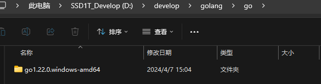

:::tip 摘要
vscode golang环境配置以及golang makefile打包配置，ps:为什么不用goland？因为没有元子！囧
:::
<!-- more -->

## windows

版本：go1.22.0

### 1、安装golang

官方下载地址：https://golang.google.cn/

下载链接：https://dl.google.com/go/go1.22.0.windows-amd64.zip

解压安装到D:\develop\golang\go下，如下



### 2、创建工作区GOPATH并创建bin,src,pkg目录

D:\develop\golang\workspace


说明：

>GOPATH 是 Go 语言中使用的一个环境变量，它使用绝对路径提供项目的**工作目录（**也称为**工作区）,** 是存放 Golang 项目代码的文件路径, GOPATH 适合处理大量 Go语言源码、多个包组合而成的复杂工程。

**`GOPATH`目录一般为：**

>1、bin 存放编译生成的二进制文件。比如 执行命令 go get github.com/google/gops，bin目录会生成 gops 的二进制文件。
>
>2、pkg 其中pkg下面以下三个文件夹。
>
>XX_amd64: 其中 XX 是目标操作系统，比如 mac 系统对应的是darwin_amd64, linux 系统对应的是 linux_amd64，存放的是.a结尾的文件。
>mod: 当开启go Modules 模式下，go get命令缓存下依赖包存放的位置
>sumdb: go get命令缓存下载的checksum数据存放的位
>3、src 存放golang项目代码的位置


如下是一个完整的Go项目的开发目录：

```tex
my-go                 // my-go为GOPATH目录
  -- bin
     -- myApp1        // 编译生成
     -- myApp2        // 编译生成
     -- myApp3        // 编译生成
  -- pkg                             依赖包编译后的*.a文件//
  -- src
     -- MyApp1        // 项目1
        -- models
        -- controllers
        -- others
        -- main.go 
     -- MyApp2        // 项目2
        -- models
        -- controllers
        -- others
        -- main.go
```

GOPATH造成问题
        在使用 GOPATH 模式下，我们需要将应用代码存放在固定的$GOPATH/src目录下，且如果执行go get使用第三方类库的时候会自动下载并安装到$GOPATH目录下。 项目的Golang代码，和第三方的Golang文件混在一起, 每个如果项目都需要同样的依赖，那么我们就会在不同的GoPath的src中下载大量重复的第三方依赖包，这同样会占用大量的磁盘空间

GOPATH 的缺点

>1. 必须指定目录，
>
>2. go get 命令的时候，无法指定获取的版本
>3. 引用第三方项目的时候，无法处理v1、v2、v3等不同版本的引用问题，因为在GOPATH 模式下项目路径都是 github.com/foo/project
>4. 无法同步一致第三方版本号，在运行 Go 应用程序的时候，无法保证其它人与所期望依赖的第三方库是相同的版本。

我们给不同的项目设置不同的GoPath，优点非常明显：

便于管理项目，每个项目都是不同的GoPath，这对于我们管理多个Golang项目而言，能够非常清晰的处理项目结构。如果我们把所有项目都放在同一个GoPath的src包下，那么项目的结构就会变得非常混乱，难以管理。

但是当我们需要依赖第三方的包的时候，不同的项目设置不同的GoPath的缺点也非常明显：

第三方依赖的包和我们自己的Golang包混在一起，会给我们的项目文件管理带来一定的麻烦。
不同的GoPath都需要下载依赖，那么磁盘中重复的依赖就会非常多，会占用我们大量的磁盘空间。
所以，设置一个GoPath目录，解决依赖重复的问题，设置不同的GoPath目录，解决Golang项目结构混乱的问题，这本身就是个有争议性的问题。

**为了解决这所有的问题，Golang最终引入了GoModule的概念。**


### 3、设置环境变量

设置变量


设置path可执行路径


设置GO模块代理：

地址：https://goproxy.cn/


测试：

```cmd
> go version
go version go1.22.0 windows/amd64


> go env
set GO111MODULE=on
set GOARCH=amd64
set GOBIN=
set GOCACHE=C:\Users\xxx\AppData\Local\go-build
set GOENV=C:\Users\xxx\AppData\Roaming\go\env
set GOEXE=.exe
set GOEXPERIMENT=
set GOFLAGS=
set GOHOSTARCH=amd64
set GOHOSTOS=windows
set GOINSECURE=
set GOMODCACHE=D:\develop\golang\workspace\pkg\mod
set GONOPROXY=
set GONOSUMDB=
set GOOS=windows
set GOPATH=D:\develop\golang\workspace
set GOPRIVATE=
set GOPROXY=https://goproxy.cn
set GOROOT=D:\develop\golang\go\go1.22.0.windows-amd64\go
set GOSUMDB=sum.golang.org
set GOTMPDIR=
set GOTOOLCHAIN=auto
set GOTOOLDIR=D:\develop\golang\go\go1.22.0.windows-amd64\go\pkg\tool\windows_amd64
set GOVCS=
set GOVERSION=go1.22.0
set GCCGO=gccgo
set GOAMD64=v1
set AR=ar
set CC=gcc
set CXX=g++
set CGO_ENABLED=0
set GOMOD=NUL
set GOWORK=
set CGO_CFLAGS=-O2 -g
set CGO_CPPFLAGS=
set CGO_CXXFLAGS=-O2 -g
set CGO_FFLAGS=-O2 -g
set CGO_LDFLAGS=-O2 -g
set PKG_CONFIG=pkg-config
set GOGCCFLAGS=-m64 -fno-caret-diagnostics -Qunused-arguments -Wl,--no-gc-sections -fmessage-length=0 -ffile-prefix-map=C:\Users\xxx\AppData\Local\Temp\go-build4132137718=/tmp/go-build -gno-record-gcc-switches
```

### 4、golang多版本管理

#### 方案一：go install

查看golang所有版本：https://golang.google.cn

例：以安装go1.18.10为例

```sh
# 注意是安装时路径是golang.org
go install golang.org/dl/go1.18.10@latest
go1.18.10  download

# 使用
go1.18.10  version
```

#### 方案二：gvm版本管理器

github地址：https://github.com/moovweb/gvm


### 5、安装vscode并安装插件

### （1）设置vscode更新方式（可略）

打开 vscode → 文件 → 首选项 → 设置→ 在上方搜索栏搜索「更新」，找到「Update: Mode」→ 选择 manual，这样软件不会自动更新，但是你可以自己手动检查更新


### （2）配置windows vscode（可略）

配置以下功能：

- 右键文件用vscode打开文件
- 右键文件夹用vscode打开文件夹
- 右键空白区域用vscode打开

**右键文件用vscode打开文件**

1. Win+R 打开运行，输入regedit，打开注册表，找到HKEY_CLASSES_ROOT  =>  *  =>  shell分支，如果没有shell分支，则在*下点击右键，选择“新建－项”，建立shell分支。
2. 在shell下新建“vscode”项，在右侧窗口的“默认”双击，在数据里输入“用vscode打开文件”。这是右键上显示的文字，可以随便写
3. 在“vscode”下再新建Command项，在右侧窗口的“默认”键值栏内输入程序所在的安装路径，我的是："D:\devtools\web\VSCode-win32-x64-1.89.1\Code.exe" "%1"。其中的%1表示要打开的文件参数。

**右键文件夹用vscode打开文件夹**

1. Win+R 打开运行，输入regedit，打开注册表，找到HKEY_CLASSES_ROOT  =>  Directory  =>  shell分支
2. 在shell下新建“vscode”项，在右侧窗口的“默认”双击，在数据里输入“用vscode打开文件夹”。这是右键上显示的文字，可以随便写
3. 在“vscode”下再新建Command项，在右侧窗口的“默认”键值栏内输入程序所在的安装路径，我的是："D:\devtools\web\VSCode-win32-x64-1.89.1\Code.exe" "%1"。其中的%1表示要打开的文件夹参数。

**右键空白区域用vscode打开**

1. Win+R 打开运行，输入regedit，打开注册表，找到HKEY_CLASSES_ROOT  =>  Directory => Background  =>  shell分支
2. 在shell下新建“vscode”项，在右侧窗口的“默认”双击，在数据里输入“用vscode打开”。这是右键上显示的文字，可以随便写
3. 在“vscode”下再新建Command项，在右侧窗口的“默认”键值栏内输入程序所在的安装路径，我的是："D:\devtools\web\VSCode-win32-x64-1.89.1\Code.exe" "%v"。%v为参数

**说明：D:\devtools\web\VSCode-win32-x64-1.89.1\Code.exe为Vscode的安装路径，根据各自环境修改。**


### （3）vscode设置cmder终端（可略）

终极推荐：cmder终端，windows最强终端，比cmd,powershell等强太多了。

官方下载地址：https://github.com/cmderdev/cmder

建议下载完整包cmder.zip，里面包含git等命令

vscode设置cmder终端官方wiki:https://github.com/cmderdev/cmder/wiki/Seamless-VS-Code-Integration

```json
	// 设置cmder
	"terminal.integrated.defaultProfile.windows": "Cmder",
    "terminal.integrated.profiles.windows": {
        "Cmder": {
            "name": "Cmder",
            "path": [
                "${env:windir}\\Sysnative\\cmd.exe",
                "${env:windir}\\System32\\cmd.exe"
            ],
            "args": ["/k", "D:\\devtools\\other\\cmder\\vendor\\bin\\vscode_init.cmd"],
            "icon": "terminal-cmd",
            "color": "terminal.ansiGreen"
        },
    },
```

说明：args部分的"D:\\devtools\\other\\cmder"为我自己的安装路径，按各自环境修改，其余不变


### （4）安装Go插件

插件推荐：Go、Code Runner、GoComment、vscode-proto3：


#### **Go插件**

更新 Go 工具：
`ctrl + shift + P` 搜索 `Go: Install/Update Tools`，可能需要梯子


全部选择好后，点确定后开始安装（需要代理）：


可以看到有一些 exe 文件被安装到了我设置的 `工作区\bin` 目录下：


#### **Code Runner插件**


#### **GoComment插件**


**vscode-proto3插件**


### 6、vscode快捷键

```tex
pkgm：生成main包+main主函数
tys：快捷构建结构体
ff：fmt.Printf格式化输出
fp：fmt.Println换行输出
for：for循环
forr：for range
```

命令补全

```json
{
	"Print to console": {
		"scope": "javascript,typescript",
		"prefix": "clg",
		"body": [
			"console.log('$1');",
			"$2"
		],
		"description": "Log output to console"
	},
	"golang Printf var": {
		"prefix": "gv",
		"body": [
			"$1 := $2",
			"fmt.Printf(\"$1: %v\\n\", $1)"
		],
		"description": "定义变量并打印 var := "
	},
	"golang Printf var, _ :=": {
		"prefix": "gvh",
		"body": [
			"$1, _ := $2",
			"fmt.Printf(\"$1: %v\\n\", $1)"
		],
		"description": "定义变量并打印 var, _ := "
	},
	"golang var, err :=": {
		"prefix": "gve",
		"body": [
			"$1, err := $2",
			"if err != nil {",
			"",
			"  return",
			"}",
			"fmt.Printf(\"$1: %v\\n\", $1)"
		],
		"description": "定义变量并打印 var, err := "
	},
	"h5": {
		"prefix": "h5", // 触发的关键字 输入vh按下tab键
		"body": [
			"<!DOCTYPE html>",
			"<html lang=\"en\">\n",
			"<head>",
			"   <meta charset=\"UTF-8\">",
			"   <meta name=\"viewport\" content=\"width=device-width, initial-scale=1.0\">",
			"   <meta http-equiv=\"X-UA-Compatible\" content=\"ie=edge\">",
			"   <title>Document</title>",
			"   <style>\n",
			"   </style>",
			"</head>\n",
			"<body>",
			"   <div>",
			"     $0",
			"   </div>",
			"</body>\n",
			"</html>",
		],
		"description": "h5 template"
	},
	"vue3 ts template": {
		"prefix": "v3",
		"body": [
			"<script setup lang=\"ts\">",
			"import { ref } from 'vue'\n",
			"",
			"</script>",
			"<template>",
			"  <div>",
			"    $0",
			"  </div>",
			"</template>",
			"<style lang=\"scss\" scoped>\n",
			"</style>"
		],
		"description": "Vue3 typescript template"
	},
	"vue2 template": {
		"prefix": "v2",
		"body": [
			"<template>",
			"  <div>\n",
			"    $0",
			"  </div>",
			"</template>",
			"<script>",
			"export default {",
			"  name:'',",
			"  data() {",
			"  return {\n",
			"    }",
			"  },",
			"  methods:{\n",
			"  },",
			"}",
			"</script>",
			"<style lang=\"scss\" scoped>\n",
			"</style>\n",
		],
		"description": "vue2 template"
	},
	"vh": {
		"prefix": "vh",
		"body": [
			"<!DOCTYPE html>",
			"<html lang=\"en\">\n",
			"<head>",
			"  <meta charset=\"UTF-8\">",
			"  <meta name=\"viewport\" content=\"width=device-width, initial-scale=1.0\">",
			"  <meta http-equiv=\"X-UA-Compatible\" content=\"ie=edge\">",
			"  <title>Document</title>",
			"  <script src=\"./lib/vue-2.4.0.js\"></script>",
			"  <style>\n",
            "  </style>",
			"</head>\n",
			"<body>",
			"  <div id=\"app\">\n",
			"    $0",
			"  </div>",
			"  <script>",
			"  var vm = new Vue({",
			"    el:'#app',",
			"    data() {",
			"      return {\n",
			"      }",
			"    },",
			"    methods:{\n",
			"    },",
			"  });",
			"  </script>",
			"</body>\n",
			"</html>",
		],
		"description": "vh template"
	},
	"async-function-arrow": {
		"prefix": "vf",
		"body": [
			"// $1",
			"const resultList = ref<type>()",
			"const ${2:FuncName} = async () => {",
			"  const res = await ${3:API()}",
			"  console.log(res)",
			"}"
		],
		"description": "箭头Async函数",
	},
}
```


### 7、安装make命令编译工具mingw

**MinGW 介绍**

MinGW 的全称是：Minimalist GNU on Windows 。是将经典的开源 C语言 编译器 GCC 移植到了 Windows 平台下，并且包含了 Win32API ，因此可以将源代码编译为可在 Windows 中运行的可执行程序。

而且还可以使用一些 Windows 不具备的，Linux平台下的开发工具。

**一句话来概括：MinGW 就是 GCC 的 Windows 版本** 。

**MinGW-w64 与 MinGW 的区别**

MinGW-w64 与 MinGW 的区别在于 MinGW 只能编译生成32位可执行程序，而 MinGW-w64 则可以编译生成 64位 或 32位 可执行程序。

正因为如此，MinGW 现已被 MinGW-w64 所取代，且 MinGW 也早已停止了更新，内置的 GCC 停滞在了 4.8.1 版本，而 MinGW-w64 内置的 GCC 则更新到了 8.1.0 版本。

**安装MinGW-w64**

下载地址：https://sourceforge.net/projects/mingw-w64/files/

下载这个：https://sourceforge.net/projects/mingw-w64/files/Toolchains%20targetting%20Win64/Personal%20Builds/mingw-builds/8.1.0/threads-win32/seh/x86_64-8.1.0-release-win32-seh-rt_v6-rev0.7z


解压，将bin下的mingw32-make.exe重命名成make.exe，设置系统环境PATH路径，即可使用了。

附相关博文：

Windows下MinGW-w64的安装:
https://zhuanlan.zhihu.com/p/355510947
Mingw快捷安装教程 并完美解决出现的下载错误：The file has been downloaded incorrectly:
https://blog.csdn.net/yvge669/article/details/124564622


**Makefile参考1**

源码地址：https://github.com/stylite1024/iris-web

```makefile
# 参考：https://github.com/adnanh/webhook/blob/master/Makefile
# 二进制包名
# BINARY ?=$(shell grep "AppName.*=" config/info.go | awk  -F'"' '{print $2}')
BINARY	?=$(shell grep "AppName.*=" config/info.go | grep -oP '"\K[^"]+')

# 版本号
VERSION	?=$(shell grep "Version.*=" config/info.go | grep -oP '"\K[^"]+')

# go版本
# GO_VERSION ?= $(shell go version | grep -o '[0-9]\+.[0-9]\+.[0-9]\+')
GO_VERSION	?= $(shell grep '^go' go.mod | cut -d' ' -f2)

# 设置当前的GOOS和GOARCH
# 系统平台，如linux、windows
GOOS	?= $(shell go env GOOS)
# 系统架构，如amd64
GOARCH	?= $(shell go env GOARCH)

# 查看支持操作系统和架构命令：go tool dist list
# 定义可以打包的操作系统列表
PLATFORMS	:= windows linux darwin
# 定义可以打包的架构列表
ARCHES	:= amd64 arm64 386 

# 打包docker镜像变量
DOCKERFILE_PATH         ?= ./Dockerfile
DOCKERBUILD_CONTEXT     ?= ./
DOCKER_NAMESPACE		?= go-app

# 使用内置目标名.PHONY声明这些“伪目标”名是“伪目标”，而不是与“伪目标”同名的文件
.PHONY: help update run build build-image build-run-container remove-image remove-container push-image build-push-image all clean 

default: help

update:
	@go mod tidy

run: update
	@go run .

build: update
ifeq ("$(GOOS)", "windows")
	@CGO_ENABLED=0 GOOS=${GOOS} GOARCH=${GOARCH} go build -ldflags "-s -w" -o ./bin/${BINARY}.exe  .
else
	@CGO_ENABLED=0 GOOS=${GOOS} GOARCH=${GOARCH} go build -ldflags "-s -w" -o ./bin/${BINARY}  .
endif

build-image: remove-container remove-image
# @docker build -t  ${DOCKER_REPO}/${BINARY}:${VERSION} -f ${DOCKERFILE_PATH} --build-arg GOVERSION="${GO_VERSION}" ${DOCKERBUILD_CONTEXT}
	@docker build -t  ${BINARY}:${VERSION} -f ${DOCKERFILE_PATH} --build-arg GOVERSION="${GO_VERSION}" ${DOCKERBUILD_CONTEXT}
	@docker tag ${BINARY}:${VERSION} ${BINARY}:latest

build-run-container: remove-container build-image
	@docker run -d --name ${BINARY} ${BINARY}:${VERSION}
	@docker ps|grep ${BINARY}

remove-image: remove-container
	@docker rmi -f ${BINARY}:latest
	@docker rmi -f ${BINARY}:${VERSION}

remove-container:
	@docker rm -f ${BINARY}

push-image:
	@docker tag	${BINARY}:${VERSION} ${DOCKER_NAMESPACE}/${BINARY}:${VERSION}
	@docker tag ${BINARY}:latest ${DOCKER_NAMESPACE}/${BINARY}:latest
	@docker push ${DOCKER_NAMESPACE}/${BINARY}:${VERSION}
	@docker push ${DOCKER_NAMESPACE}/${BINARY}:latest

build-push-image: build-image push-image

all: update
	@for platform in $(PLATFORMS); do \
		for arch in $(ARCHES); do \
			echo "building  ${BINARY}-$${platform}-$${arch}  binary file..."; \
			GOOS=$${platform} GOARCH=$${arch} go build -ldflags "-s -w" -o "./bin/${BINARY}-$${platform}-$${arch}" .; \
		done; \
	done

clean:
	@if [ -d bin ] ; then rm -rf ./bin ; fi
	@echo "clean successful"

help:
	@echo "usage: make <option>"
	@echo "options and effects:"
	@echo "	help				: Show help"
	@echo "	update				: Run 'go mod tidy'"
	@echo "	Run					: Run 'go run .'"
	@echo "	Build				: Build the binary of this project for current platform"
	@echo "	build-image			: Build docker image"
	@echo "	build-run-container	: Build docker image and run docker container"
	@echo "	remove-images		: Remove docker image"
	@echo "	remove-container	: Remove docker container"
	@echo "	all 				: Build multiple platform multiple arch binary of this project"
	@echo "	clean				: Cleaning up all the generated binary files"
```


**Makefile参考2**

```makefile
APP := $(shell cat go.mod | grep "^module " | sed -e "s/module //g")
VERSION  = $(shell git describe --tags --always)
REVISION = $(shell git rev-parse --short HEAD)
BRANCH = $(shell git rev-parse --abbrev-ref HEAD)
BUILD_USER = ${shell git show -s --format=%an}
BUILD_DATE = $(shell date -R)
GOARCH := $(shell go env GOARCH)
GOOS := $(shell go env GOOS)

define LDFLAGS
"
-w -s \
-X 'github.com/prometheus/common/version.Version=${VERSION}' \
-X 'github.com/prometheus/common/version.Revision=${REVISION}' \
-X 'github.com/prometheus/common/version.Branch=${BRANCH}' \
-X 'github.com/prometheus/common/version.BuildUser=${BUILD_USER}' \
-X 'github.com/prometheus/common/version.BuildDate=${BUILD_DATE}' \
"
endef
SERVER_MAIN_FILE="src/modules/server/server.go"
AGENT_MAIN_FILE="src/modules/agent/agent.go"
GOBUILD_SERVER=CGO_ENABLED=0 go build -a -ldflags ${LDFLAGS}
GOBUILD_AGENT=CGO_ENABLED=0 go build -a -ldflags ${LDFLAGS}  

# 使用内置目标名.PHONY声明这些“伪目标”名是“伪目标”，而不是与“伪目标”同名的文件
.PHONY: help all build windows linux darwin

default:help

all:build windows linux darwin ls

server:
	@${GOBUILD_SERVER} -o ./bin/${APP}-server  ${SERVER_MAIN_FILE}
agent:
	@${GOBUILD_AGENT} -o ./bin/${APP}-agent ${AGENT_MAIN_FILE}
build:
	@${GOBUILD_SERVER} -o ./bin/${APP}-server ${SERVER_MAIN_FILE}
	@${GOBUILD_AGENT} -o ./bin/${APP}-agent ${AGENT_MAIN_FILE}
windows:
	@GOOS=windows ${GOBUILD_SERVER} -o ./bin/${APP}-server-${VERSION}-windows-${GOARCH}.exe ${SERVER_MAIN_FILE}
	@GOOS=windows ${GOBUILD_AGENT} -o ./bin/${APP}-agent-${VERSION}-windows-${GOARCH}.exe ${AGENT_MAIN_FILE}
linux:
	@GOOS=linux ${GOBUILD_SERVER} -o ./bin/${APP}-server-${VERSION}-linux-${GOARCH} ${SERVER_MAIN_FILE}
	@GOOS=linux ${GOBUILD_AGENT} -o ./bin/${APP}-agent-${VERSION}-linux-${GOARCH} ${AGENT_MAIN_FILE}
darwin:
	@GOOS=darwin ${GOBUILD_SERVER} -o ./bin/${APP}-server-${VERSION}-darwin-${GOARCH} ${SERVER_MAIN_FILE}
	@GOOS=darwin ${GOBUILD_AGENT} -o ./bin/${APP}-agent-${VERSION}-darwin-${GOARCH} ${AGENT_MAIN_FILE}
ls:
	@ls ./bin

clean:
	@echo "Cleaning up all the generated files"
	@if [ -d bin ] ; then rm -rf ./bin ; fi

help:
	@echo "usage: make <option>"
	@echo "options and effects:"
	@echo "    help   	: Show help"
	@echo "    all    	: Build multiple binary of this project"
	@echo "    build  	: Build the binary of this project for current platform"
	@echo "    windows	: Build the windows binary of this project"
	@echo "    linux  	: Build the linux binary of this project"
	@echo "    darwin 	: Build the darwin binary of this project"
	@echo "    clean  	: Cleaning up all the generated files"
```

使用

```json
make 
make build
```


### 8、缩减Golang编译后文件大小的三种方法

推荐文章：https://zhuanlan.zhihu.com/p/313053187?utm_id=0

总结：（推荐下面两个方法一起用，gccgo可能不支持相关go版本且太复杂，不推荐）

```sh
# 方法一： 优化编译标志，使用-ldflags "-s -w"去掉调试信息和符号表
go build -ldflags "-s -w" -o main.exe  main.go

# 方法二： 使用UPX压缩可以减小二进制文件的大小，但可能会使程序运行时变慢。-o 指定压缩后的文件名。-9指定压缩级别，1-9
upx -9 -o main-compress.exe  main.exe
```


### 9、go build编译后为exe程序添加ico图标

下载工具resourcehacker，地址：https://www.angusj.com/resourcehacker/#download，zip版本解压

```sh
ResourceHacker.exe -open main.exe -save output.exe -action addskip -res icon.ico -mask ICONGROUP,MAIN,
# 命令说明：
main.exe为go build打包后的exe文件
output.exe为添加ico图标完成后的exe文件
icon.ico为ico图标
```

ICO图标在线生成工具：http://tools.jb51.net/aideddesign/ico_img


---
::: tip 更多文章请关注我的公众号,自动推送更新

:::