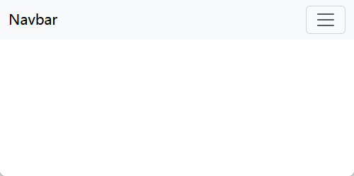
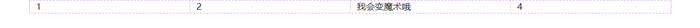

:::tip 摘要
移动端WEB开发之响应式布局
:::
<!-- more -->

# 移动端WEB开发之响应式布局

### 1.0 响应式开发原理 

#### 1.1 响应式开发原理

就是使用媒体查询针对不同宽度的设备进行布局和样式的设置，从而适配不同设备的目的。

设备的划分情况：

+ 小于768的为超小屏幕（手机）
+ 768~992之间的为小屏设备（平板）
+ 992~1200的中等屏幕（桌面显示器）
+ 大于1200的宽屏设备（大桌面显示器）

#### 1.2 响应式布局容器

响应式需要一个父级做为布局容器，来配合子级元素来实现变化效果。

原理就是在不同屏幕下，通过媒体查询来改变这个布局容器的大小，再改变里面子元素的排列方式和大小，从而实现不同屏幕下，看到不同的页面布局和样式变化。

父容器版心的尺寸划分

+ 超小屏幕（手机，小于 768px）：设置宽度为 100%
+ 小屏幕（平板，大于等于 768px）：设置宽度为 750px
+ 中等屏幕（桌面显示器，大于等于 992px）：宽度设置为 970px
+ 大屏幕（大桌面显示器，大于等于 1200px）：宽度设置为 1170px 

但是我们也可以根据实际情况自己定义划分

**例：响应式布局原理**

```html
<!DOCTYPE html>
<html lang="en">

<head>
    <meta charset="UTF-8">
    <meta name="viewport" content="width=device-width, initial-scale=1.0">
    <meta http-equiv="X-UA-Compatible" content="ie=edge">
    <title>Document</title>
    <style>
        .container {
            height: 150px;
            background-color: pink;
            margin: 0 auto;
        }
        /* 1. 超小屏幕下  小于 768  布局容器的宽度为 100% */
        
        @media screen and (max-width: 767px) {
            .container {
                width: 100%;
            }
        }
        /* 2. 小屏幕下  大于等于768  布局容器改为 750px */
        
        @media screen and (min-width: 768px) {
            .container {
                width: 750px;
            }
        }
        /* 3. 中等屏幕下 大于等于 992px   布局容器修改为 970px */
        
        @media screen and (min-width: 992px) {
            .container {
                width: 970px;
            }
        }
        /* 4. 大屏幕下 大于等于1200 布局容器修改为 1170 */
        
        @media screen and (min-width: 1200px) {
            .container {
                width: 1170px;
            }
        }
    </style>
</head>

<body>
    <!-- 响应式开发里面，首先需要一个布局容器 -->
    <div class="container"></div>
</body>

</html>
```


**例：响应式导航**

①当我们屏幕大于等于800像素，我们给nav宽度为800px，因为里面子盒子需要浮动，所以nav需要清除浮动。

②nav里面包含8个小li  盒子，每个盒子的宽度定为100px，高度为30px，浮动一行显示。

③当我们屏幕缩放，宽度小于800像素的时候，nav盒子宽度修改为100% 宽度。

④nav里面的8个小li，宽度修改为33.33%，这样一行就只能显示3个小li ，剩余下行显示。

```html
<!DOCTYPE html>
<html lang="en">

<head>
    <meta charset="UTF-8">
    <meta name="viewport" content="width=device-width, initial-scale=1.0">
    <meta http-equiv="X-UA-Compatible" content="ie=edge">
    <title>Document</title>
    <style>
        * {
            margin: 0;
            padding: 0;
        }
        
        ul {
            list-style: none;
        }
        
        .container {
            width: 750px;
            margin: 0 auto;
        }
        
        .container ul li {
            float: left;
            width: 93.75px;
            height: 30px;
            background-color: green;
        }
        
        @media screen and (max-width: 767px) {
            .container {
                width: 100%;
            }
            .container ul li {
                width: 33.33%;
            }
        }
    </style>
</head>

<body>
    <div class="container">
        <ul>
            <li>导航栏</li>
            <li>导航栏</li>
            <li>导航栏</li>
            <li>导航栏</li>
            <li>导航栏</li>
            <li>导航栏</li>
            <li>导航栏</li>
            <li>导航栏</li>
        </ul>
    </div>
</body>

</html>
```


###  2.0 bootstrap的介绍

#### 2.1Bootstrap简介

Bootstrap 来自 Twitter（推特），是目前最受欢迎的前端框架。Bootstrap 是基于HTML、CSS 和 JAVASCRIPT 的，它简洁灵活，使得 Web 开发更加快捷。

[中文网](lhttp://www.bootcss.com/)  [官网](lhttp://getbootstrap.com/)  [推荐网站](http://bootstrap.css88.com/)

框架：顾名思义就是一套架构，它有一套比较完整的网页功能解决方案，而且控制权在框架本身，有预制样式库、组件和插件。使用者要按照框架所规定的某种规范进行开发。

#### 2.2 bootstrap优点

+ 标准化的html+css编码规范
+ 提供了一套简洁、直观、强悍的组件
+ 有自己的生态圈，不断的更新迭代
+ 让开发更简单，提高了开发的效率

#### 2.3 版本简介

2.x.x：停止维护,兼容性好,代码不够简洁，功能不够完善。

3.x.x：

- 目前使用最多,稳定,但是放弃了IE6-IE7。对 IE8 支持但是界面效果不好,偏向用于开发响应式布局、移动设备优先的WEB 项目。
- 支持 IE8+ 浏览器
- 依赖 jQuery

4.x.x：

- 支持 IE10+ 浏览器
- 支持 Flexbox 布局
- 不依赖 jQuery

5.x.x：(本文使用的版本)

- 最新
- 支持 Flexbox 布局
- 支持 Grid 布局
- 支持 CSS 自定义属性
- 不依赖 jQuery
- 不支持 IE 浏览器


#### 2.4bootstrap基本使用

##### 2.4.1 bootstrap3

在现阶段我们还没有接触JS相关课程，所以我们只考虑使用它的样式库。

Bootstrap 使用四步曲： 

1. 创建文件夹结构  

   

   

2. 创建 html 骨架结构 

   ```
   <!DOCTYPE html>
   <html lang="zh-CN">
     <head>
       <meta charset="utf-8">
       <meta http-equiv="X-UA-Compatible" content="IE=edge">
       <meta name="viewport" content="width=device-width, initial-scale=1">
       <!-- 上述3个meta标签*必须*放在最前面，任何其他内容都*必须*跟随其后！ -->
       <title>Bootstrap 101 Template</title>

       <!-- Bootstrap -->
       <link href="css/bootstrap.min.css" rel="stylesheet">

       <!-- HTML5 shim and Respond.js for IE8 support of HTML5 elements and media queries -->
       <!-- WARNING: Respond.js doesn't work if you view the page via file:// -->
       <!--[if lt IE 9]>
         <script src="//cdn.bootcss.com/html5shiv/3.7.2/html5shiv.min.js"></script>
         <script src="//cdn.bootcss.com/respond.js/1.4.2/respond.min.js"></script>
       <![endif]-->
     </head>
     <body>
       <h1>你好，世界！</h1>

       <!-- jQuery (necessary for Bootstrap's JavaScript plugins) -->
       <script src="//cdn.bootcss.com/jquery/1.11.3/jquery.min.js"></script>
       <!-- Include all compiled plugins (below), or include individual files as needed -->
       <script src="js/bootstrap.min.js"></script>
     </body>
   </html>
   ```

   

3. 引入相关样式文件  

   ```
   <!-- Bootstrap 核心样式-->
   <link rel="stylesheet" href="bootstrap/css/bootstrap.min.css">
   ```

   

4. 书写内容 

   直接拿Bootstrap 预先定义好的样式来使用

   修改Bootstrap 原来的样式，注意权重问题

   学好Bootstrap 的关键在于知道它定义了哪些样式，以及这些样式能实现什么样的效果


##### 2.4.2 bootstrap5

```html
<!doctype html>
<html lang="en">

<head>
    <meta charset="utf-8">
    <meta name="viewport" content="width=device-width, initial-scale=1">
    <title>Bootstrap demo</title>
    <link href="https://cdn.jsdelivr.net/npm/bootstrap@5.3.3/dist/css/bootstrap.min.css" rel="stylesheet"
        integrity="sha384-QWTKZyjpPEjISv5WaRU9OFeRpok6YctnYmDr5pNlyT2bRjXh0JMhjY6hW+ALEwIH" crossorigin="anonymous">
</head>

<body>
    <nav class="navbar navbar-expand-lg bg-body-tertiary">
        <div class="container-fluid">
            <a class="navbar-brand" href="#">Navbar</a>
            <button class="navbar-toggler" type="button" data-bs-toggle="collapse"
                data-bs-target="#navbarSupportedContent" aria-controls="navbarSupportedContent" aria-expanded="false"
                aria-label="Toggle navigation">
                <span class="navbar-toggler-icon"></span>
            </button>
            <div class="collapse navbar-collapse" id="navbarSupportedContent">
                <ul class="navbar-nav me-auto mb-2 mb-lg-0">
                    <li class="nav-item">
                        <a class="nav-link active" aria-current="page" href="#">Home</a>
                    </li>
                    <li class="nav-item">
                        <a class="nav-link" href="#">Link</a>
                    </li>
                    <li class="nav-item dropdown">
                        <a class="nav-link dropdown-toggle" href="#" role="button" data-bs-toggle="dropdown"
                            aria-expanded="false">
                            Dropdown
                        </a>
                        <ul class="dropdown-menu">
                            <li><a class="dropdown-item" href="#">Action</a></li>
                            <li><a class="dropdown-item" href="#">Another action</a></li>
                            <li>
                                <hr class="dropdown-divider">
                            </li>
                            <li><a class="dropdown-item" href="#">Something else here</a></li>
                        </ul>
                    </li>
                    <li class="nav-item">
                        <a class="nav-link disabled">Disabled</a>
                    </li>
                </ul>
                <form class="d-flex" role="search">
                    <input class="form-control me-2" type="search" placeholder="Search" aria-label="Search">
                    <button class="btn btn-outline-success" type="submit">Search</button>
                </form>
            </div>
        </div>
    </nav>
    <script src="https://cdn.jsdelivr.net/npm/bootstrap@5.3.3/dist/js/bootstrap.bundle.min.js"
        integrity="sha384-YvpcrYf0tY3lHB60NNkmXc5s9fDVZLESaAA55NDzOxhy9GkcIdslK1eN7N6jIeHz"
        crossorigin="anonymous"></script>
</body>

</html>
```





#### 2.5 bootstrap布局容器

Bootstrap 需要为页面内容和栅格系统包裹一个 .container 或者.container-fluid 容器，它提供了两个作此用处的类。

.container

+ 响应式布局的容器  固定宽度
+ 大屏 ( >=1200px)  宽度定为 1170px
+ 中屏 ( >=992px)   宽度定为  970px
+ 小屏 ( >=768px)   宽度定为  750px
+ 超小屏  (100%) 

.container-fluid（偏向于只开发移动端）

+ 流式布局容器 百分百宽度
+ 占据全部视口（viewport）的容器。

例：

```html
<!doctype html>
<html lang="en">

<head>
    <meta charset="utf-8">
    <meta name="viewport" content="width=device-width, initial-scale=1">
    <title>Bootstrap demo</title>
    <link href="https://cdn.jsdelivr.net/npm/bootstrap@5.3.3/dist/css/bootstrap.min.css" rel="stylesheet"
        integrity="sha384-QWTKZyjpPEjISv5WaRU9OFeRpok6YctnYmDr5pNlyT2bRjXh0JMhjY6hW+ALEwIH" crossorigin="anonymous">
</head>

<body>
    <div class="container">123</div>
    <div class="container-fluid">123</div>
    
    <script src="https://cdn.jsdelivr.net/npm/bootstrap@5.3.3/dist/js/bootstrap.bundle.min.js"
        integrity="sha384-YvpcrYf0tY3lHB60NNkmXc5s9fDVZLESaAA55NDzOxhy9GkcIdslK1eN7N6jIeHz"
        crossorigin="anonymous"></script>
</body>

</html>
```


#### 2.6 bootstrap栅格系统

##### 栅格选项参数

Bootstrap提供了一套响应式、移动设备优先的流式栅格系统，随着屏幕或视口（viewport）尺寸的增加，系统会自动分为最多12列。

栅格系统用于通过一系列的行（row）与列（column）的组合来创建页面布局，你的内容就可以放入这些创建好的布局中。

|                     | 超小屏幕（手机）< 768px | 小屏设备（平板）>=768px | 中等屏幕（桌面显示器）>=992px | 宽屏设备（大桌面显示器）>=1200px |
| ------------------- | :---------------------: | :---------------------: | :---------------------------: | :------------------------------: |
| .container 最大宽度 | 自动(100%)              | 750px                   | 970px                         | 1170px                           |
| 类前缀              | .col-xs-                | .col-sm-                | .col-md-                      | .col-lg-                         |
| 列（column）数      |12|12|12|12|

+ 按照不同屏幕划分为1~12 等份
+ 行（row） 可以去除父容器作用15px的边距
+ xs-extra small：超小； sm-small：小；  md-medium：中等； lg-large：大；
+ 列（column）大于 12，多余的“列（column）”所在的元素将被作为一个整体另起一行排列
+ 每一列默认有左右15像素的 padding
+ 可以同时为一列指定多个设备的类名，以便划分不同份数  例如 class="col-md-4 col-sm-6"

例：

```html
<!doctype html>
<html lang="en">

<head>
    <meta charset="utf-8">
    <meta name="viewport" content="width=device-width, initial-scale=1">
    <title>Bootstrap demo</title>
    <link href="https://cdn.jsdelivr.net/npm/bootstrap@5.3.3/dist/css/bootstrap.min.css" rel="stylesheet"
        integrity="sha384-QWTKZyjpPEjISv5WaRU9OFeRpok6YctnYmDr5pNlyT2bRjXh0JMhjY6hW+ALEwIH" crossorigin="anonymous">
    <style>
        [class^="col"] {
            border: 1px solid #ccc;
        }
        .row:nth-child(1) {
            background-color: pink;
        }
    </style>
</head>

<body>
    <div class="container">
        <div class="row">
            <div class="col-lg-3 col-md-4 col-sm-6 col-xs-12">1</div>
            <div class="col-lg-3 col-md-4 col-sm-6 col-xs-12">2</div>
            <div class="col-lg-3 col-md-4 col-sm-6 col-xs-12">3</div>
            <div class="col-lg-3 col-md-4 col-sm-6 col-xs-12">4</div>
        </div>
        <!-- 如果孩子的份数相加等于12 则孩子能占满整个 的container 的宽度 -->
        <div class="row">
            <div class="col-lg-6">1</div>
            <div class="col-lg-2">2</div>
            <div class="col-lg-2">3</div>
            <div class="col-lg-2">4</div>
        </div>
        <!-- 如果孩子的份数相加 小于 12 则会？ 则占不满整个container 的宽度 会有空白 -->
        <div class="row">
            <div class="col-lg-6">1</div>
            <div class="col-lg-2">2</div>
            <div class="col-lg-2">3</div>
            <div class="col-lg-1">4</div>
        </div>
        <!-- 如果孩子的份数相加 大于 12 则会？多于的那一列会 另起一行显示  -->
        <div class="row">
            <div class="col-lg-6">1</div>
            <div class="col-lg-2">2</div>
            <div class="col-lg-2">3</div>
            <div class="col-lg-3">4</div>
        </div>
    </div>

    <script src="https://cdn.jsdelivr.net/npm/bootstrap@5.3.3/dist/js/bootstrap.bundle.min.js"
        integrity="sha384-YvpcrYf0tY3lHB60NNkmXc5s9fDVZLESaAA55NDzOxhy9GkcIdslK1eN7N6jIeHz"
        crossorigin="anonymous"></script>
</body>
</html>
```


##### 栅格嵌套

栅格系统内置的栅格系统将内容再次嵌套。简单理解就是一个列内再分成若干份小列。我们可以通过添加一个新的 .row 元素和一系列 .col-sm-* 元素到已经存在的 .col-sm-*
元素内。

```
<!-- 列嵌套 -->
 <div class="col-sm-4">
    <div class="row">
         <div class="col-sm-6">小列</div>
         <div class="col-sm-6">小列</div>
    </div>
</div>

```

例

```html
<!doctype html>
<html lang="en">

<head>
    <meta charset="utf-8">
    <meta name="viewport" content="width=device-width, initial-scale=1">
    <title>Bootstrap demo</title>
    <link href="https://cdn.jsdelivr.net/npm/bootstrap@5.3.3/dist/css/bootstrap.min.css" rel="stylesheet"
        integrity="sha384-QWTKZyjpPEjISv5WaRU9OFeRpok6YctnYmDr5pNlyT2bRjXh0JMhjY6hW+ALEwIH" crossorigin="anonymous">
</head>

<body>
    <div class="container" style="height: 50px;background-color: pink;">
        <div class="row">
            <div class="col-md-4">
                <!-- 我们列嵌套最好加1个行 row 这样可以取消父元素的padding值 而且高度自动和父级一样高 -->
                <!-- 当宽度小于md，会另起一行 -->
                <div class="row" style="background-color: gold;">
                    <div class="col-md-4" style="background-color: green;">a</div>
                    <div class="col-md-8" style="background-color: palevioletred;">b</div>
                </div>
            </div>
            <div class="col-md-4">2</div>
            <div class="col-md-4">3</div>
        </div>
    </div>

    <script src="https://cdn.jsdelivr.net/npm/bootstrap@5.3.3/dist/js/bootstrap.bundle.min.js"
        integrity="sha384-YvpcrYf0tY3lHB60NNkmXc5s9fDVZLESaAA55NDzOxhy9GkcIdslK1eN7N6jIeHz"
        crossorigin="anonymous"></script>
</body>

</html>
```


##### 列偏移

使用 .col-md-offset-* 类可以将列向右侧偏移。这些类实际是通过使用 * 选择器为当前元素增加了左侧的边距（margin）。

示例：

```html
<!doctype html>
<html lang="en">

<head>
    <meta charset="utf-8">
    <meta name="viewport" content="width=device-width, initial-scale=1">
    <title>Bootstrap demo</title>
    <link href="https://cdn.jsdelivr.net/npm/bootstrap@5.3.3/dist/css/bootstrap.min.css" rel="stylesheet"
        integrity="sha384-QWTKZyjpPEjISv5WaRU9OFeRpok6YctnYmDr5pNlyT2bRjXh0JMhjY6hW+ALEwIH" crossorigin="anonymous">
    <style>
        .row div {
            height: 50px;
            background-color: pink;
        }
    </style>
</head>

<body>
    <div class="container">
        <div class="row">
            <div class="col-md-3">左侧</div>
            <!-- 偏移的份数 就是 12 - 两个盒子的份数 = 6 -->
            <div class="col-md-3 offset-md-6">右侧</div>
        </div>
        <div class="row">
            <!-- 如果只有一个盒子 那么就偏移 = (12 - 8) /2 -->
            <div class="col-md-8 offset-md-2">中间盒子</div>
        </div>
    </div>

    <script src="https://cdn.jsdelivr.net/npm/bootstrap@5.3.3/dist/js/bootstrap.bundle.min.js"
        integrity="sha384-YvpcrYf0tY3lHB60NNkmXc5s9fDVZLESaAA55NDzOxhy9GkcIdslK1eN7N6jIeHz"
        crossorigin="anonymous"></script>
</body>

</html>
```


##### 列排序

使用`.order-`类来控制内容的视觉顺序。这些类是响应式的，因此您可以通过断点设置`order`（例如，`.order-1.order-md-2`）。包括对所有六个网格层的`1`到`5`的支持。如果你需要更多的`.order-*` 类，你可以通过Sass变量修改默认数字。

```
<!doctype html>
<html lang="en">

<head>
    <meta charset="utf-8">
    <meta name="viewport" content="width=device-width, initial-scale=1">
    <title>Bootstrap demo</title>
    <link href="https://cdn.jsdelivr.net/npm/bootstrap@5.3.3/dist/css/bootstrap.min.css" rel="stylesheet"
        integrity="sha384-QWTKZyjpPEjISv5WaRU9OFeRpok6YctnYmDr5pNlyT2bRjXh0JMhjY6hW+ALEwIH" crossorigin="anonymous">
    <style>
        .row div {
            height: 50px;
            background-color: pink;
        }
    </style>
</head>

<body>
    <div class="container">
        <div class="row">
            <div class="col order-4">
                1
            </div>
            <div class="col order-3">
                2
            </div>
            <div class="col order-2">
                3
            </div>
            <div class="col order-1">
                4
            </div>
        </div>
    </div>

    <script src="https://cdn.jsdelivr.net/npm/bootstrap@5.3.3/dist/js/bootstrap.bundle.min.js"
        integrity="sha384-YvpcrYf0tY3lHB60NNkmXc5s9fDVZLESaAA55NDzOxhy9GkcIdslK1eN7N6jIeHz"
        crossorigin="anonymous"></script>
</body>

</html>
```


##### 实用工具

为了更快地进行适合移动设备的开发，请使用响应式显示类按设备显示和隐藏元素。避免创建同一站点的完全不同的版本，而是针对每种屏幕尺寸响应隐藏元素。

要隐藏元素，只需使用`.d-none`类或`.d-{sm,md,lg,xl,xxl}-none`类之一来表示任何响应式屏幕变体。

要仅在给定的屏幕大小间隔上显示元素，您可以将一个`.d-*-none` 类与 `.d-*-*`类组合在一起，例如`.d-none .d-md-block .d-xl-none .d-xxl-none` 将隐藏除中型和大型设备之外的所有屏幕尺寸的元素。


示例：

```html
<!doctype html>
<html lang="en">

<head>
    <meta charset="utf-8">
    <meta name="viewport" content="width=device-width, initial-scale=1">
    <title>Bootstrap demo</title>
    <link href="https://cdn.jsdelivr.net/npm/bootstrap@5.3.3/dist/css/bootstrap.min.css" rel="stylesheet"
        integrity="sha384-QWTKZyjpPEjISv5WaRU9OFeRpok6YctnYmDr5pNlyT2bRjXh0JMhjY6hW+ALEwIH" crossorigin="anonymous">
</head>

<body>
    <div class="container">
        <div class="row">
            <div class="col-lg-3 col-md-4 col-sm-6 col-xs-12">1</div>
            <div class="col-lg-3 col-md-4 col-sm-6 col-xs-12">2</div>
            <!-- 小于md隐藏 -->
            <div class="col-lg-3 col-md-4 d-none d-md-block">我会变魔术哦</div>
            <div class="col-lg-3 col-md-4 col-sm-6 col-xs-12">4</div>
        </div>
    </div>

    <script src="https://cdn.jsdelivr.net/npm/bootstrap@5.3.3/dist/js/bootstrap.bundle.min.js"
        integrity="sha384-YvpcrYf0tY3lHB60NNkmXc5s9fDVZLESaAA55NDzOxhy9GkcIdslK1eN7N6jIeHz"
        crossorigin="anonymous"></script>
</body>

</html>
```




### 3.0 阿里百秀案例制作

#### 3.0 阿里百秀响应式案例效果


#### 3.1 技术选型

方案：我们采取响应式页面开发方案

技术：bootstrap框架

设计图： 本设计图采用 1280px 设计尺寸

项目结构搭建

Bootstrap 使用四步曲： 

1. 创建文件夹结构  

2. 创建 html 骨架结构  
3. 引入相关样式文件  
4. 书写内容 

container宽度修改

因为本效果图采取 1280的宽度， 而Bootstrap 里面 container宽度 最大为 1170px，因此我们需要手动改下container宽度

```
 /* 利用媒体查询修改 container宽度适合效果图宽度  */
  @media (min-width: 1280px) { 
    .container { 
	width: 1280px; 
     } 
   }

```


#### 3.2 阿里百秀实现(bootstrap5.3.3)

```html
<!doctype html>
<html lang="en">

<head>
    <meta charset="utf-8">
    <meta name="viewport" content="width=device-width, initial-scale=1">
    <title>Bootstrap demo</title>
    <link href="css/bootstrap.min.css" rel="stylesheet">
    <link rel="stylesheet" href="css/bootstrap-icons.min.css">
    <style>
        /* 初始化样式 */
        ul {
            list-style-type: none;
            margin: 0;
            padding: 0;
        }

        a {
            color: #666;
            text-decoration: none;
        }

        a:hover {
            text-decoration: none;
        }

        body {
            background-color: #f5f5f5;
        }

        .container {
            background-color: #fff;
        }

        /* 利用媒体查询修改 container宽度适合效果图宽度  */
        @media (min-width: 1280px) {
            .container {
                width: 1280px;
            }
        }

        /* header */
        header {
            padding-left: 0 !important;
        }

        .logo {
            background-color: #429ad9;
        }

        .logo img {
            display: block;
            /* width: 100%; */
            /* logo图片不需要缩放 */
            max-width: 100%;
            margin: 0 auto;
        }

        /* 1.我们如果进入了超小屏幕下  logo里面的图片就隐藏起来 */
        /* 2. 我们事先准备好一个盒子 在logo里面，它平时是隐藏起来的，只有在超小屏幕下显示 */
        .logo span {
            display: block;
            height: 50px;
            line-height: 50px;
            color: #fff;
            font-size: 18px;
            text-align: center;
        }

        .nav {
            background-color: #eee;
            border-bottom: 1px solid #ccc;
        }

        .nav a {
            display: block;
            height: 50px;
            line-height: 50px;
            padding-left: 30px;
            font-size: 16px;
        }

        .nav a:hover {
            background-color: #fff;
            color: #333;
        }

        .nav ul {
            width: 100%;
        }

        .nav i {
            padding-right: 5px;
        }

        /* 当我们进入 小屏幕 还有 超小屏幕的时候 我们 nav 里面的li 浮动起来 并且宽度为 20%  */

        @media screen and (max-width: 991px) {
            .nav li {
                float: left;
                width: 20%;
            }

            article {
                margin-top: 10px;
            }
        }


        /* 当我们进入 超小屏幕的时候 我们 nav 文字会变成14px  */

        @media screen and (max-width: 767px) {
            .nav li a {
                font-size: 14px;
                padding-left: 3px;
            }

            /* 当我们处于超小屏幕 news 第一个li 宽度为 100%  剩下的小li  各 50% */
            .news li:nth-child(1) {
                width: 100% !important;
            }

            .news li {
                width: 50% !important;
            }

            .publish h3 {
                font-size: 14px;
            }
        }

        /* 新闻 */
        .news li {
            float: left;
            width: 25%;
            height: 128px;
        }

        .news li a {
            position: relative;
            display: block;
            width: 100%;
            height: 100%;
        }

        .news li {
            float: left;
            width: 25%;
            height: 128px;
            padding-right: 10px;
            margin-bottom: 10px;
        }

        .news li:nth-child(1) {
            width: 50%;
            height: 266px;
        }

        .news li:nth-child(1) p {
            line-height: 41px;
            font-size: 20px;
            padding: 0 10px;
        }

        .news li a img {
            width: 100%;
            height: 100%;
        }

        .news li a p {
            position: absolute;
            bottom: 0;
            left: 0;
            width: 100%;
            height: 41px;
            padding: 5px 10px;
            margin-bottom: 0;
            background: rgba(0, 0, 0, .5);
            font-size: 12px;
            color: #fff;
        }

        /* 发表 */
        .publish {
            border-top: 1px solid #ccc;
        }

        .publish .row {
            border-bottom: 1px solid #ccc;
            padding: 10px 0;
        }

        .pic {
            margin-top: 10px;
        }

        .pic img {
            width: 100%;
        }

        /* 热搜 */
        .banner img {
            width: 100%;
        }

        .hot {
            display: block;
            margin-top: 20px;
            padding: 0 20px 20px;
            border: 1px solid #ccc;
        }

        .hot span {
            border-radius: 0;
            margin-bottom: 20px;
        }

        .hot p {
            font-size: 12px;
        }
    </style>
</head>

<body>
    <div class="container">
        <div class="row">
            <header class="col-md-2">
                <!-- .logo+.nav 快速生成-->
                <div class="logo">
                    <a href="#">
                        
                        <span class="d-block d-sm-none">阿里百秀</span>
                    </a>
                </div>
                <div class="nav">
                    <ul>
                        <li><a href="#"><i class="bi bi-bar-chart"></i>生活馆</a></li>
                        <li><a href="#"><i class="bi bi-bar-chart"></i>自然汇</a></li>
                        <li><a href="#"><i class="bi bi-bar-chart"></i>科技湖</a></li>
                        <li><a href="#"><i class="bi bi-bar-chart"></i>奇趣事</a></li>
                        <li><a href="#"><i class="bi bi-bar-chart"></i>美食杰</a></li>
                    </ul>
                </div>
            </header>
            <article class="col-md-7">
                <div class="news">
                    <!-- ul>li*5 -->
                    <ul>
                        <li>
                            <a href="#">
                                
                                <p>阿里百秀</p>
                            </a>
                        </li>
                        <li>
                            <a href="#">
                                
                                <p>奇了 成都一小区护卫长得像马云 市民纷纷求合影</p>
                            </a>
                        </li>
                        <li>
                            <a href="#">
                                
                                <p>奇了 成都一小区护卫长得像马云 市民纷纷求合影</p>
                            </a>
                        </li>
                        <li>
                            <a href="#">
                                
                                <p>奇了 成都一小区护卫长得像马云 市民纷纷求合影</p>
                            </a>
                        </li>
                        <li>
                            <a href="#">
                                
                                <p>奇了 成都一小区护卫长得像马云 市民纷纷求合影</p>
                            </a>
                        </li>
                    </ul>
                </div>
                <div class="publish">
                    <div class="row">
                        <div class="col-sm-9">
                            <h4>生活馆 关于指甲的10个健康知识 你知道几个？</h4>
                            <p class="text-secondary d-none d-sm-none d-md-block">alibaixiu 发布于 2015-11-23</p>
                            <p class="d-none d-sm-none d-md-block">指甲是经常容易被人们忽略的身体部位， 事实上从指甲的健康状况可以看出一个人的身体健康状况， 快来看看10个暗藏在指甲里知识吧！
                            </p>
                            <p class="text-secondary d-none d-sm-none d-md-block">阅读(2417)评论(1)赞 (18) <span>标签：健康 / 感染 / 指甲 / 疾病 /
                                    皮肤
                                    / 营养 / 趣味生活</span>
                            </p>
                        </div>
                        <div class="col-sm-3 pic d-none d-sm-none d-md-block">
                            
                        </div>
                    </div>
                    <div class="row">
                        <div class="col-sm-9">
                            <h4>生活馆 关于指甲的10个健康知识 你知道几个？</h4>
                            <p class="text-secondary d-none d-sm-none d-md-block">alibaixiu 发布于 2015-11-23</p>
                            <p class="d-none d-sm-none d-md-block">指甲是经常容易被人们忽略的身体部位， 事实上从指甲的健康状况可以看出一个人的身体健康状况， 快来看看10个暗藏在指甲里知识吧！
                            </p>
                            <p class="text-secondary d-none d-sm-none d-md-block">阅读(2417)评论(1)赞 (18) <span>标签：健康 / 感染 / 指甲 / 疾病 /
                                    皮肤
                                    / 营养 / 趣味生活</span>
                            </p>
                        </div>
                        <div class="col-sm-3 pic d-none d-sm-none d-md-block">
                            
                        </div>
                    </div>
                </div>
            </article>
            <aside class="col-md-3">
                <a href="#" class="banner">
                    
                </a>
                <a href="#" class="hot">
                    <span class="btn btn-primary">热搜</span>
                    <h4 class="text-primary">欢迎加入中国博客联盟</h4>
                    <p>这里收录国内各个领域的优秀博客，是一个全人工编辑的开放式博客联盟交流和展示平台......</p>
                </a>
            </aside>
        </div>
    </div>

    <script src="js/bootstrap.bundle.min.js"></script>
</body>

</html>
```

