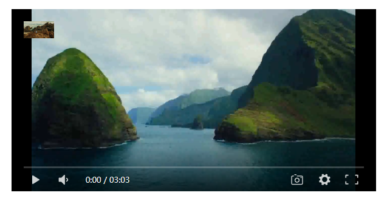

## 1、DPlayer H5播放器

DPlayer是一个可爱的HTML5弹幕视频播放器，可以帮助人们轻松构建视频和弹幕。

github：https://github.com/DIYgod/DPlayer

文档地址：https://dplayer.diygod.dev/zh/


## 2、Demo

index.html

```html
<!DOCTYPE html>
<html lang="en">

<head>
    <meta charset="UTF-8">
    <meta name="viewport" content="width=device-width, initial-scale=1.0">
    <meta http-equiv="X-UA-Compatible" content="ie=edge">
    <title>Dplayer</title>
</head>

<body>
    <div id="app" style="display: flex;justify-content: center;align-items: center;height: 100vh;">
        <div id="dplayer" style="height: 300px;width: 600px;"></div>
    </div>
    <script src="https://unpkg.com/vue@3/dist/vue.global.prod.js"></script>
    <script src="./DPlayer.min.js"></script>
    <script>
        const { createApp, onMounted, ref } = Vue
        const app = createApp({
            setup () {
                const videoUrl = ref('./test.mp4')

                const dp = ref()
                onMounted(() => {
                    dp.value = new DPlayer({
                        container: document.getElementById('dplayer'),
                        autoplay: false,
                        theme: '#FADFA3',
                        loop: true,
                        lang: 'zh-cn',
                        screenshot: true,
                        hotkey: true,
                        preload: 'auto',
                        logo: 'logo.png',
                        volume: 0.5,
                        mutex: true,
                        video: {
                            url: videoUrl.value,
                            pic: 'dplayer.png',
                            thumbnails: 'thumbnails.png',
                            type: 'auto',
                        },
                    });
                })

                return {
                    videoUrl,
                    dp,
                }
            }
        })
        app.mount("#app")
    </script>
</body>

</html>
```

效果：




---

::: tip 更多文章请关注我的公众号,自动推送更新

:::