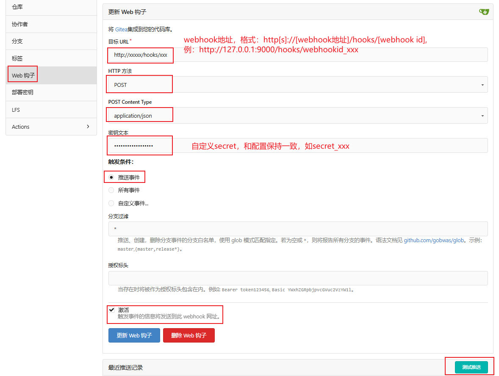

:::tip 摘要
Git webhook自动部署
:::
<!-- more -->

## 1、webhook介绍

[webhook](https://github.com/adnanh/webhook) 是一个用 Go 编写的轻量级可配置工具，它允许您轻松地在服务器上创建 HTTP 端点（钩子），您可以使用这些端点来执行配置的命令。您还可以将数据从 HTTP 请求（例如标头、有效负载或查询变量）传递到您的命令。[Webhook](https://github.com/adnanh/webhook) 还允许您指定必须满足的规则才能触发钩子。

例如，如果您使用的是 Github 或 Bitbucket，则可以使用 [webhook](https://github.com/adnanh/webhook) 设置一个钩子，每当您将更改推送到项目的 master 分支时，该钩子都会在暂存服务器上运行项目的重新部署脚本。

如果您使用 Mattermost 或 Slack，您可以设置“传出 webhook 集成”或“斜杠命令”以在您的服务器上运行各种命令，然后可以使用“传入 webhook 集成”或适当的响应正文直接向您或您的频道报告。

[Webhook](https://github.com/adnanh/webhook) 的目标只是它应该做的，那就是：

1. 收到请求，
2. 解析标头、有效负载和查询变量，
3. 检查是否满足钩子的指定规则，
4. 最后，通过以下方式将指定的参数传递给指定的命令 命令行参数或通过环境变量。

webhook Github地址：https://github.com/adnanh/webhook


## 2、webhook安装

1. 在github上下载并解压，将webhook可执行文件拷贝到/usr/local/bin/目录下
2. 创建配置文件目录和文件

```sh
# 创建配置文件目录
# mkdir -p  /data/app/webhook

# cat /data/app/webhook/hoos.json
[
  {
    "id": "redeploy-webhook",
    "execute-command": "/var/scripts/redeploy.sh",
    "command-working-directory": "/var/webhook"
  }
]
```

3.创建webhook启动服务

```sh
# cat /usr/lib/systemd/system/webhook.service 
[Unit]
Description=Webhook Service
After=network.target

[Service]
Type=simple
User=root
Group=root
LimitNOFILE=1024

Restart=on-failure
RestartSec=10
ExecStart=/usr/local/bin/webhook -verbose -hooks=/data/app/webhook/hooks.json -hotreload -port 9000 -debug

[Install]
WantedBy=multi-user.target

# systemctl daemon-reload
# systemctl start webhook
# systemctl enable webhook
# systemctl status webhook
```

```tex
启动参数说明：
-hotreload:热加载
-port 9000:端口号
更多参数参考：https://github.com/adnanh/webhook/blob/master/docs/Webhook-Parameters.md
```

4、nginx反向代理（可略）

nginx.conf

```tex
upstream webhook {
  server 127.0.0.1:9000;
}
server {
  listen 80;
  listen [::]:80;
  server_name webhook.xxx.com;
  location ~ .*\.(js|css)(.*) {
      proxy_pass http://frps;
      expires      30d;
      error_log /dev/null;
      access_log off;
  }
  location / {
    proxy_pass http://webhook;
    proxy_set_header HOST $host;
    proxy_set_header X-Forwarded-Proto $scheme;
    proxy_set_header X-Real-IP $remote_addr;
    proxy_set_header X-Forwarded-For $proxy_add_x_forwarded_for;
  }
}

```


## 3、webhook使用

以gitea webhook自动部署代码到nginx为例

**前提：安装git，并配置免密钥拉取代码**

/data/app/webhook/hooks.json

```json
[
    {
        "id": "webhookid_xxx",
        "execute-command": "/data/app/webhook/run/command.sh",
        "command-working-directory": "/data/app/webhook",
        "response-message": "ok",
        "incoming-payload-content-type": "application/x-www-form-urlencoded",
        "pass-arguments-to-command": [
            {
                "source": "string",
                "name": "xxxxxx.git",
                "comment": "GIT_URL"
            },
            {
                "source": "string",
                "name": "/xxx/xxxx",
                "comment": "DEPLOY_DIR"
            }
        ],
        "trigger-rule": {
            "and": [
                {
                    "match": {
                        "type": "payload-hmac-sha256",
                        "secret": "secret_xxx",
                        "parameter": {
                            "source": "header",
                            "name": "X-Gitea-Signature"
                        }
                    }
                }
            ]
        }
    }
]
```

```tex
说明：
webhookid_xxx: webhook id, 唯一,自定义
xxxxxx.git: git仓库地址,自定义
/xxx/xxxx： 部署目录，自定义
secret_xxx: 和gitea通讯密钥，自定义
```

自定义执行脚本

/data/app/webhook/run/command.sh

```sh
# webhook执行脚本
# cat /data/app/webhook/run/command.sh
#!/bin/bash

# variables
GIT_URL=${1}
DEPLOY_DIR=${2}

echo -e "\n########################## print variables start ##########################"
echo ${GIT_URL}
echo ${DEPLOY_DIR}
echo "########################## print variables end ##########################"

tmp_var=${GIT_URL##*/}
GIT_REPO=${tmp_var%%.git}

[ -d  ${DEPLOY_DIR} ] || mkdir -p ${DEPLOY_DIR}

cd ${DEPLOY_DIR}

# git clone or git pull
if [ ! -d ${GIT_REPO} ];then
    echo "# git clone"
    pwd
    git clone ${GIT_URL}
else
    echo "# git pull"
    cd ${GIT_REPO}
    pwd
    git pull
fi

# 配置可执行权限
# chmod +x /data/app/webhook/run/command.sh
```

Gitea 服务器的 Webhook 设置

允许从外部服务器触发Gitea webhook

/data/gitea/conf/app.ini

```ini
[webhook]
ALLOWED_HOST_LIST = *
```

配置gitea webhook勾子




nginx vhost配置

```tex
server {
    listen 80;
    server_name  xxx.xxx.ink;
    client_max_body_size 500M;

    index index.html index.htm;
    root /xxx/xxxx/仓库名;

    location ~ .*\.(gif|jpg|jpeg|png|bmp|swf|flv|mp4|ico)$ {
      expires 30d;
      access_log off;
    }
    location ~ .*\.(js|css)?$ {
      expires 7d;
      access_log off;
    }
    location ~ /(\.user\.ini|\.ht|\.git|\.svn|\.project|LICENSE|README\.md) {
      deny all;
    }
    location /.well-known {
      allow all;
    }
}
```

