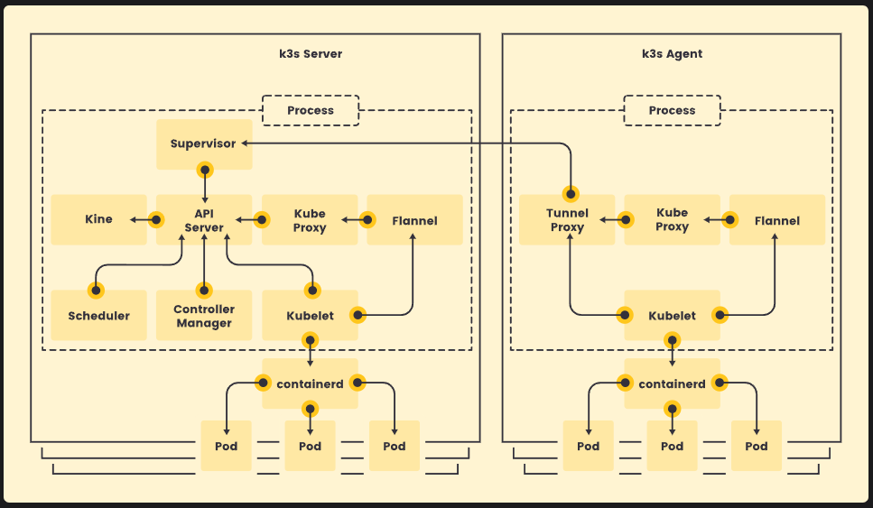
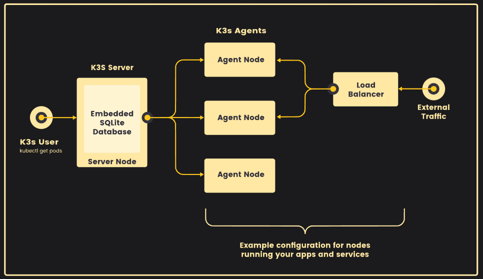
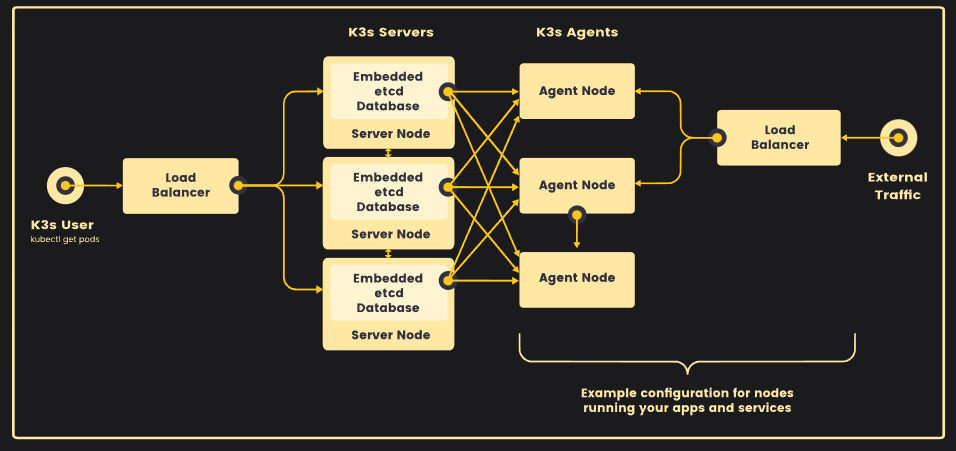
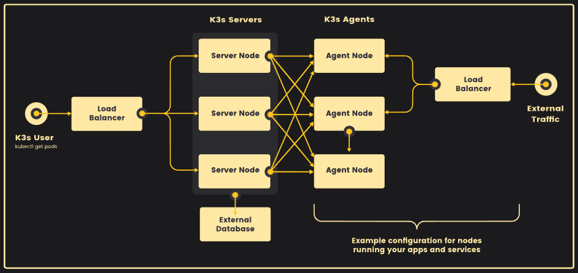
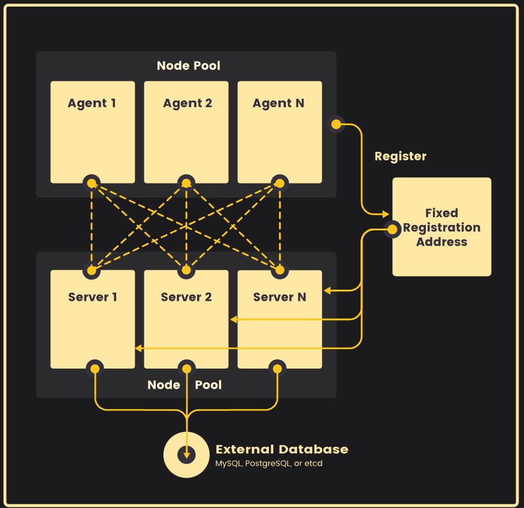
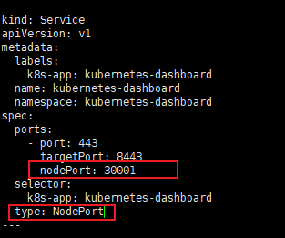

:::tip 摘要
使用k3s快速部署kubernetes学习测试环境
:::
<!-- more -->

## 1、什么是 K3s？

K3s 是轻量级的 Kubernetes。K3s 易于安装，仅需要 Kubernetes 内存的一半，所有组件都在一个小于 100 MB 的二进制文件中。

为什么叫 K3s?我们希望安装的 Kubernetes 只占用一半的内存。Kubernetes 是一个 10 个字母的单词，简写为 K8s。Kubernetes 的一半就是一个 5 个字母的单词，因此简写为 K3s。K3s 没有全称，也没有官方的发音。

K3s 是一个完全兼容的 Kubernetes 发行版，具有以下增强功能：

- 打包为单个二进制文件。
- 使用基于 sqlite3 作为默认存储机制的轻量级存储后端。同时支持使用 etcd3、MySQL 和 Postgres。
- 封装在简单的启动程序中，可以处理很多复杂的 TLS 和选项。
- 默认情况下是安全的，对轻量级环境有合理的默认值。
- 添加了简单但强大的batteries-included功能，例如：
  - 本地存储提供程序
  - service load balancer
  - Helm controller
  - Traefik ingress controller
- 所有 Kubernetes control plane 组件的操作都封装在单个二进制文件和进程中。因此，K3s 支持自动化和管理复杂的集群操作（例如证书分发等）。
- 最大程度减轻了外部依赖性，K3s 仅需要现代内核和 cgroup 挂载。K3s 打包了所需的依赖，包括：
  - containerd
  - Flannel (CNI)
  - CoreDNS
  - Traefik (Ingress)
  - Klipper-lb (Service LB)
  - 嵌入式网络策略控制器
  - 嵌入式 local-path-provisioner
  - 主机实用程序（iptables、socat 等）
- 它适用于：
    - Edge
    - IoT
    - CI
    - Development
    - ARM
    - 嵌入 K8s
    - 不去学习那么多的 Kubernetes 高深知识也能上手使用


## 2、架构

### 2.1 Server与Agent

- Server 节点指的是运行 `k3s server` 命令的主机，control plane 和数据存储组件由 K3s 管理。
- Agent 节点指的是运行 `k3s agent` 命令的主机，不具有任何数据存储或 control plane 组件。
- Server 和 Agent 都运行 kubelet、容器运行时和 CNI。有关运行无 Agent 的 Server 的更多信息，请参阅[高级选项](https://docs.k3s.io/zh/advanced#运行无-agent-的-server实验性)。



### 2.2 [带有嵌入式数据库的单节点Server](https://docs.k3s.io/zh/architecture#带有嵌入式数据库的单服务器设置)

下图显示了具有嵌入式 SQLite 数据库的单节点 K3s Server 集群示例。

在此配置中，每个 Agent 节点都注册到同一个 Server 节点。K3s 用户可以通过调用 Server 节点上的 K3s API 来操作 Kubernetes 资源。



### 2.3 [高可用 K3s](https://docs.k3s.io/zh/architecture#高可用-k3s)

单服务器集群可以满足各种用例，但如果你的环境对 Kubernetes control plane 的正常运行时间有要求，你可以在 HA 配置中运行 K3s。一个高可用 K3s 集群包括：

#### 2.3.1 嵌入式数据

- 三个或多个 **Server 节点**为 Kubernetes API 提供服务并运行其他 control plane 服务
- **嵌入式 etcd 数据存储**（与单节点设置中使用的嵌入式 SQLite 数据存储相反）



#### **2.3.2 外部数据库**

- 两个或多个 **Server 节点**为 Kubernetes API 提供服务并运行其他 control plane 服务
- **外部数据存储**（例如 MySQL、PostgreSQL 或 etcd）



### 2.4 Agent 节点的固定注册地址

在 HA 服务器配置中，每个节点都能使用固定的注册地址向 Kubernetes API 注册，如下图所示。

注册后，Agent 节点直接与其中一个 Server 节点建立连接。



### 2.5 [Agent 节点注册的工作原理](https://docs.k3s.io/zh/architecture#agent-节点注册的工作原理)

Agent 节点通过 `k3s agent` 进程发起的 WebSocket 连接进行注册，连接由作为 agent 进程一部分运行的客户端负载均衡器维护。最初，Agent 通过本地负载均衡器端口 6443 连接到 supervisor（和 kube-apiserver）。负载均衡器维护了一个要连接的可用端点列表。默认（也是最初唯一的）端点来源于 `--server` 地址中的主机名。连接到集群后，Agent 会从默认命名空间中的 Kubernetes Service 端点列表中检索 kube-apiserver 地址列表。这些端点添加到负载均衡器，然后负载均衡器将保持与集群中所有 Server 稳定连接，提供与 kube-apiserver 的连接，从而容忍单个 Server 的中断。

Agent 将使用节点集群 Secret 以及随机生成的节点密码注册到 Server，密码存储在 `/etc/rancher/node/password` 中。Server 会将各个节点的密码存储为 Kubernetes Secret，后续的任何尝试都必须使用相同的密码。节点密码 Secret 存储在 `kube-system` 命名空间中，名称使用 `<host>.node-password.k3s` 模板。这样做是为了保护节点 ID 的完整性。

如果 Agent 的 `/etc/rancher/node` 目录被删除，或者你希望使用现有名称重新加入节点，那么你需要从集群中删除该节点。这将清除旧节点条目和节点密码 Secret，并允许节点（重新）加入集群。

如果你经常重复使用主机名，但无法删除节点密码 Secret，你可以使用 `--with-node-id` 标志启动 K3s Server 或 Agent，从而将唯一的节点 ID 自动附加到主机名。启用后，节点 ID 也存储在 `/etc/rancher/node/` 中。


## 3、k3s安装

#### 0.规划

单节点server与多节点agent


| 资源     | 规格                                                         |
| -------- | ------------------------------------------------------------ |
| 机器配置 | 2核、2gRAM、40disk                                           |
| 系统     | rockylinux9.3                                                |
| k3s版本  | v1.25.16+k3s4（具体组件版本查阅：https://github.com/k3s-io/k3s/releases/tag/v1.25.16%2Bk3s4） |

| 节点        | IP           |
| ----------- | ------------ |
| k3s-server  | 192.168.8.42 |
| k3s-agent01 | 192.168.8.43 |
| k3s-agent02 | 192.168.8.44 |


#### 1.主机名配置

每台主机必须具有唯一的主机名。如果你的计算机没有唯一的主机名，请传递 `K3S_NODE_NAME` 环境变量，并为每个节点提供一个有效且唯一的主机名。

```sh
# 根据规划设置主机名【master节点上操作】
hostnamectl set-hostname k3s-server

# 根据规划设置主机名【node01节点操作】
hostnamectl set-hostname k3s-agent01

# 根据规划设置主机名【node02节点操作】
hostnamectl set-hostname k3s-agent02
```

#### 2.IP配置

略，各个系统IP配置都不一样，根据自己系统配置。

#### 3.主机名与IP解析（所有节点）

```sh
cat >> /etc/hosts << EOF
192.168.8.42 k3s-server
192.168.8.43 k3s-agent01
192.168.8.44 k3s-agent02
EOF
```

#### 4.关闭防火墙与SELINUX（所有节点）

```sh
# 关闭防火墙
systemctl stop firewalld
systemctl disable firewalld

# 关闭selinux
sed -i 's/enforcing/disabled/' /etc/selinux/config
setenforce 0
```

#### 5.时间同步配置（所有节点）

```sh
yum install chrony -y
systemctl start chronyd && systemctl enable chronyd && chronyc sources
date
```

#### 6.关闭swap分区（所有节点）

```sh
sed -ri 's/.*swap.*/#&/' /etc/fstab  
swapoff -a 
grep swap /etc/fstab 
```

#### 7.安装k3s server（server节点）

```sh
# 安装v1.25.16+k3s4版本k8s
curl -sfL https://rancher-mirror.rancher.cn/k3s/k3s-install.sh | INSTALL_K3S_MIRROR=cn INSTALL_K3S_VERSION=v1.25.16+k3s4 sh -

# 安装完成后结果
[INFO]  Creating /usr/local/bin/kubectl symlink to k3s
[INFO]  Creating /usr/local/bin/crictl symlink to k3s
[INFO]  Skipping /usr/local/bin/ctr symlink to k3s, command exists in PATH at /usr/bin/ctr
[INFO]  Creating killall script /usr/local/bin/k3s-killall.sh
[INFO]  Creating uninstall script /usr/local/bin/k3s-uninstall.sh
[INFO]  env: Creating environment file /etc/systemd/system/k3s.service.env
[INFO]  systemd: Creating service file /etc/systemd/system/k3s.service
[INFO]  systemd: Enabling k3s unit
Created symlink from /etc/systemd/system/multi-user.target.wants/k3s.service to /etc/systemd/system/k3s.service.
[INFO]  systemd: Starting k3s

# k3s镜像列表
k3s ctr images ls
```

运行此安装后：

- 默认安装containerd

- K3s 服务将被配置为在节点重启后或进程崩溃或被杀死时自动重启。
- 将安装其他实用程序，包括 `kubectl`、`crictl`、`ctr`、`k3s-killall.sh` 和 `k3s-uninstall.sh`。
- [kubeconfig](https://kubernetes.io/docs/concepts/configuration/organize-cluster-access-kubeconfig/) 文件将写入到 `/etc/rancher/k3s/k3s.yaml`，由 K3s 安装的 kubectl 将自动使用该文件。

单节点 Server 安装是一个功能齐全的 Kubernetes 集群，它包括了托管工作负载 pod 所需的所有数据存储、control plane、kubelet 和容器运行时组件。除非你希望向集群添加容量或冗余，否则没有必要添加额外的 Server 或 Agent 节点。


**安装自动补全工具**

```sh

yum install bash-completion -y 
source /usr/share/bash-completion/bash_completion
echo "source <(kubectl completion bash)" >> ~/.bashrc
echo "source <(k3s completion bash)" >> ~/.bashrc
bash
```

**配置镜像加速**

由于安全原因，国内无法直接使用dockerhub，会出现failed to pull image "rancher/mirrored-pause:3.6"等问题，需要使用镜像加速器。很多大厂已经关闭镜像加速，可以私建加速器或者使用为爱发电加速器。

可用加速器：

https://www.wangdu.site/course/2109.html

自建加速器：

https://github.com/cmliu/CF-Workers-docker.io

https://github.com/bboysoulcn/registry-mirror

https://github.com/dqzboy/Docker-Proxy

k3s只需要在k3s-server节点配置镜像加速器即可，会自动同步到agent端。**注意：将endpoint的地址改为自己需要的加速器。**

```sh
cat > /etc/rancher/k3s/registries.yaml <<EOF
mirrors:
  docker.io:
    endpoint:
      - "https://hub.xxx.com"
  quay.io:
    endpoint:
      - "https://quay.xxx.com"
  registry.k8s.io:
    endpoint:
      - "https://k8s.xxx.com"
  gcr.io:
    endpoint:
      - "https://gcr.xxx.com"
  k8s.gcr.io:
    endpoint:
      - "https://k8s-gcr.xxx.com"
  ghcr.io:
    endpoint:
      - "https://ghcr.xxx.com"
  mcr.microsoft.com:
    endpoint:
      - "https://mcr.xxx.com"
  docker.elastic.com:
    endpoint:
      - "https://elastic.xxx.com"
EOF

# 重启
systemctl restart k3s
# 检查镜像源（此命令server端和agent端都适用）
crictl info
```


#### 9.安装k3s agent（agent节点）

从k3s server获取token，用于添加agent

```sh
cat /var/lib/rancher/k3s/server/node-token
```

安装Agent 节点并将它们添加到集群

```sh
curl -sfL https://rancher-mirror.rancher.cn/k3s/k3s-install.sh | INSTALL_K3S_MIRROR=cn INSTALL_K3S_VERSION=v1.25.16+k3s4 K3S_NODE_NAME=k3s-agent01 K3S_URL=https://k3s-server:6443 K3S_TOKEN=xxxx  sh -

# 参数说明：
K3S_NODE_NAME=k3s-agent01为agent节点主机名
K3S_URL=https://k3s-server:6443为server节点通讯地址
K3S_TOKEN=xxxx为通讯Token,从server上的/var/lib/rancher/k3s/server/node-token获取

# 检查
# kubectl get nodes
NAME          STATUS   ROLES                  AGE     VERSION
k3s-agent01   Ready    <none>                 5h44m   v1.25.16+k3s4
k3s-server    Ready    control-plane,master   5h50m   v1.25.16+k3s4
k3s-agent02   Ready    <none>                 5h42m   v1.25.16+k3s4
```

`K3S_URL` 参数会导致安装程序将 K3s 配置为 Agent 而不是 Server。K3s Agent 将注册到在 URL 上监听的 K3s Server。`K3S_TOKEN` 使用的值存储在 Server 节点上的 `/var/lib/rancher/k3s/server/node-token` 中。


#### 10. 测试

```sh
cat > k8s-demo.yaml <<EOF
apiVersion: v1
kind: Namespace
metadata:
  name: k8s-demo
---
apiVersion: apps/v1
kind: Deployment
metadata:
  name: nginx-deployment
  namespace: k8s-demo
spec:
  selector:
    matchLabels:
      app: k8s-demo
  replicas: 2
  template:
    metadata:
      labels:
        app: k8s-demo
    spec:
      containers:
        - name: nginx
          image: nginx:latest
          ports:
            - containerPort: 80
          resources:
            requests:
              cpu: "10m"
              memory: "20Mi"
            limits:
              cpu: "100m"
              memory: "100Mi"
---
apiVersion: v1
kind: Service
metadata:
  name: nginx-service
  namespace: k8s-demo
spec:
  selector:
    app: k8s-demo
  ports:
  - port: 8080
    targetPort: 80
---
apiVersion: networking.k8s.io/v1
kind: Ingress
metadata:
  name: nginx-ingress
  namespace: k8s-demo
spec:
  rules:
  - host: www.test.com
    http:
      paths:
      - path: /
        pathType: Prefix
        backend:
          service:
            name: nginx-service
            port:
              number: 8080
EOF

kubectl apply -f k8s-demo.yaml
kubectl get pods,deploy,svc,ingress -n k8s-demo

# kubectl get pods,deploy,svc,ingress -n k8s-demo
NAME                                    READY   STATUS    RESTARTS   AGE
pod/nginx-deployment-797ccbdd7f-5cwhd   1/1     Running   0          156m
pod/nginx-deployment-797ccbdd7f-5jm6q   1/1     Running   0          156m

NAME                               READY   UP-TO-DATE   AVAILABLE   AGE
deployment.apps/nginx-deployment   2/2     2            2           156m

NAME                    TYPE        CLUSTER-IP     EXTERNAL-IP   PORT(S)    AGE
service/nginx-service   ClusterIP   10.43.121.86   <none>        8080/TCP   156m

NAME                                      CLASS     HOSTS         ADDRESS                                  PORTS   AGE
ingress.networking.k8s.io/nginx-ingress   traefik   www.test.com   192.168.8.42,192.168.8.43,192.168.8.44   80      156m
```

windows设置hosts

192.168.8.8  www.test.com

192.168.8.8  www.test.com

192.168.8.8  www.test.com

访问http://www.oby.com/


#### 11.部署dashboard管理面板

**（1）官方面板dashboard**

Dashboard是官方提供的一个UI，可用于基本管理K8s资源。**注意版本兼容性。**dashboard-2.7.0完美适配k8s1.25

地址：https://github.com/kubernetes/dashboard

默认Dashboard只能集群内部访问，修改service为NodePort类型，暴露到外部



```sh
#下载
wget https://raw.githubusercontent.com/kubernetes/dashboard/v2.7.0/aio/deploy/recommended.yaml

#修改
# vi recommended.yaml
---
kind: Service
apiVersion: v1
metadata:
  labels:
    k8s-app: kubernetes-dashboard
  name: kubernetes-dashboard
  namespace: kubernetes-dashboard
spec:
  ports:
    - port: 443
      targetPort: 8443
      nodePort: 30001
  selector:
    k8s-app: kubernetes-dashboard
  type: NodePort
---

# 部署
kubectl apply -f recommended.yaml
kubectl get pods,deploy,svc -n kubernetes-dashboard

# 创建service account用户dashboard-admin并绑定默认cluster-admin管理员集群角色：
# 创建用户
kubectl create serviceaccount  -n kubernetes-dashboard
# 用户授权
kubectl create clusterrolebinding dashboard-admin --clusterrole=cluster-admin --serviceaccount=kubernetes-dashboard:dashboard-admin
# 获取用户Token
kubectl create token dashboard-admin -n kubernetes-dashboard
# 访问地址：https://NodeIP:30001
```

**（2）国产化kuboard**

地址：https://kuboard.cn/

```sh
# 下载
wget https://addons.kuboard.cn/kuboard/kuboard-v3.yaml

# 安装
kubectl apply -f kuboard-v3.yaml
kubectl get pods,deploy,svc -n kuboard

# 访问 Kuboard
在浏览器中打开链接 http://NodeIP:30080
输入初始用户名和密码，并登录
用户名： admin
密码： Kuboard123
```


#### 12.集群访问

**内部访问**

`/etc/rancher/k3s/k3s.yaml` 中存储的 kubeconfig 文件用于配置对 Kubernetes 集群的访问。如果你已经安装了上游的 Kubernetes 命令行工具（如 kubectl 或 helm)，你需要用正确的 kubeconfig 路径配置它们。这可以通过导出 `KUBECONFIG` 环境变量或调用 `--kubeconfig` 命令行标志来完成。有关详细信息，请参阅以下示例。

利用 KUBECONFIG 环境变量：

```bash
export KUBECONFIG=/etc/rancher/k3s/k3s.yaml
kubectl get pods --all-namespaces
helm ls --all-namespaces
```

或者在命令中指定 kubeconfig 文件的位置：

```bash
kubectl --kubeconfig /etc/rancher/k3s/k3s.yaml get pods --all-namespaces
helm --kubeconfig /etc/rancher/k3s/k3s.yaml ls --all-namespaces
```

**使用 kubectl 从外部访问集群**

将 `/etc/rancher/k3s/k3s.yaml` 复制到位于集群外部的主机上的 `~/.kube/config`。然后，将 `server` 字段的值替换为你 K3s Server 的 IP 或名称。现在，你可以使用 `kubectl` 来管理 K3s 集群。


#### 13.相关问题

**问题一：k3s与本地nginx 80 443冲突导致nginx访问404问题**

https://docs.k3s.io/networking/networking-services

原因：k3s traefik将80 443的流量转发到ServiceLB上，所以访问不到本机nginx的vhost，k3s 内置的 traefik 入口侦听端口 80 和 443。

解决：如果出于某种原因想要在 k3s 主机上部署非容器化的 Web 服务器，则应禁用 traefik 或将服务配置为使用不同的端口。k3s禁用traefik

```sh
# cat /etc/systemd/system/k3s.service
ExecStart=/usr/local/bin/k3s server --disable=traefik
```


**问题二：拉取镜像失败**

如下

```sh
Failed to create pod sandbox: rpc error: code = Unknown desc = failed to get sandbox image "rancher/mirrored-pause:3.6": failed to pull image "rancher/mirrored-pause:3.6": failed to pull and unpack image "docker.io/rancher/mirrored-pause:3.6": failed to copy: httpReadSeeker: failed open: failed to do request: Get "https://production.cloudflare.docker.com/registry-v2/docker/registry/v2/blobs/sha256/62/6270bb605e12e581514ada5fd5b3216f727db55dc87d5889c790e4c760683fee/data?verify=1723914380-UMTxOvsbCvth0OIwEoQC2XjoqJ4%3D": dial tcp 31.13.80.37:443: connect: connection refused
```

原因：国内无法使用dockerhub

解决：需要使用镜像器加速器或者科学上网


**问题三：部署kuboard端口冲突**

如下

```sh
# kubectl apply -f kuboard-v3.yaml
namespace/kuboard created
configmap/kuboard-v3-config created
serviceaccount/kuboard-boostrap created
clusterrolebinding.rbac.authorization.k8s.io/kuboard-boostrap-crb unchanged
daemonset.apps/kuboard-etcd created
deployment.apps/kuboard-v3 created
The Service "kuboard-v3" is invalid: spec.ports[1].nodePort: Invalid value: 30081: provided port is already allocated
```

解决：

```sh
# vi kuboard-v3.yaml
apiVersion: v1
kind: Service
metadata:
  annotations: {}
  labels:
    k8s.kuboard.cn/name: kuboard-v3
  name: kuboard-v3
  namespace: kuboard
spec:
  ports:
    - name: web
      nodePort: 30080
      port: 80
      protocol: TCP
      targetPort: 80
    - name: tcp
      nodePort: 30082 #修改为30082
      port: 10081
      protocol: TCP
      targetPort: 10081
    - name: udp
      nodePort: 30082 #修改为30082
      port: 10081
      protocol: UDP
      targetPort: 10081
  selector:
    k8s.kuboard.cn/name: kuboard-v3
  sessionAffinity: None
  type: NodePort
```


