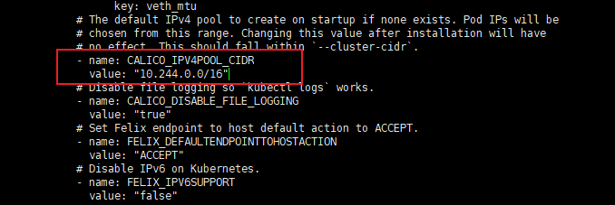

:::tip 摘要
kubeadm部署kubernetes v1.29.0集群（k8s1.29.0）
:::
<!-- more -->

## 一、部署说明

k8s架构：


Kubernetes 主要由以下几个核心组件组成：

- etcd：保存了整个集群的状态；

- kube-apiserver：提供了资源操作的唯一入口，并提供认证、授权、访问控制、API 注册和发现等机制；

- kube-controller-manager：负责维护集群的状态，比如故障检测、自动扩展、滚动更新等；

- kube-scheduler：负责资源的调度，按照预定的调度策略将 Pod 调度到相应的机器上；

- kubelet：负责维持容器的生命周期，同时也负责 Volume（CVI）和网络（CNI）的管理；

- Container runtime：负责镜像管理以及 Pod 和容器的真正运行（CRI），默认的容器运行时为 Docker；

- kube-proxy 负责为 Service 提供 cluster 内部的服务发现和负载均衡。

  

## 二、环境准备

### 2.1 服务器要求

- 一台或多台安装linux服务器，此处使用vmware17安装虚拟服务器
- 硬件配置：2GB或更多RAM，2个CPU或更多CPU，硬盘30GB或更多【注意master需要两核】,开启cpu虚拟化
- 需要拉取镜像，如果服务器不能上网，需要提前下载镜像并导入节点

### 2.2 k8s集群架构


### 2.2 集群规划

| 软件       | 版本           | 备注 |
| ---------- | -------------- | ---- |
| 操作系统   | Rockeylinux9.2 |      |
| kubernetes | 1.29.0         |      |
| docker     | 24.0.7         |      |

| 角色       | IP           | 备注   |
| ---------- | ------------ | ------ |
| k8s-master | 192.168.8.8  | master |
| k8s-node01 | 192.168.8.9  | node   |
| k8s-node02 | 192.168.8.10 | node   |

### 2.3 服务器环境准备(所有节点)

#### 1.主机名配置

```sh
# 根据规划设置主机名【master节点上操作】
hostnamectl set-hostname k8s-master

# 根据规划设置主机名【node01节点操作】
hostnamectl set-hostname k8s-node01

# 根据规划设置主机名【node02节点操作】
hostnamectl set-hostname k8s-node02
```

#### 2.IP配置

略，各个系统IP配置都不一样，根据自己系统配置。

#### 3.主机名与IP解析

```sh
cat >> /etc/hosts << EOF
192.168.8.8 k8s-master
192.168.8.9 k8s-node01
192.168.8.10 k8s-node02
EOF
```

#### 4.关闭防火墙与SELINUX

```sh
# 关闭防火墙
systemctl stop firewalld
systemctl disable firewalld

# 关闭selinux
sed -i 's/enforcing/disabled/' /etc/selinux/config
setenforce 0
```

#### 5.时间同步配置

```sh
yum install chrony -y
systemctl start chronyd && systemctl enable chronyd && chronyc sources
date
```

#### 6.配置内核路由转发及网桥过滤

```sh
cat > /etc/sysctl.d/k8s.conf << EOF
net.bridge.bridge-nf-call-ip6tables = 1
net.bridge.bridge-nf-call-iptables = 1
net.ipv4.ip_forward=1
vm.swappiness=0
EOF
sysctl --system

# 加载br_netfilter模块
modprobe  br_netfilter
lsmod |grep  br_netfilter
```

#### 7.配置ipvs转发

```sh
yum -y install ipset ipvsadm

# 配置ipvsadm模块加载方式
# 添加需要加载的模块
mkdir -p /etc/sysconfig/ipvsadm
cat > /etc/sysconfig/ipvsadm/ipvs.modules <<EOF
#!/bin/bash
modprobe -- ip_vs
modprobe -- ip_vs_rr
modprobe -- ip_vs_wrr
modprobe -- ip_vs_sh
modprobe -- nf_conntrack
EOF

# 授权、运行、检查是否加载
chmod 755 /etc/sysconfig/ipvsadm/ipvs.modules && bash /etc/sysconfig/ipvsadm/ipvs.modules && lsmod | grep -e ip_vs -e nf_conntrack
```

#### 8.关闭swap分区

```sh
sed -ri 's/.*swap.*/#&/' /etc/fstab  
swapoff -a 
grep swap /etc/fstab 
```


## 三、安装docker、ci-dockerd、kubelet、kubeadm、kubectl（所有节点）

### 3.0 说明（与安装无关）

（1）关于[容器运行时接口](https://kubernetes.io/zh-cn/docs/concepts/overview/components/#container-runtime)（CRI）

官方文档：https://kubernetes.io/zh-cn/docs/setup/production-environment/container-runtimes/#install-and-configure-prerequisites

早期k8s使用docker-shim调用docker容器引擎，但docker-shim不符合CRI标准，每次k8s升级，都要重新适配，极其麻烦，Kubernetes v1.24移除docker-shim的支持，使用CRI shim。containerd是一个主流的容器引擎，内置CRI shim，与Docker相兼容，相比Docker轻量很多，目前较为成熟。

参考资料：[https://kubernetes.io/zh/docs/setup/production-environment/container-runtimes/#containerd](#containerd)

 k8s（v1.24版本以前）使用docker-shim调用流程：kubelet(客户端) -> docker shim -> dockerd -> containerd -> containerd-shim -> runc


k8s（v1.24版本以后）使用CRI shim调用流程：kubelet(客户端) ->CRI shim(被contained内置) -> containerd -> containerd-shim -> runc  


**为什么要安装docker和ci-dockerd?**

Kubernetes v1.24移除docker-shim的支持，而Docker Engine默认又不支持CRI标准，因此二者默认无法再直接集成。为此，Mirantis和Docker联合创建了cri-dockerd项目，用于为Docker Engine提供一个能够支持到CRI规范的桥梁，从而能够让Docker作为Kubernetes容器引擎。

如图所示：


### 3.1 安装docker

参考：

docker安装：https://developer.aliyun.com/mirror/docker-ce

cgroup驱动：https://kubernetes.io/zh-cn/docs/setup/production-environment/container-runtimes/#cgroup-drivers

```sh
yum -y install wget && wget https://mirrors.aliyun.com/docker-ce/linux/centos/docker-ce.repo -O /etc/yum.repos.d/docker-ce.repo
yum -y install docker-ce

# 配置cgroup驱动及镜像下载加速器：
cat > /etc/docker/daemon.json << EOF
{
  "exec-opts": ["native.cgroupdriver=systemd"],
   "registry-mirrors": [
        "https://registry.docker-cn.com",
        "https://docker.mirrors.ustc.edu.cn",
        "https://dockerhub.azk8s.cn",
        "http://hub-mirror.c.163.com"
	]
}
EOF

systemctl enable docker && systemctl start docker && systemctl status docker && docker info|grep systemd
```

### 3.2 安装cri-dockerd

参考：https://github.com/Mirantis/cri-dockerd

说明：**Pause镜像和Pause容器**

每个Pod里运行着一个特殊的被称之为Pause的容器，其他容器则为业务容器，这些业务容器共享Pause容器的网络栈和Volume挂载卷，因此他们之间通信和数据交换更为高效，在设计时我们可以充分利用这一特性将一组密切相关的服务进程放入同一个Pod中。同一个Pod里的容器之间仅需通过localhost就能互相通信。
**kubernetes中的pause容器主要为每个业务容器提供以下功能：**

- PID命名空间：Pod中的不同应用程序可以看到其他应用程序的进程ID。
- 网络命名空间：Pod中的多个容器能够访问同一个IP和端口范围。
- IPC命名空间：Pod中的多个容器能够使用SystemV IPC或POSIX消息队列进行通信。
- UTS命名空间：Pod中的多个容器共享一个主机名；Volumes（共享存储卷）：
- Pod中的各个容器可以访问在Pod级别定义的Volum


```sh
# 下载安装最新版的cri-dockerd
wget https://github.com/Mirantis/cri-dockerd/releases/download/v0.3.8/cri-dockerd-0.3.8.amd64.tgz
tar xf cri-dockerd-0.3.8.amd64.tgz 
mv cri-dockerd/cri-dockerd  /usr/bin/
rm -rf  cri-dockerd  cri-dockerd-0.3.8.amd64.tgz

# 配置启动项
cat > /etc/systemd/system/cri-docker.service<<EOF
[Unit]
Description=CRI Interface for Docker Application Container Engine
Documentation=https://docs.mirantis.com
After=network-online.target firewalld.service docker.service
Wants=network-online.target
Requires=cri-docker.socket
[Service]
Type=notify
# ExecStart=/usr/bin/cri-dockerd --container-runtime-endpoint fd://
# 指定用作 Pod 的基础容器的容器镜像（“pause 镜像”）
ExecStart=/usr/bin/cri-dockerd --pod-infra-container-image=registry.aliyuncs.com/google_containers/pause:3.9 --container-runtime-endpoint fd:// 
ExecReload=/bin/kill -s HUP $MAINPID
TimeoutSec=0
RestartSec=2
Restart=always
StartLimitBurst=3
StartLimitInterval=60s
LimitNOFILE=infinity
LimitNPROC=infinity
LimitCORE=infinity
TasksMax=infinity
Delegate=yes
KillMode=process
[Install]
WantedBy=multi-user.target
EOF
# 说明：--pod-infra-container-image根据kubeadm config images list列出的配置镜像pause镜像配置。

cat > /etc/systemd/system/cri-docker.socket <<EOF
[Unit]
Description=CRI Docker Socket for the API
PartOf=cri-docker.service
[Socket]
ListenStream=%t/cri-dockerd.sock
SocketMode=0660
SocketUser=root
SocketGroup=docker
[Install]
WantedBy=sockets.target
EOF

systemctl daemon-reload 
systemctl enable cri-docker && systemctl start cri-docker && systemctl status cri-docker
```


### 3.3 安装kubelet、kubeadm、kubectl

```sh
# 配置k8s源
cat <<EOF | tee /etc/yum.repos.d/kubernetes.repo
[kubernetes]
name=Kubernetes
baseurl=https://mirrors.aliyun.com/kubernetes-new/core/stable/v1.29/rpm/
enabled=1
gpgcheck=1
gpgkey=https://mirrors.aliyun.com/kubernetes-new/core/stable/v1.29/rpm/repodata/repomd.xml.key
EOF

yum install -y kubelet kubeadm kubectl

# 配置 cgroup 驱动与docker一致
cp /etc/sysconfig/kubelet{,.bak}
cat > /etc/sysconfig/kubelet <<EOF
KUBELET_EXTRA_ARGS="--cgroup-driver=systemd"
EOF
systemctl enable kubelet

# 安装自动补全工具(可选)
yum install bash-completion -y 
source /usr/share/bash-completion/bash_completion
echo "source <(kubectl completion bash)" >> ~/.bashrc
source  ~/.bashrc   


# 查看配置镜像
# 强烈建议提前pull镜像
kubeadm config images list --image-repository registry.aliyuncs.com/google_containers

# 拉取配置镜像
kubeadm config images pull  --image-repository registry.aliyuncs.com/google_containers \
--cri-socket=unix:///var/run/cri-dockerd.sock
```

**偷懒小技巧：如果是用vmware，操作完以上步骤，做个快照，以后想添加节点直接克隆虚拟机，就不需要每台都操作，直接修改主机名和IP可以作master或node节点，哈哈哈哈**


## 四、部署k8s master

```sh
# 初始化集群
kubeadm init \
--apiserver-advertise-address 192.168.8.8  \
--kubernetes-version v1.29.0 \
--pod-network-cidr=10.244.0.0/16 \
--image-repository registry.aliyuncs.com/google_containers \
--cri-socket=unix:///var/run/cri-dockerd.sock \
--ignore-preflight-errors=all
```

说明：

--apiserver-advertise-address 集群通告地址，node节点连接master的地址，如果是高可用，需要配置VIP的地址。这里是单master架构，默认master地址即可。
--kubernetes-version K8s版本，与上面安装的一致
--pod-network-cidr Pod网络，与下面部署的CNI网络组件yaml中保持一致
--cri-socket 指定cri-dockerd接口，如果是containerd则使用--cri-socket unix:///run/containerd/containerd.sock

如果初始化一直超时，请检查/etc/systemd/system/cri-docker.service文件pause镜像是否与docker images的镜像一致。

```sh
# 创建配置目录
mkdir -p $HOME/.kube
sudo cp -i /etc/kubernetes/admin.conf $HOME/.kube/config
sudo chown $(id -u):$(id -g) $HOME/.kube/config

# 默认初始化生成token有效期是24小时，所以我们用自己的生成不过期的token，node节点加入需要用到
kubeadm token create --ttl 0  --print-join-command
# 生成结果如下：
kubeadm join 192.168.8.8:6443 --token l0p87y.osc78zqb5n9wpmc7 --discovery-token-ca-cert-hash sha256:567667dd42cdef1c1db11d1a323d97eafd580c3343cde86972bcb41ac3b2bf9f
```
相关token命令知识（与安装无关）
```sh
# 1、查看token
# kubeadm token list
TOKEN                     TTL         EXPIRES                USAGES                   DESCRIPTION                                                EXTRA GROUPS
9vtcrz.xct33esabs8zchqn   23h         2024-04-27T17:36:54Z   authentication,signing   The default bootstrap token generated by 'kubeadm init'.   system:bootstrappers:kubeadm:default-node-token
tldne2.j4wyhwy6nlyop6tk   <forever>   <never>   authentication,signing   <none>                                                     system:bootstrappers:kubeadm:default-node-token

# 2、重新生成token
# 默认初始化生成token有效期是24小时，所以我们用自己的生成不过期的token，node节点加入需要用到
kubeadm token create --ttl 0  --print-join-command

# 3、使用已经生成的token
# 查找需要的toekn
# kubeadm token list
# 获取公钥的hash值
openssl x509 -pubkey -in /etc/kubernetes/pki/ca.crt | openssl rsa -pubin -outform der 2>/dev/null | openssl dgst -sha256 -hex | sed 's/^.* //'
# 拼接加入命令
kubeadm join 192.168.8.8:6443  --token [已经生成的token]     --discovery-token-ca-cert-hash sha256:[获取到的公钥hash值]  --cri-socket unix:///run/containerd/containerd.sock
```


## 五、部署k8s node
说明：node节点操作都一样。

```sh
kubeadm join 192.168.8.8:6443 \
--token l0p87y.osc78zqb5n9wpmc7 \
--discovery-token-ca-cert-hash sha256:567667dd42cdef1c1db11d1a323d97eafd580c3343cde86972bcb41ac3b2bf9f \
--cri-socket=unix:///var/run/cri-dockerd.sock
```

说明：这命令在master节点使用kubeadm token create --ttl 0  --print-join-command生成的，添加节点需要指定cri-dockerd接口--cri-socket ，这里是使用cri-dockerd，如果是containerd则使用--cri-socket unix:///run/containerd/containerd.sock


## 六、部署容器网络（CNI）

Calico是一个纯三层的数据中心网络方案，是目前Kubernetes主流的网络方案。

下载地址：https://github.com/projectcalico/calico

```sh
wget https://raw.githubusercontent.com/projectcalico/calico/v3.27.0/manifests/calico.yaml
```

下载完后还需要修改里面定义Pod网络（CALICO_IPV4POOL_CIDR），与前面kubeadm init的 --pod-network-cidr指定的一样。



修改完后文件后，部署：

```sh
kubectl apply -f calico.yaml
kubectl get pods -n kube-system

# kubectl get nodes
NAME         STATUS   ROLES           AGE   VERSION
k8s-node01   Ready    <none>          14h   v1.29.0
k8s-node02   Ready    <none>          95m   v1.29.0
k8s-master   Ready    control-plane   14h   v1.29.0
# 说明k8s部署完成
```

等Calico Pod都Running，节点也会准备就绪。

注：以后所有yaml文件都只在Master节点执行。

安装目录：/etc/kubernetes/

组件配置文件目录：/etc/kubernetes/manifests/

参考资料：[https://kubernetes.io/docs/setup/production-environment/tools/kubeadm/create-cluster-kubeadm/#pod-network](#pod-network)


## 七、测试k8s集群

```sh
kubectl create deployment web -r 2 --image=nginx
kubectl expose deployment web --port=80  --type=NodePort

# kubectl get deployments
NAME   READY   UP-TO-DATE   AVAILABLE   AGE
web    2/2     2            2           103s

# kubectl get pods
NAME                  READY   STATUS    RESTARTS   AGE
web-76fd95c67-db768   1/1     Running   0          2m24s
web-76fd95c67-k59wj   1/1     Running   0          2m24s

# kubectl get svc |grep web
web          NodePort    10.98.28.43   <none>        80:31166/TCP   2m25s
# 31166端口是容器80映射到主机的端口
```

两个nginx pod部署完了，访问：

http://192.168.8.9:31166/

http://192.168.8.10:31166/


## 八、部署k8s管理面板Dashboard（可选）

说明：我写文章时，两种dashboard都还没适配k8s1.29.0版本，所以可以不安装，哪种比较好，自己看着来呗。

### （1）部署官方Dashboard

地址：https://github.com/kubernetes/dashboard

Dashboard是官方提供的一个UI，可用于基本管理K8s资源。dashboard当前稳定版本是2.7.0

兼容性：


默认Dashboard只能集群内部访问，修改service为NodePort类型，暴露到外部

```shell
wget https://raw.githubusercontent.com/kubernetes/dashboard/v2.7.0/aio/deploy/recommended.yaml
```

默认Dashboard只能集群内部访问，修改Service为NodePort类型，暴露到外部：


```sh
# vi recommended.yaml
---
kind: Service
apiVersion: v1
metadata:
  labels:
    k8s-app: kubernetes-dashboard
  name: kubernetes-dashboard
  namespace: kubernetes-dashboard
spec:
  ports:
    - port: 443
      targetPort: 8443
      nodePort: 30001
  selector:
    k8s-app: kubernetes-dashboard
  type: NodePort
---
```

部署

```sh
kubectl apply -f recommended.yaml
kubectl get pods -n kubernetes-dashboard
```

访问地址：https://NodeIP:30001

创建service account并绑定默认cluster-admin管理员集群角色：

```sh
# 创建用户
kubectl create serviceaccount dashboard-admin -n kubernetes-dashboard
# 用户授权
kubectl create clusterrolebinding dashboard-admin --clusterrole=cluster-admin --serviceaccount=kubernetes-dashboard:dashboard-admin
# 获取用户Token
kubectl create token dashboard-admin -n kubernetes-dashboard
```

使用输出的token登录Dashboard。


### **（2）部署国产化kuboard**

地址：https://kuboard.cn/


```shell
wget https://addons.kuboard.cn/kuboard/kuboard-v3.yaml
kubectl apply -f kuboard-v3.yaml
kubectl get pods -n kuboard
```

访问 Kuboard
在浏览器中打开链接 http://your-node-ip-address:30080
输入初始用户名和密码，并登录
用户名： admin
密码： Kuboard123