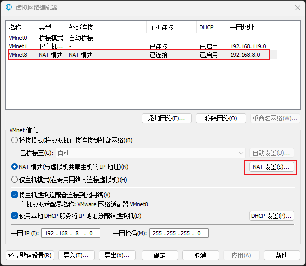
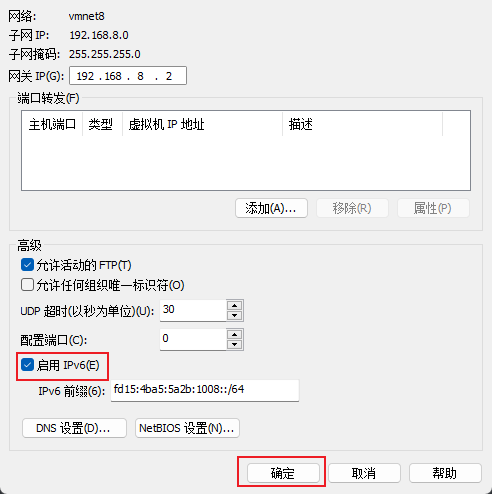
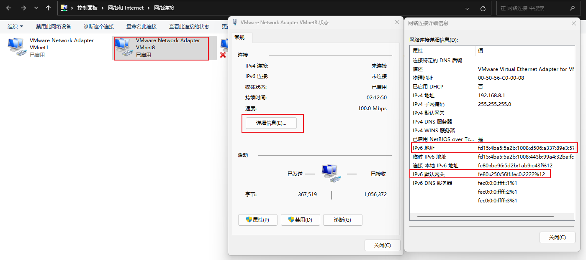

:::tip 摘要
IPv6基础及应用
:::
<!-- more -->


## 一、什么是IPv6

IPv6（Internet Protocol Version 6）作为下一代互联网协议，旨在解决IPv4地址耗尽的问题。随着互联网设备的爆炸性增长，IPv6逐渐成为一种必然的选择。IPv6

是一种为了解决[IPv4地址](https://so.csdn.net/so/search?q=IPv4地址&spm=1001.2101.3001.7020)不足问题而设计的协议。它使用128位地址空间，可以提供约3.4×10^38个独特的IP地址，极大地扩展了可用的互联网地址池。IPv6还引

入了简化的报头、更好的安全性和内置的支持多播和任播。ipv6相比ipv4数量更多、速度更快。


## 二、IPv6地址概述

### 2.1 IPv6类型

IPv6地址主要分为以下几种类型：

- 全局单播地址（Global Unicast Address）**（重点：ipv6公网地址）**
- 唯一本地地址（Unique Local Address，ULA）**（重点：ipv6私网地址）**
- 链路本地地址（Link-Local Address）

- 多播地址（Multicast Address）
- 任播地址（Anycast Address）

**全局单播地址（Global Unicast Address）**

全局单播地址相当于IPv4的公网地址，用于在全球范围内唯一标识一个网络接口。其前缀通常是2000::/3，即所有以2000至3FFF开头的IPv6地址都属于全局单播地址。

**唯一本地地址（Unique Local Address，ULA）**

唯一本地地址相当于IPv4的私网地址，用于在本地网络中唯一标识一个网络接口。其前缀通常是fd00::/8。


### 2.2 IPv6网段表示方法

**（1）IPv6网段的表示方法主要有以下三种**

1. ‌**‌[冒分十六进制表示法](https://www.baidu.com/s?wd=冒分十六进制表示法&usm=2&ie=utf-8&rsv_pq=a73715d20003b581&oq=ipv6网段表示方法&rsv_t=a64fMnAO3HrpD928jVx%2Bxld6pE2jNlO05qsnf5TycLehFImYMJSb2L%2B56nA&sa=re_dqa_generate)**‌：IPv6地址由8个16位的十六进制数组成，每两个十六进制数之间用冒号(:)隔开。例如：`2001:0db8:85a3:0000:0000:8a2e:0370:7334`。‌

2. ‌**0位压缩表示法**‌：当IPv6地址中存在连续的0时，可以用双冒号(::)来表示。但一个IPv6地址中只能出现一次::。例如：`2001:db8:0:1::45ff/64`。

3. ‌**‌[内嵌IPv4地址表示法](https://www.baidu.com/s?wd=内嵌IPv4地址表示法&usm=2&ie=utf-8&rsv_pq=a73715d20003b581&oq=ipv6网段表示方法&rsv_t=5c83zYmRcV%2BlLEZGch%2F0sTEPc8FQtiRDcH0dk9TSBoD92ON2wrbIsManhQk&sa=re_dqa_generate)**‌：为了实现IPv4-IPv6互通，IPv4地址可以嵌入IPv6地址中。前96位采用冒分十六进制表示，后32位采用点分十进制表示。例

   如：`::192.168.0.1`和`::FFFF:192.168.0.1`。

**（2）具体应用场景和示例**

1. ‌**冒分十六进制表示法**‌：适用于完整的IPv6地址表示，每段用冒号隔开。例如：`2001:0db8:85a3:0000:0000:8a2e:0370:7334`。
2. ‌**0位压缩表示法**‌：适用于存在连续0的IPv6地址。例如：`2001:db8:0:1::45ff/64`。
3. ‌**内嵌IPv4地址表示法**‌：适用于IPv4-IPv6互通的场景。例如：`::192.168.0.1`和`::FFFF:192.168.0.1`。

**（3）如何验证IPv6地址**

```sh
# 脚本
# cat > IPv6.sh<<"EOF" 
#!/bin/bash
if [[ $1 =~ ^([0-9a-fA-F]{1,4}:){7}[0-9a-fA-F]{1,4}$ ]]
then
	echo "[$1] is a valid IPv6 address."
else
     echo "[$1] is not a valid IPv6 address."
fi
EOF

# bash IPv6.sh fd15:4ba5:5a2b:1008:20c:29ff:fea2:24cb
[fd15:4ba5:5a2b:1008:20c:29ff:fea2:24cb] is a valid IPv6 address.
# bash IPv6.sh 1::3:
[1::3:] is not a valid IPv6 address.
```


## 三、配置IPv6地址

**注意：如果不是虚拟机，可以跳到第（1）步设置IPv6**

（0）vmware开启ipv6

打开vmware点击**编辑**，打开**虚拟网络编辑器**，点击**更改设置**，如下图标注顺序选择 VMnet8 NAT设置 开启IPv6





打开windows，控制面板 > 网络和 Internet > 网络连接，查看IPv6地址和IPv6网关



（1）检查IPv6支持

首先，确认系统是否支持IPv6。使用以下命令检查：

```sh
cat /proc/net/if_inet6
# 如果输出了信息，说明系统支持IPv6。如果没有输出，请确认内核模块是否加载：
lsmod | grep ipv6
```

（2）启用IPv6

如果IPv6没有启用，可以通过以下步骤启用它。

```sh
cat >> /etc/sysctl.conf <<EOF
net.ipv6.conf.all.disable_ipv6 = 0
net.ipv6.conf.default.disable_ipv6 = 0
EOF

sysctl -p
```

（3）配置网络接口

Debian/Ubuntu系统

```sh
# vi /etc/network/interfaces
auto ens32
# ipv4
iface ens32 inet static
address 192.168.8.101
netmask 255.255.255.0
gateway 192.168.8.2
# ipv6
iface ens32 inet6 static
address fd15:4ba5:5a2b:1008:d506:a337:89e3:57a0
netmask 64 
gateway fe80::250:56ff:fec0:2222

### 重启服务器
reboot
```

CentOS/RHEL系统

```sh
# vi /etc/sysconfig/network-scripts/ifcfg-ens32
IPV6INIT=yes
IPV6_AUTOCONF=no
IPV6_FAILURE_FATAL=no
IPV6ADDR=fd15:4ba5:5a2b:1008:d506:a337:89e3:57a0/64
IPV6_DEFAULTGW=fe80::250:56ff:fec0:2222

### 重启服务器
reboot
```

（4）验证IPv6配置

```sh
# 在linux服务器上操作
ip a show ens32
ip -6 route show default
ip  route show default

# 在windows上操作
ping fd15:4ba5:5a2b:1008:d506:a337:89e3:57a0
```


## 四、常用服务配置IPv6

**nginx**

nginx同时启用IPv4和IPv6

```sh
# nginx同时启动IPv4和IPv6
cat nginx.conf
server {
	listen 80;
	listen [::]:80;
	...
}

# ss -anultp|grep nginx
tcp   LISTEN 0      511          0.0.0.0:80        0.0.0.0:*    users:(("nginx",pid=708,fd=5),("nginx",pid=707,fd=5),("nginx",pid=705,fd=5))
tcp   LISTEN 0      511             [::]:80           [::]:*    users:(("nginx",pid=708,fd=6),("nginx",pid=707,fd=6),("nginx",pid=705,fd=6))

# 访问
http://192.168.8.101:80
http://[fd15:4ba5:5a2b:1008:d506:a337:89e3:57a0]:80
```

**haproxy**

haproxy同时启用IPv4和IPv6

```sh
# cat /etc/haproxy/haproxy.cfg
global
    maxconn 2000
    ulimit-n 16384
    log 127.0.0.1 local0 err
    stats timeout 30s
defaults
    log global
    mode http
    option httplog
    timeout connect 5000
    timeout client 50000
    timeout server 50000
    timeout http-request 15s
    timeout http-keep-alive 15s
listen stats
    bind 0.0.0.0:12345
    bind [::]:12345
    log global
    mode http
    maxconn 10
    stats enable
    stats refresh 30s
    stats show-node
    stats auth admin:123456
    stats uri /stats
frontend monitor-in
    bind 0.0.0.0:33305
    bind [::]:33305
    mode http
    option httplog
    monitor-uri /monitor
frontend k8s-master
    bind 0.0.0.0:16443
    bind [::]:16443
    mode tcp
    option tcplog
    tcp-request inspect-delay 5s
    default_backend k8s-master
backend k8s-master
    mode tcp
    option tcp-check
    balance roundrobin
    default-server inter 10s downinter 5s rise 2 fall 2 slowstart 60s maxconn 250 maxqueue 256 weight 100
    server  k8s-master-01  192.168.8.101:6443 check
    server  k8s-master-02  192.168.8.102:6443 check
    
# 访问
http://192.168.8.101:33305/monitor
http://[fd15:4ba5:5a2b:1008:d506:a337:89e3:57a0]:33305/monitor

http://192.168.8.101:12345/stats
http://[fd15:4ba5:5a2b:1008:d506:a337:89e3:57a0]:12345/stats
# 用户名/密码：admin/123456
```

**keepalived**

keepalived同时启用IPv4和IPv6虚拟IP

```sh
# cat /etc/keepalived/keepalived.conf
vrrp_instance VI_1 { 
    ...
    # IPv4
    virtual_ipaddress {
    	192.168.8.100/24
    }
    # IPv6
    virtual_ipaddress_excluded {
        fd15:4ba5:5a2b:1008:d506:a337:89e3:57a0/64
    }
	...
}
```

