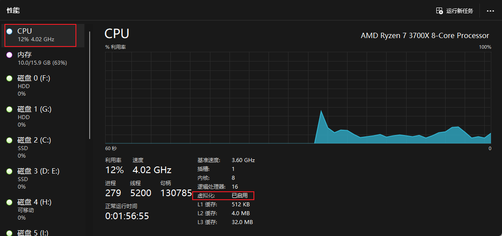
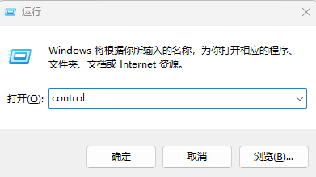
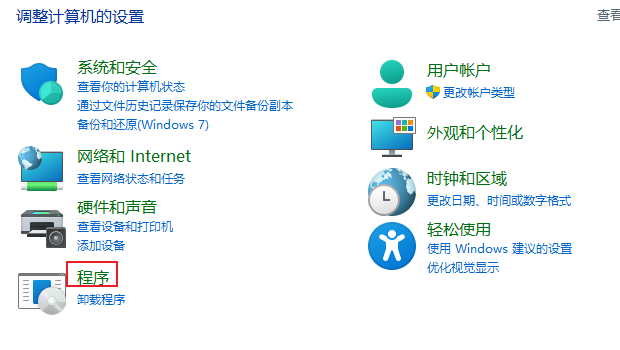
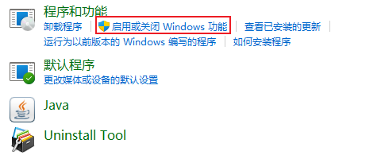
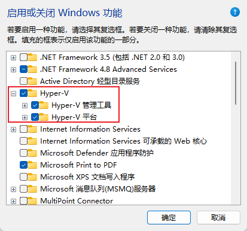
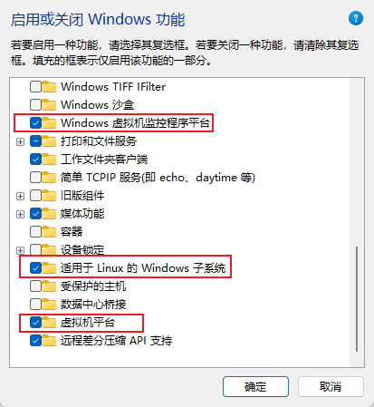
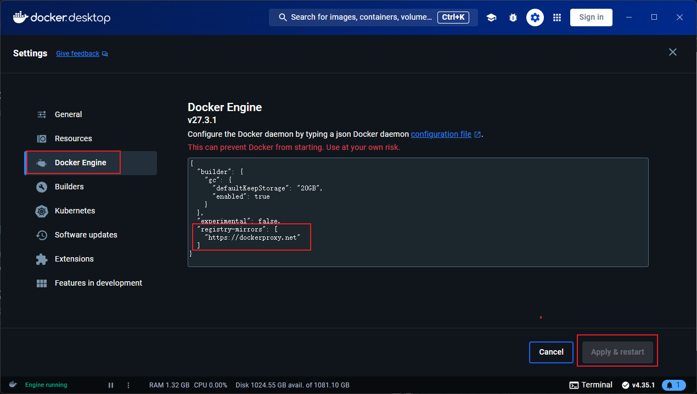
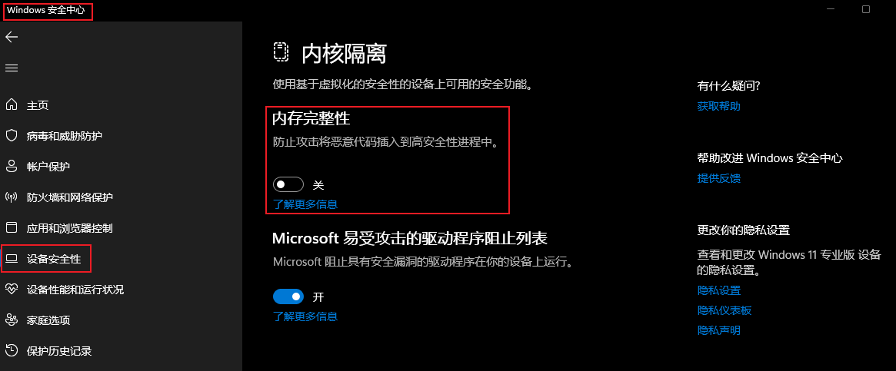
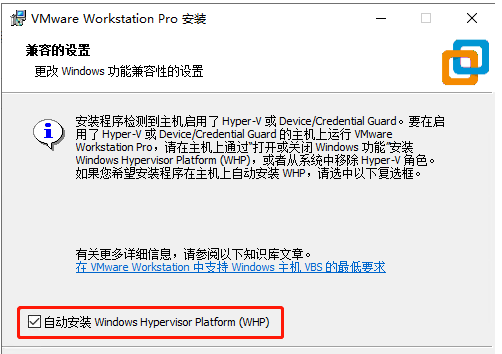
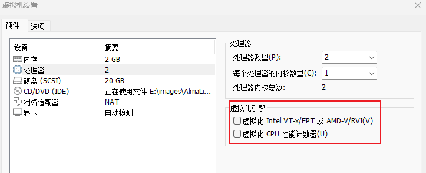

:::tip 摘要
windows安装docker及Hyper-V和VMware共存
:::
<!-- more -->

# 一、windows安装docker

## 1、系统虚拟化

### 1.1 启用虚拟化

任务管理器(CTRL+Shift+Esc), 选择性能，查看CPU虚拟化，确认是否已启用（默认启用）。**需要在BIOS在开启，根据各主板BIOS开启。**



### 1.2 启用Hyper-v并开启虚拟任务

按住键盘Win+R,输入control











## 2、安装docker

在官网www.docker.com，下载Docker Desktop，直接安装，下一步下一步即可。

配置加速源：

```sh
{
  "registry-mirrors": [
    "https://dockerproxy.net"
  ]
}
```

具体：



## 3、运行容器

打开Windows PowerShell

```sh
docker run --name some-nginx  -p 81:80 -d nginx
```

浏览器访问：localhost:81

# 二、Hyper-V和VMware共存

## 2.1 前提

1. 将 Windows 版本升级到 Windows 10 20H1 或更高版本。
2. 将 VMWare Workstation/Player 升级到 15.5.5 或更高版本

## 2.2 关闭windows内核隔离



## 2.3 安装vmware

以vmware17为例，直接安装即可。其他版本安装时可能需要勾选WHP，如下图



## 2.4 vmware虚拟机注意事项

打开虚拟机的设置选项，找到“处理器”，**去掉如图所示的虚拟化引擎两个或三个选项前面的钩**，点击“确定”。否则，在运行虚拟机时，VMWare Workstation/Player 会提示“开机时出错： VMWarePlayer 在此主机上不支持嵌套虚拟化。模块 MonitorMode 启动失败。未能启动虚拟机。”（VMware Workstation does not support nested virtualization on this host. Module ‘MonitorMode’ power on failed. Failed to start the virtual machine.）


